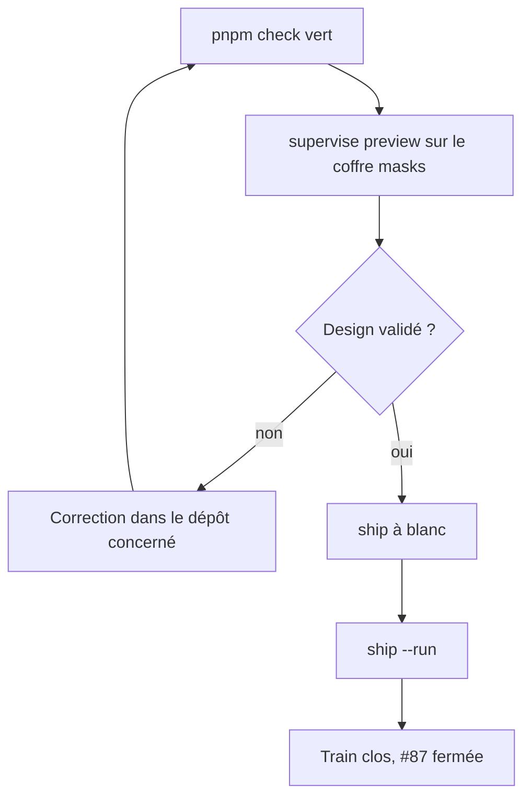
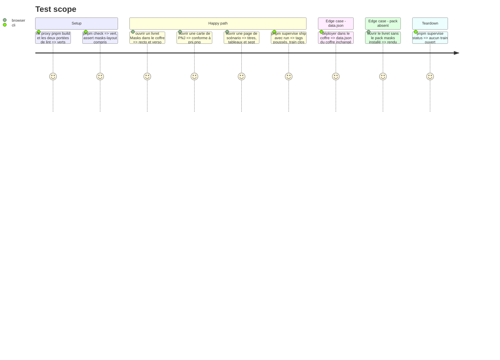

# Instruction: Valider et livrer

Le superviseur épingle la candidate puis la finale, écrit lockfiles et enregistrements, et enchaîne la livraison. L'utilisateur ne valide que le design et le fonctionnel, sur le coffre Masks.

## Architecture projection

> Tree of the final files. ✅ create · ✏️ modify · ❌ delete

```txt
obsidian-handbook/
├── package.json, manifest.json, versions.json     ✏️ par `pnpm version <x.y.z>`
├── CHANGELOG.md                                   ✏️ section de la version
├── pnpm-lock.yaml                                 ✏️ épingle finale, écrit par le superviseur
└── supervisor/trains/masks-2e.json                ✏️ clos par `ship`
schema-pbta/
└── release-train/, release-stage.*.json           ✏️ manifestes du train v10
```

## User Journey



## Test Scope



## Tasks to do

### `1)` Porte complète

> Aucune des deux portées de lint ne fait foi seule.

1. `rtk proxy pnpm build`, `./node_modules/.bin/eslint src --ext .ts`, `pnpm lint`, `pnpm check`
2. Supprimer tout harnais jetable `src/__assert_*.ts` avant de builder

### `2)` Validation visuelle

> Design et fonctionnel : la seule validation humaine.

1. `pnpm supervise preview --vault C:/Users/fxgui/Documents/Perso/RPG/masks` ; ne jamais écraser `data.json`
2. Comparer aux dix captures : livret recto et verso, carte de PNJ, page de texte, tableau, boîte de move, texte à lire, déclencheur de crise, vignette portrait, titre de chapitre
3. Trancher Staatliches ou Bebas Neue sur un rendu côte à côte ; si Bebas Neue l'emporte, retour en phase 3 pour la police et sa licence
4. Vérifier l'export PDF d'un livret et d'une page de scénario

### `3)` Version et livraison

> La version et le `CHANGELOG` se préparent avec le changement.

1. `pnpm version <x.y.z>` (mineure) et section du `CHANGELOG.md` ; `pnpm assert:release-version`
2. Message de commit en anglais dans `.git/SUPERVISOR_COMMIT_MSG` de chaque dépôt
3. `pnpm supervise ship --message "<message>"` à blanc, lire le plan annoncé, puis `--run`
4. Après la release de Handbook : décider si `handbook/masks/pack.json` relève `minimumHandbookVersion` ; si oui, c'est un commit `schema-pbta` distinct, postérieur à la release

### `4)` Clôture

> Laisser la mémoire à jour.

1. Corriger dans l'issue #87 la mention `styles/fonts.css` et y reporter les réponses aux questions ouvertes
2. Mettre à jour `aidd_docs/memory/internal/ci-and-release.md` (v10) et `game-packs.md` (rôles d'image Masks)

## Test acceptance criteria

| Task | Acceptance criteria |
| ---- | ------------------- |
| 1 | Build, deux lints et `pnpm check` sont verts sur un arbre sans harnais jetable |
| 2 | L'utilisateur a validé les dix rendus face aux captures ; la police de titre est arrêtée ; `data.json` du coffre est intact |
| 3 | Les tags de `schema-pbta` v10, de Handbook et de Lantern sont publiés ; le train est clos |
| 4 | L'issue #87 est fermée avec ses questions ouvertes résolues |
