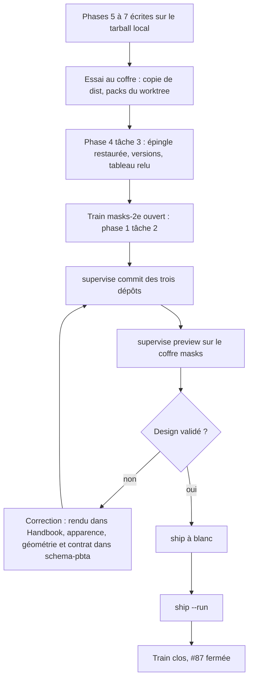
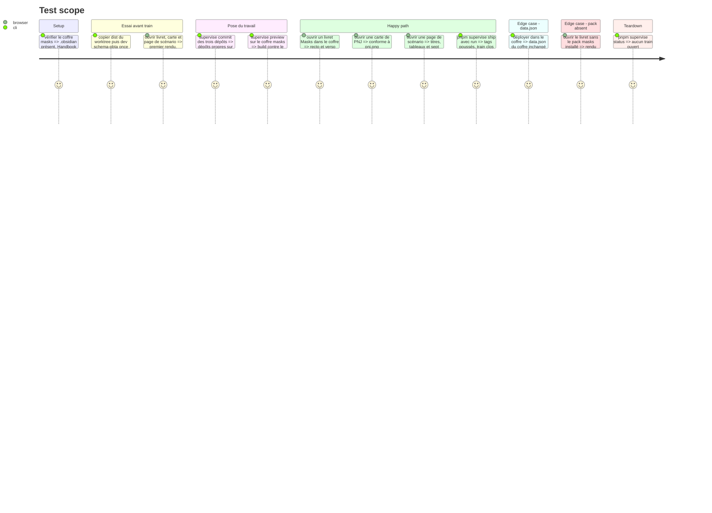

# Instruction: Essayer au coffre, puis valider le rendu et livrer le train

> Exécution dans les worktrees du superviseur (`plan.md`, ligne Exécution) : chemins sous `<W>/<dépôt>`, commandes `pnpm supervise` lancées depuis `<W>/obsidian-handbook` avec `--root <W>`.

Cette phase se fait en **deux temps** (`plan.md`, ligne Ordre). La tâche 1 est la fin de l'écriture : le rendu s'essaie au coffre dès que les phases 5 à 7 sont écrites, sur le tarball local, sans train ni commit. Les tâches 2 à 4 sont la livraison du train unique `masks-2e` (`schema-pbta`, `lantern`, Handbook #87), une fois l'épingle restaurée et les versions préparées (phase 4, tâche 3) et le train ouvert (phase 1, tâche 2). L'utilisateur ne valide que le design et le fonctionnel, sur le coffre Masks.

## Architecture projection

> Tree of the final files. ✅ create · ✏️ modify · ❌ delete

```txt
obsidian-handbook/
└── supervisor/trains/masks-2e.json                ✏️ clos par `ship`
schema-pbta/
└── handbook/masks/                                ✏️ seulement si la validation visuelle demande une retouche d'apparence
aidd_docs/memory/internal/ci-and-release.md        ✏️ clôture (tâche 5)
```

## User Journey



## Test Scope



## Tasks to do

### `1)` Essai au coffre (écriture, avant tout train)

> Même geste que pour #89 : voir le rendu avant de livrer quoi que ce soit, et corriger tant que rien n'est commité, contrat compris. `supervise preview` ne sert pas ici : il exige des dépôts propres.

1. Préalable, fait par l'utilisateur le 2026-10-07 et à revérifier au moment d'exécuter : `C:/Users/fxgui/Documents/Perso/RPG/masks` est un coffre, Handbook y est installé et activé avec son propre `data.json` (jeu `masks` sélectionné), la source `schema-pbta` est installée sous `.obsidian/handbook/sources/` : `pnpm dev:schema-pbta` exige cette source déjà installée
2. Depuis `<W>/obsidian-handbook`, épingle locale en place : `rtk proxy pnpm build`, puis copie de `dist/main.js`, `dist/styles.css`, `dist/manifest.json` dans `.obsidian/plugins/obsidian-handbook/` du coffre ; ne jamais écraser `data.json` (md5 relevé avant et après)
3. `pnpm dev:schema-pbta --vault C:/Users/fxgui/Documents/Perso/RPG/masks --once` : son `--source ../schema-pbta` vise `<W>/schema-pbta`, donc le pack Masks non publié
4. L'utilisateur regarde livret, carte de PNJ et page de scénario face aux captures. Un défaut de rendu (donnée, région, accroche) se corrige dans Handbook, un défaut d'apparence ou de géométrie dans `handbook/masks/` (`layout.css` pour la carte et le livret), un défaut de contrat (région, libellé, champ) dans `schema-pbta` suivi d'un nouveau `npm pack` : **à ce stade aucun ne coûte de release**
5. Ce premier avis ne remplace pas le verdict de la tâche 3 ; il sert à la relecture du contrat (phase 4, tâche 3) et tranche déjà, si possible, Staatliches ou Bebas Neue
6. Enchaîner sur la phase 4, tâche 3 (épingle restaurée, versions, tableau relu), puis sur la phase 1, tâche 2 (ouvrir le train) ; revenir ici pour la tâche 2

### `2)` Pose du travail

> `preview` n'accepte que des dépôts propres sur `origin/main` : le commit vient avant la validation visuelle. `present` (lancé par `preview`, puis par `ship`) joue `pnpm check` de Handbook et de Lantern **sur l'archive que `schema-pbta` publierait** : c'est là que la porte complète est lue, l'épingle restaurée ne compilant pas seule.

1. Les trois messages de commit sont prêts (phase 4, tâche 3). `pnpm supervise commit schema-pbta --root <W>`, puis `pnpm supervise commit lantern --only --root <W>` et `pnpm supervise commit obsidian-handbook --only --root <W>` (chacun commite et pousse ; aucune release n'est publiée)
2. Si `commit` refuse (lint, fichier hors train, épingle locale oubliée), c'est l'action `repair` de `ship-train` : la lire dans son journal complet, jamais dans la fin de sortie
3. Aucune épingle locale ne subsiste (`package.json` et `pnpm-lock.yaml` visent la release publiée) ; aucun harnais jetable `src/__assert_*.ts`

### `3)` Validation visuelle

> Design et fonctionnel : la seule validation humaine.

1. Le coffre existe depuis la tâche 1 : `preview` refuse un dossier sans `.obsidian` et un coffre où `manifest.json` du plugin est absent
2. `pnpm supervise preview --vault C:/Users/fxgui/Documents/Perso/RPG/masks --root <W>` : construit Handbook contre le checkout de `schema-pbta`, le déploie depuis `<W>/obsidian-handbook` (pas depuis le checkout habituel) et monte dans le coffre les packs que `schema-pbta` publie par son `handbook.json` ; ne jamais écraser `data.json`. Aucune réinstallation de source n'est à faire : le pack monté est celui du train
3. Comparer aux dix captures : livret recto et verso, carte de PNJ, page de texte, tableau, boîte de move, texte à lire, déclencheur de crise, vignette portrait, titre de chapitre ; deux témoins : le pré-tiré des captures réécrit en texte original, et un livret vierge
4. Trancher Staatliches ou Bebas Neue sur un rendu côte à côte ; si Bebas Neue l'emporte, la police et sa licence s'ajoutent à `handbook/masks/` (règles de la phase 3)
5. Vérifier l'export PDF d'un livret et d'une page de scénario
6. Corrections, **avant `ship`**, dans le même train : un défaut de rendu se corrige dans Handbook, un défaut d'apparence, de géométrie ou de contrat dans `schema-pbta` (`npm.cmd run check` vert, contrat régénéré par `gen`, jamais édité), puis nouvelle pose par la tâche 2 et nouveau `preview`. Rien n'est publié tant que le verdict n'est pas donné

### `4)` Livraison

> Tout est déjà commité : `ship` n'a plus qu'à présenter, publier le fournisseur, faire adopter, publier Lantern et Handbook et clore.

1. `pnpm supervise ship --root <W>` à blanc, lire le plan annoncé ; **une fois le verdict de l'utilisateur donné**, `--run` est lancé par le skill `ship-train` (action `ship`), et un arrêt passe par son action `repair`
2. **Après la publication, toute retouche est un correctif du fournisseur** (la finale est immuable) : une retouche du contrat ou du pack demande une version corrective de `schema-pbta` et l'adoption par les consommateurs (train à part, à décider avec l'utilisateur) ; une retouche d'apparence dans `handbook/masks/` est un commit, diffusé aux coffres en `Latest release` à la release suivante du schéma
3. Après la release de Handbook : décider si `handbook/masks/pack.json` relève `minimumHandbookVersion` ; si oui, c'est un commit `schema-pbta` distinct, postérieur à la release de Handbook

### `5)` Clôture

> Laisser la mémoire à jour.

1. Corriger dans l'issue #87 la mention `styles/fonts.css` et y reporter les réponses aux questions ouvertes
2. Mettre à jour `aidd_docs/memory/internal/ci-and-release.md` (contrat `schema-pbta` adopté, un seul train) ; `game-packs.md` ne change pas (aucun rôle d'image neuf)
3. Signaler à l'utilisateur que les worktrees de `<W>` restent en place et que ses checkouts habituels sont en retard sur `origin/main` : `git worktree remove` et `git pull` sont ses gestes

## Test acceptance criteria

| Task | Acceptance criteria |
| ---- | ------------------- |
| 1 | Le coffre Masks rend livret, carte et page de scénario depuis le build et les packs du worktree ; `data.json` du coffre a le même md5 avant et après ; rien n'est commité, aucun train n'est ouvert ; les défauts vus sont corrigés ou consignés |
| 2 | Les trois dépôts sont propres et à `origin/main` ; aucune épingle locale, aucun harnais jetable ; aucune release publiée |
| 3 | `preview` a monté les packs du train ; l'utilisateur a validé les dix rendus face aux captures ; la police de titre est arrêtée ; `data.json` du coffre est intact |
| 4 | Les tags de `schema-pbta`, de Lantern et de Handbook sont publiés avec leurs releases ; le train `masks-2e` est clos |
| 5 | L'issue #87 est fermée avec ses questions ouvertes résolues |
