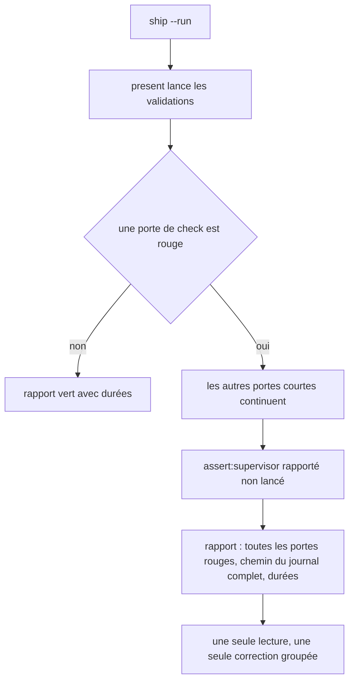
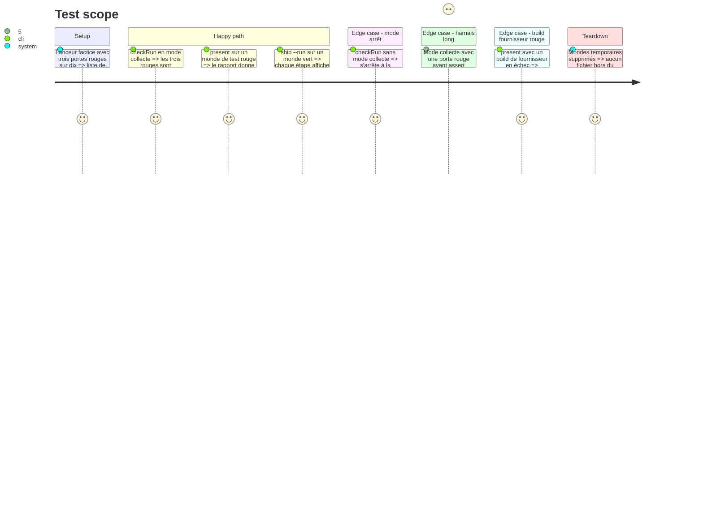

# Instruction: Échecs complets et lisibles

## Architecture projection

```txt
obsidian-handbook/
├── tools/
│   ├── check.mjs                      ✏️ délègue à checkRun, lit le mode collecte
│   ├── checkRun.mjs                   ✅ ordonnancement des portes, pur, lanceur injecté
│   ├── assert-check-run.mjs           ✅ bundle et lance le harnais
│   ├── checkRun.harness.mts           ✅ preuves du mode collecte et du mode arrêt
│   ├── supervisor.harness.mts         ✏️ scénarios : journal complet, durées, consommateur non lancé
│   └── supervisor/
│       ├── guarded.mjs                ✏️ journal complet au chemin reçu, durée mesurée
│       ├── present.mjs                ✏️ chemin des journaux, durées dans le rapport, validations non lancées derrière un build rouge
│       ├── land.mjs                   ✏️ chemin du journal dans l'erreur d'adoption
│       ├── converge.mjs               ✏️ chemin du journal dans l'erreur de convergence
│       ├── close.mjs                  ✏️ purge des journaux du train clos, résumé des durées conservé
│       └── ship.mjs                   ✏️ heure de début et durée de chaque étape
├── package.json                       ✏️ script assert:check-run
└── doc/supervisor.fr.md               ✏️ où lire un échec
```

## User Journey



## Test Scope



## Tasks to do

### `1)` Extraire l'ordonnancement de `check.mjs`

> Rendre la logique des portes prouvable sans relancer de vrais scripts.

1. Créer `tools/checkRun.mjs` : une fonction qui reçoit la liste des portes, les portes rapides, les portes sautées, les tampons, le mode et un lanceur, et rend la liste des résultats (verte, rouge, sautée, non lancée) et le code de sortie.
2. Réduire `tools/check.mjs` à la lecture de l'environnement, au calcul des empreintes, à l'appel de cette fonction et à l'écriture des tampons.
3. Vérifier par un `pnpm check` complet, lancé avec `HANDBOOK_CHECK_FORCE=1`, que le comportement par défaut est inchangé : mêmes portes, même ordre, même dernière ligne.

### `2)` Mode collecte

> Voir toutes les portes rouges en un seul passage.

1. Activer le mode collecte quand `SUPERVISOR_PRESENT=1` ou `HANDBOOK_CHECK_COLLECT=1` ; le mode arrêt reste le défaut à la main.
2. En mode collecte, laisser toutes les portes rapides finir, poursuivre les `assert:*` après un rouge, et terminer par un récapitulatif qui nomme chaque porte rouge.
3. En mode collecte, placer `assert:supervisor` après toutes les autres portes, quel que soit son rang dans `package.json`, et ne pas le démarrer si l'une d'elles est rouge : le rapporter « non lancé ». En mode arrêt, son rang ne change pas.
4. N'écrire le tampon `full` que si tout est vert et rien n'est sauté ni non lancé.

### `3)` Sortie complète des validations

> Ne plus perdre la cause derrière les trente dernières lignes.

1. Ajouter à `runGuarded` un paramètre facultatif : le chemin du journal. `runGuarded` ne connaît ni le train ni le dépôt coordinateur ; c'est l'appelant (`present`, `land`, `converge`) qui calcule ce chemin dans le répertoire git du coordinateur, sous `supervisor-logs/<train>/`. Sans ce paramètre, rien n'est écrit.
2. Nommer chaque journal par l'identifiant du dépôt, le rang de la commande et l'étape, sans reprendre le texte de la commande : un nom de fichier valide sous Windows, stable d'un passage à l'autre, écrasé par le passage suivant.
3. Rendre dans le résultat le chemin de ce fichier et la durée mesurée, en plus de la fin de sortie existante.
4. Dans `renderPresentation`, afficher pour chaque validation sa durée, et pour chaque échec le chemin du journal ; nommer aussi ce chemin dans l'erreur d'une adoption ou d'une convergence rouge.
5. À chaque présentation, adoption et convergence, ajouter au résumé des durées du train (`supervisor-logs/<train>.durations.jsonl`, un objet JSON par ligne) une entrée par commande : dépôt, étape, commande, résultat, durée, date.
6. Purger les journaux d'un train à sa clôture ; conserver son résumé des durées, que les phases 6 et 7 lisent.

### `4)` Durées du cycle et validations inutiles

> Savoir où part le temps, et ne pas valider ce qui ne peut pas passer.

1. Dans `ship.mjs`, afficher l'heure de début de chaque étape et sa durée à la fin, et ajouter au résumé des durées une entrée par étape et une par cycle `ship`, avec son code de sortie.
2. Dans `presentTrain`, ne pas lancer les validations d'un consommateur dont le build d'un fournisseur lié a échoué ; les rapporter « non lancées » avec la raison.

### `5)` Preuves et documentation

> Tenir ces comportements par des harnais.

1. Écrire `tools/checkRun.harness.mts` et `tools/assert-check-run.mjs` sur le motif de bundling du dépôt ; déclarer `assert:check-run`.
2. Ajouter les scénarios du superviseur : journal complet nommé dans le rapport, durées présentes, consommateur non lancé derrière un build rouge.
3. Mettre à jour `doc/supervisor.fr.md` : où lire un échec, ce que signifient « non lancé » et « sauté ».
4. Passer `rtk proxy pnpm build`, les deux portées de lint et `pnpm check`.

## Test acceptance criteria

| Task | Acceptance criteria |
| ---- | ------------------- |
| 1 | Un `pnpm check` à la main sur un dépôt vert affiche les mêmes portes dans le même ordre qu'avant et se termine par « Handbook core check passed. ». |
| 2 | Avec trois portes rouges, le mode collecte les nomme toutes les trois dans le récapitulatif et sort en 1 ; le mode arrêt n'en nomme qu'une. |
| 2 | Avec une porte rouge, `assert:supervisor` apparaît « non lancé » et aucun tampon n'est écrit. |
| 3 | Le rapport d'une présentation rouge donne un chemin de fichier qui existe et contient la sortie entière de la commande, y compris sa première ligne. |
| 3 | Après `close --run`, le dossier de journaux du train n'existe plus et son résumé des durées porte une ligne par commande lancée. |
| 4 | La sortie de `ship --run` porte, pour chaque étape, une heure de début et une durée ; le résumé des durées compte une entrée par cycle `ship`, vert ou rouge. |
| 4 | Un build de fournisseur rouge donne un rapport où les validations de ses consommateurs sont « non lancées », sans attendre leur durée. |
| 5 | `pnpm assert:check-run` et `pnpm assert:supervisor` passent ; `pnpm check` passe. |
