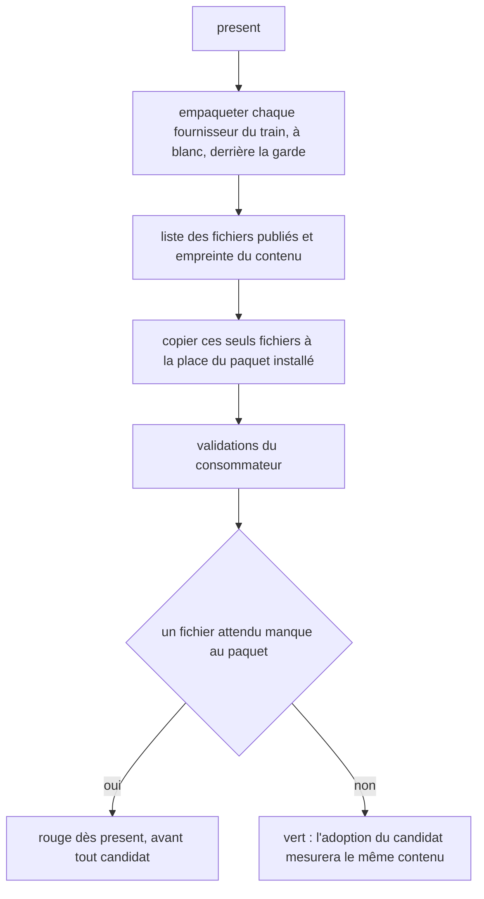
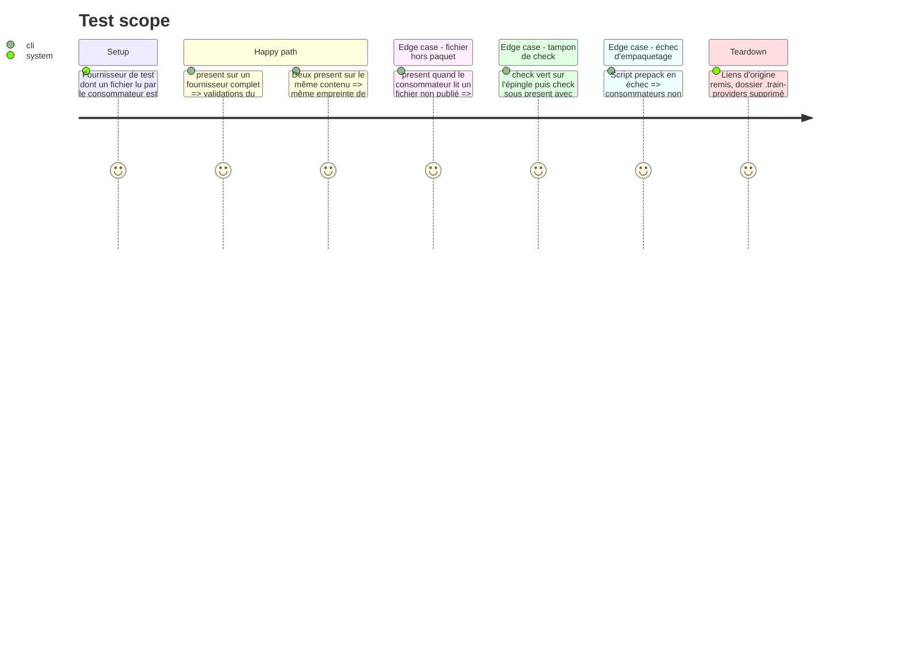

# Instruction: Présenter contre l'archive empaquetée du fournisseur

## Architecture projection

```txt
obsidian-handbook/
├── supervisor/
│   └── train.schema.json              ✏️ empreinte empaquetée facultative dans l'entrée de présentation d'un fournisseur
├── tools/
│   ├── check.mjs                      ✏️ le tampon full tient compte des fournisseurs liés
│   ├── supervisor.harness.mts         ✏️ scénarios : fichier hors paquet absent, empreinte stable
│   ├── fixtures/supervisor/           ✏️ fournisseur de test avec un fichier hors de files
│   └── supervisor/
│       ├── providerLinks.mjs          ✏️ ne copie que les fichiers du paquet, rend leur empreinte
│       ├── packedFiles.mjs            ✅ liste et empreinte des fichiers qu'un paquet publie
│       ├── present.mjs                ✏️ empaquetage derrière la garde, empreinte dans le rapport
│       └── guarded.mjs                ✏️ transmet l'empreinte des fournisseurs aux validations
└── doc/supervisor.fr.md               ✏️ ce que present mesure
```

## User Journey



## Test Scope



## Tasks to do

### `1)` Vérifier la faisabilité de l'empaquetage à blanc

> L'écart est prouvé (tableau Decisions : une adoption a échoué sur un dossier du checkout absent de l'archive). Reste à fonder le moyen sur un comportement lu, pas supposé.

1. Lancer `npm pack --dry-run --json` dans chacun des trois fournisseurs et confirmer que la sortie liste les fichiers et que `prepack` s'exécute. Les scripts de release du fournisseur PbtA empaquettent déjà par `npm pack` : c'est la même liste.
2. Confirmer que la commande ne publie rien et passe derrière la garde sans refus.
3. Confirmer que la sortie reste un JSON lisible quand `prepack` écrit sur la sortie standard, et que `git status` du fournisseur est vide après la commande.
4. Lancer la commande deux fois et comparer les contenus listés : relever tout fichier dont les octets changent d'un passage à l'autre (date de build, ordre de génération).
5. Mesurer la durée de la commande pour chaque fournisseur.
6. Consigner les cinq constats dans le tableau Decisions du plan. Si la liste ou la garde font défaut, retenir à la place la liste que rend `npm pack --dry-run` sans `--json`, ou à défaut le champ `files` de `package.json` complété des fichiers que npm publie toujours et du build existant. Si un fichier n'est pas stable, l'exclure de l'empreinte en le nommant, jamais de la copie, et marquer l'empreinte de ce fournisseur « partielle » dans l'enregistrement : les phases 5 et 6 ne s'appuient pas sur une empreinte partielle.

### `2)` Lister et empreinter ce qu'un paquet publie

> Mesurer le consommateur contre ce que le candidat contiendra.

1. Créer `tools/supervisor/packedFiles.mjs` : pour un checkout de fournisseur, rendre la liste triée des fichiers publiés et le `sha256` de leur contenu.
2. Lancer l'empaquetage par `runGuarded`, pour qu'un script du fournisseur ne puisse rien publier.
3. Dans `stageProvider`, copier ces seuls fichiers au lieu de tout le checkout.
4. Supprimer le build séparé des fournisseurs dans `presentTrain` quand l'empaquetage l'exécute déjà ; le garder sinon.

### `3)` Fermer le trou du tampon de `check`

> Un vert prouvé sur l'épingle ne doit pas valoir pour un fournisseur lié.

1. Écrire un scénario qui reproduit le cas : `check` vert sur l'épingle, puis `check` sous `present` avec un fournisseur dont le contenu diffère. Constater s'il est rejoué ou non.
2. Si le tampon `full` est réutilisé à tort, exporter l'empreinte des fournisseurs liés dans l'environnement gardé et la mêler au tampon `full` de `check.mjs`.
3. Si le scénario montre que le cas est déjà couvert, garder le scénario comme preuve et ne rien changer à `check.mjs`.

### `4)` Rapport, preuves et documentation

> Rendre visible ce qui a été mesuré.

1. Écrire l'empreinte de chaque fournisseur dans son entrée de présentation de l'enregistrement du train, à côté de son commit ; déclarer ce champ, facultatif, dans `supervisor/train.schema.json`. Les phases 5 et 6 la lisent là.
2. Afficher dans le rapport de présentation, pour chaque consommateur, les fournisseurs liés et leur empreinte.
3. Ajouter au monde de test un fournisseur dont un fichier lu par le consommateur est hors de `files`, et les scénarios du Test Scope.
4. Mettre à jour l'en-tête de `providerLinks.mjs` et `doc/supervisor.fr.md`.
5. Passer `rtk proxy pnpm build`, les deux portées de lint et `pnpm check`.

## Test acceptance criteria

| Task | Acceptance criteria |
| ---- | ------------------- |
| 1 | Le constat de faisabilité est écrit, avec la commande lancée et, pour chaque fournisseur : la liste rendue, l'état du checkout après coup, la stabilité entre deux passages et la durée. |
| 2 | Un consommateur qui lit un fichier absent du paquet échoue à `present`, et le message nomme ce fichier. |
| 2 | Deux présentations du même contenu donnent la même empreinte ; un octet modifié dans un fichier publié la change ; un fichier non publié modifié ne la change pas. |
| 2 | Après `present`, vert ou rouge, le lien d'origine du paquet est en place et `.train-providers` n'existe plus. |
| 3 | Le scénario du tampon passe : un fournisseur lié différent rejoue les portes de `check`. |
| 4 | Le rapport de présentation nomme chaque fournisseur lié avec son empreinte, et l'enregistrement du train la porte ; un enregistrement sans ce champ se lit toujours. |
| 4 | `pnpm assert:supervisor` et `pnpm check` passent. |
