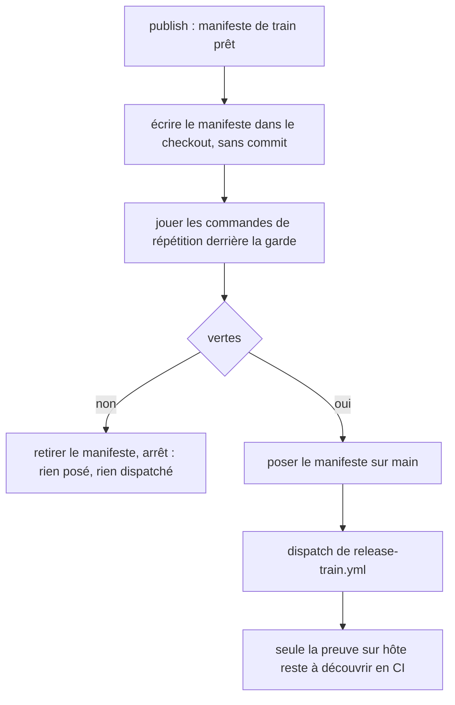
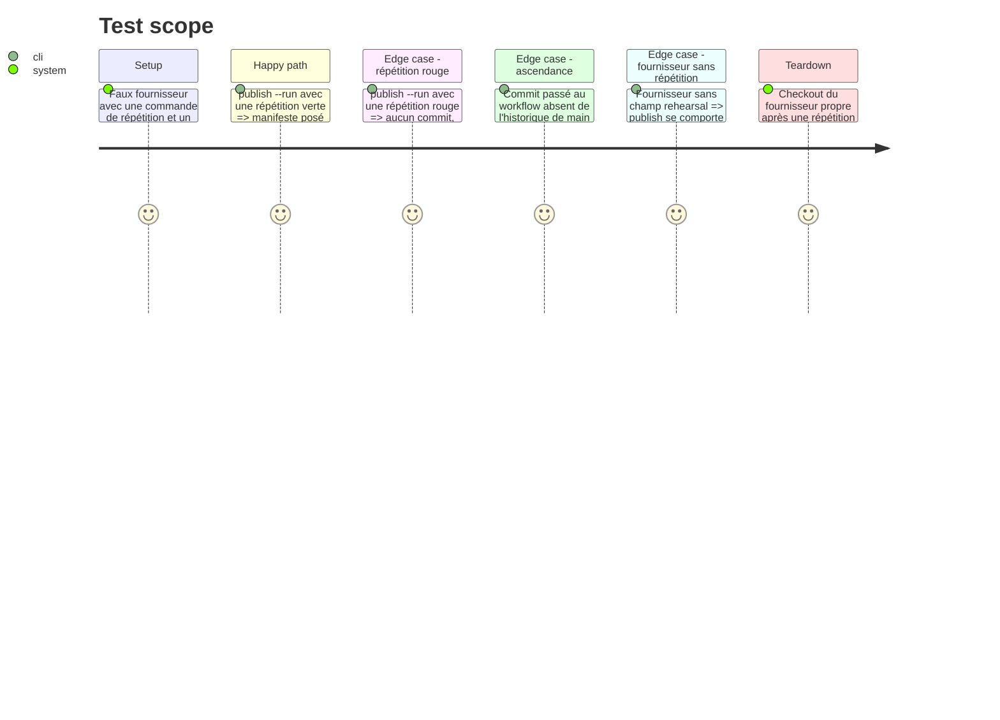

# Instruction: Répéter en local les preuves statiques du train

## Architecture projection

```txt
obsidian-handbook/
├── supervisor/
│   ├── topology.json                  ✏️ champ rehearsal des fournisseurs qui en ont une
│   └── topology.schema.json           ✏️ déclare le champ rehearsal
├── tools/
│   ├── supervisor.harness.mts         ✏️ scénarios : répétition rouge, aucun dispatch
│   ├── fixtures/supervisor/           ✏️ faux fournisseur avec une commande de répétition
│   └── supervisor/
│       ├── rehearse.mjs               ✅ joue les commandes de répétition sur le manifeste à poser
│       ├── publish.mjs                ✏️ répète avant land et avant dispatch
│       ├── topology.mjs               ✏️ lit et valide rehearsal
│       └── adapters/pbta.mjs          ✏️ fournit le manifeste et le commit à répéter
└── doc/supervisor.fr.md               ✏️ ce qui est répété, ce qui reste en CI
```

## User Journey



## Test Scope



## Tasks to do

### `1)` Fonder la commande de répétition

> Le classement est fait (tableau Decisions) : les trois runs rouges ont échoué à la validation statique. Reste à prouver qu'elle se joue en local.

1. Lancer à la main, sous Windows, la validation statique du fournisseur PbtA sur le manifeste du dernier train clos, depuis un checkout propre : elle doit sortir verte.
2. Relever ce qu'elle lit : le manifeste de train passé en argument, l'enregistrement du candidat et l'enregistrement de stage, tous trois dans le checkout, sans réseau ni dépôt consommateur.
3. Écrire dans le tableau Decisions du plan la commande retenue et ses lectures. Si elle exige autre chose que le checkout, le consigner et étendre la tâche 3 à cette entrée.

### `2)` Déclarer la répétition dans la topologie

> Garder le superviseur sans connaissance des scripts d'un fournisseur.

1. Ajouter au schéma de la topologie un champ `rehearsal` par fournisseur : une liste de commandes où le chemin du manifeste est un jeton substitué.
2. Renseigner ce champ pour le fournisseur PbtA avec sa validation statique du manifeste ; ne rien déclarer pour un fournisseur qui n'a pas de workflow de train.
3. Valider le champ à la lecture, comme les autres commandes.

### `3)` Répéter avant de poser et avant de dispatcher

> Qu'un manifeste invalide ne coûte plus un aller-retour CI.

1. Créer `tools/supervisor/rehearse.mjs` : écrire le manifeste dans le checkout, jouer les commandes par `runGuarded`, puis retirer le manifeste, que la répétition soit verte ou rouge. L'étape qui pose le manifeste le réécrit elle-même, sur un checkout propre, comme aujourd'hui.
2. Vérifier en local l'ascendance que le workflow vérifie : le commit passé en input au workflow est un ancêtre de `origin/main`.
3. Appeler la répétition dans `publish.mjs` avant l'étape qui pose le manifeste ; un rouge arrête la publication en nommant la commande et son journal.
4. Ne rien changer au dispatch lui-même ni à la lecture du run.

### `4)` Preuves et documentation

> Tenir la limite entre local et CI par écrit.

1. Ajouter les scénarios du Test Scope au harnais du superviseur.
2. Documenter dans `doc/supervisor.fr.md` ce qui est répété en local et ce qui reste propre à la CI.
3. Passer `rtk proxy pnpm build`, les deux portées de lint et `pnpm check`.

## Test acceptance criteria

| Task | Acceptance criteria |
| ---- | ------------------- |
| 1 | Le plan porte la commande de répétition retenue, la liste de ce qu'elle lit et son résultat vert sous Windows sur le manifeste du dernier train clos. |
| 2 | Une topologie dont `rehearsal` n'est pas une liste de commandes est refusée à la lecture, par nom. |
| 3 | Avec une répétition rouge, `publish --run` sort en erreur, le faux `gh` n'a reçu aucun dispatch et `origin/main` du fournisseur n'a pas bougé. |
| 3 | Après une répétition, rouge ou verte, `git status` du fournisseur est vide avant que l'étape suivante ne commence. |
| 3 | Avec une répétition verte, le manifeste est posé puis le workflow dispatché, une seule fois. |
| 4 | `pnpm assert:supervisor` et `pnpm check` passent. |
