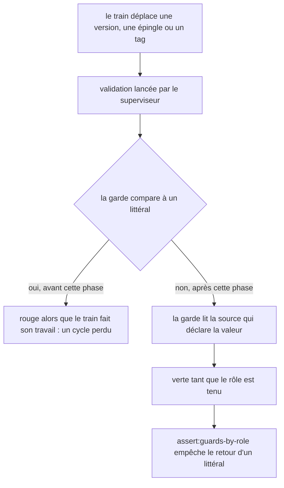
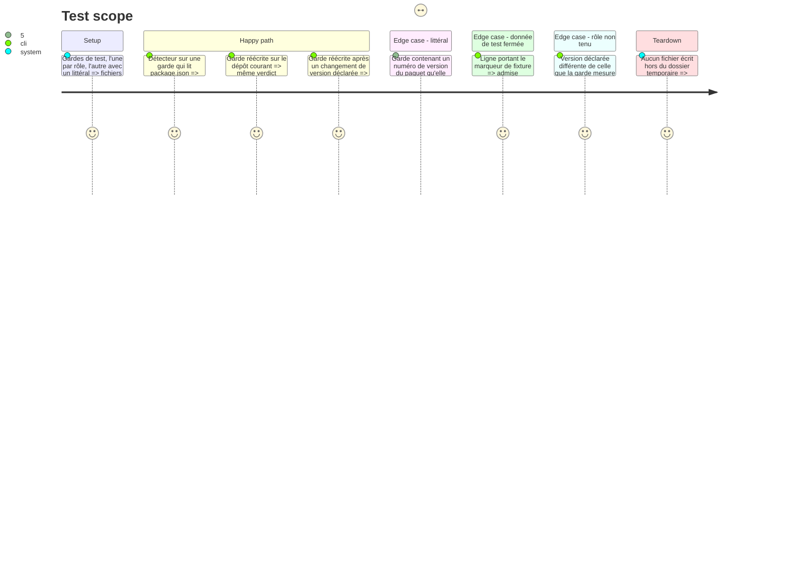

# Instruction: Gardes écrites par rôle

## Architecture projection

```txt
obsidian-handbook/
├── tools/
│   ├── assert-guards-by-role.mjs      ✅ refuse un littéral de version dans une garde
│   ├── guardsByRole.harness.mts       ✅ preuves du détecteur sur des gardes de test
│   └── gardes de l'inventaire         ✏️ littéraux remplacés là où ils figent une valeur du train
├── package.json                       ✏️ script assert:guards-by-role
├── aidd_docs/memory/internal/assertion-harnesses.md  ✏️ règle « un rôle, jamais un littéral »
└── doc/supervisor.fr.md               ✏️ ce qu'une garde peut attendre d'un train

lantern/, schema-*/
└── scripts de l'inventaire, hors paquet publié   ✏️ gardes par rôle
```

`tools/assert-consumer-schema-pins.mjs` n'est pas modifié : il lit déjà l'épingle dans `package.json`, la compare aux octets publiés, et reçoit `--final` de la commande de convergence. Aucun script des cinq dépôts ne lit `SUPERVISOR_PRESENT` (recherche faite) : aucune garde ne devine aujourd'hui l'étape du cycle par l'environnement.

## User Journey



## Test Scope



## Tasks to do

### `1)` Inventaire des gardes figées

> Savoir lesquelles cassent quand le train déplace une valeur.

1. Partir des trois gardes que le dernier train PbtA a cassées et qu'il a fallu corriger en cours de route : la preuve du train de release et le harnais de couverture des packs dans Handbook, la validation de l'installation Handbook dans le fournisseur PbtA. Relever pour chacune ce qu'elle figeait et comment elle a été corrigée.
2. Étendre le relevé, dans les cinq dépôts de la topologie, à chaque script derrière une commande `validations` ou `convergence`.
3. Pour chacun, noter s'il compare à un littéral de version, de tag, de SHA ou d'URL d'archive, et si ce littéral est une valeur que le train déplace ou une donnée de test fermée.
4. Noter aussi toute garde qui ne peut pas décider par ses arguments ni par les fichiers qu'elle lit, parce que son attendu dépend de l'étape du cycle. La recherche préalable n'en a trouvé aucune.
5. Écrire l'inventaire dans le tableau Decisions du plan, avec la liste des gardes à réécrire. Si la liste est vide hors des trois gardes déjà corrigées, passer directement à la tâche 3.
6. Vérifier, par la liste des fichiers publiés de la phase 2, que les scripts à modifier dans Lantern et les `schema-*` ne sont pas empaquetés ; un script empaqueté sort de cette phase et suit le flux inter-dépôts dans un train à part.

### `2)` Réécrire les gardes par rôle

> Qu'une garde ne casse plus parce que le train fait son travail.

1. Dans chaque garde de l'inventaire, remplacer le littéral par la lecture de la source qui le déclare (`package.json`, manifeste de train, enregistrement du train).
2. Ne retirer aucune affirmation, ne changer aucun comparateur, aucun seuil ni aucun compteur.
3. Garder inchangés les littéraux des données de test fermées, en leur posant le marqueur de fixture.
4. Pour une garde relevée en tâche 1.4, lui passer l'étape par un argument de sa commande dans la topologie, comme `--final` aujourd'hui ; ne pas ajouter de variable d'environnement.
5. Préparer un commit par dépôt, dans l'ordre fournisseurs puis consommateurs, sans publication, sans tag et hors de tout train.

### `3)` Garde de la règle

> Empêcher le retour des littéraux.

1. Créer `tools/assert-guards-by-role.mjs`. Il lit la liste des scripts de garde de Handbook dans une table qu'il déclare (les `assert-*.mjs` et harnais qui mesurent une épingle, une version ou un train, issus de l'inventaire). Dans ces fichiers il refuse trois motifs écrits en chiffres : un numéro de version à trois composantes, un tag de release, une URL d'archive d'un paquet de la topologie. Un motif générique (expression régulière sans chiffres figés) n'est pas un littéral. Une ligne de donnée de test fermée est admise si elle porte un marqueur de fixture explicite.
2. Écrire `tools/guardsByRole.harness.mts` sur le motif de bundling du dépôt, avec les cas du Test Scope ; déclarer `assert:guards-by-role` dans `package.json`.
3. Ajouter la règle à `aidd_docs/memory/internal/assertion-harnesses.md` et à `doc/supervisor.fr.md`.
4. Passer `rtk proxy pnpm build`, les deux portées de lint et `pnpm check` ; lancer les validations de la topologie dans chaque dépôt modifié.

## Bilan (2026-10-08)

Phase lancée sur une question (« il y a une phase 4 ? ») lue comme une demande d'implémentation, puis confirmée.

**Handbook** — build, les deux lints et `pnpm check` complet forcé verts, `assert:guards-by-role` compris (13 gardes sans chiffre figé).

- Tâche 1 : inventaire dans le tableau Decisions du plan.
- Tâche 2 : `tools/assert-release-train-schema-adrenaline.mjs` réécrite avec `finalPin` ; version d'Obsidian en constante unique `PINNED_OBSIDIAN` dans `tools/release-train-schema-pbta-assert.mjs` ; marqueurs de fixture dans `assert-release-train-schema-pbta.mjs`, `assert-release-train-schema-in-the-mist.mjs` et `pbtaPackCoverage.harness.mts`.
- Tâche 3 : `tools/guardsByRole.mjs`, `tools/assert-guards-by-role.mjs`, `tools/guardsByRole.harness.mts`, script `assert:guards-by-role`, règle dans `assertion-harnesses.md` et `doc/supervisor.fr.md`.

**Fournisseur PbtA** — `npm run check` vert en entier. `tools/validate-package.ts` lit la version de contrat et le tag dans `src/contract-version` ; `tools/validate-handbook-packs.ts` et `tools/validate-handbook-install.ts` lisent le minimum d'hôte dans `tools/handbook-minimum-host.ts`. Commit local sur `main`, non poussé.

**Rien à réécrire** dans Lantern ni dans les fournisseurs Adrenaline et Mist.

**Écarts consignés au plan** : l'affirmation sha256 de la garde Adrenaline est retirée ; cette garde passe de rouge à verte ; le minimum d'hôte PbtA était surclassé par l'inventaire.

## Test acceptance criteria

| Task | Acceptance criteria |
| ---- | ------------------- |
| 1 | Le plan liste chaque garde figée avec son dépôt, son fichier et la valeur figée, et dit si une garde dépend de l'étape du cycle. |
| 2 | Chaque garde réécrite rend le même verdict qu'avant sur le dépôt courant. |
| 2 | Chaque garde réécrite reste verte quand la valeur déclarée change avec elle, et rouge quand la valeur mesurée s'en écarte, en nommant les deux valeurs. |
| 2 | Le diff de chaque garde ne retire aucune affirmation et ne change aucun comparateur. |
| 3 | `pnpm assert:guards-by-role` échoue sur une garde de test portant un numéro de version, en nommant fichier et ligne, admet une ligne marquée fixture, et passe sur le dépôt. |
| 3 | `pnpm check` passe dans Handbook ; les validations de la topologie passent dans chaque dépôt modifié. |
