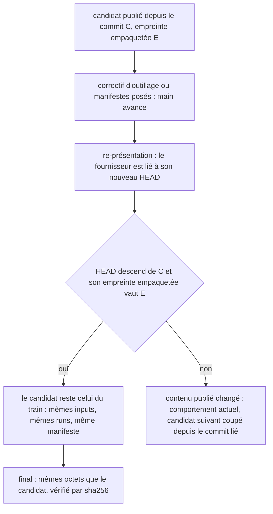
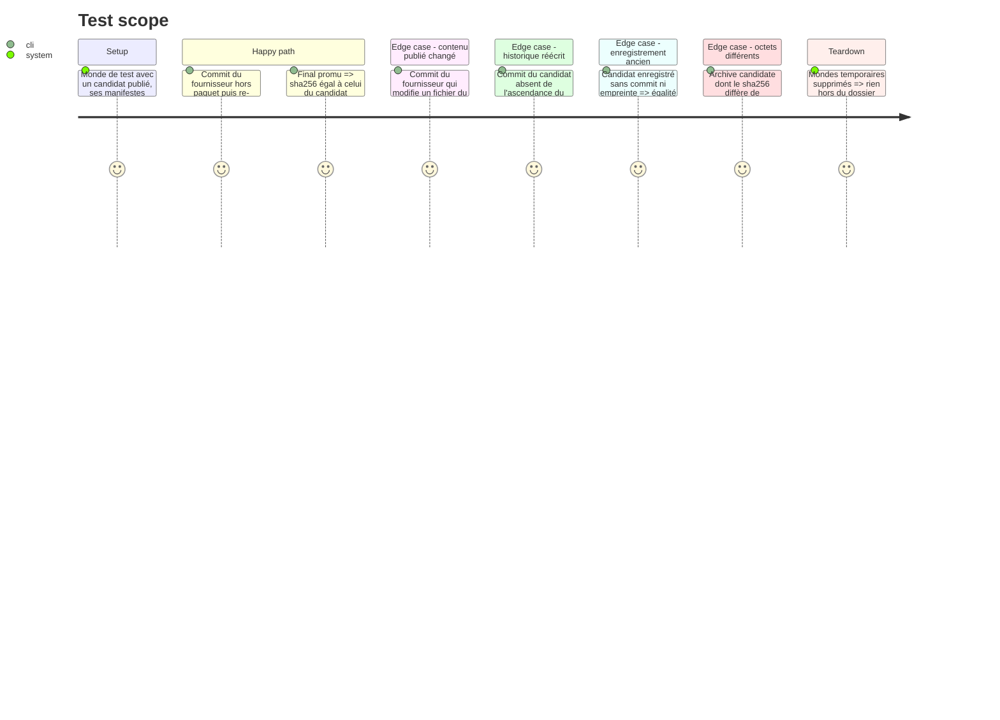

# Instruction: Candidat reconnu par ascendance et par contenu empaqueté

## Architecture projection

```txt
obsidian-handbook/
├── supervisor/
│   └── train.schema.json              ✏️ le candidat enregistré porte son commit et son empreinte empaquetée
├── tools/
│   ├── supervisor.harness.mts         ✏️ scénarios : runs et manifeste conservés après re-présentation, étapes inchangées si le contenu publié a changé
│   └── supervisor/
│       ├── candidateIdentity.mjs      ✅ règle « ce candidat est encore celui du train »
│       ├── adapters/common.mjs        ✏️ manifestProblem et candidateFields nomment le commit du candidat
│       └── adapters/pbta.mjs          ✏️ inputs des workflows, filtre des manifestes et reçu du digest sur le commit du candidat
└── doc/supervisor.fr.md               ✏️ ce qui identifie un candidat
```

`adapters/adrenaline.mjs` et `adapters/mist.mjs` ne comparent aucun commit de fournisseur (recherche faite) : ils ne sont pas modifiés.

## User Journey



## Test Scope



## Tasks to do

### `1)` Reproduire la perte

> Tenir par un scénario ce que la lecture du code annonce.

1. Écrire un scénario : candidat publié, manifestes posés, runs verts enregistrés, commit du fournisseur hors paquet, re-présentation, puis `publish`.
2. Constater les étapes que `publish` propose alors (redispatch du digest, du stage et du train, manifeste re-posé) et l'écrire dans le tableau Decisions du plan.
3. Garder ce scénario : il devient le cas nominal de la tâche 3, son attendu inversé.

### `2)` Enregistrer d'où vient le candidat

> Garder dans le train ce que l'égalité de commit portait implicitement.

1. À l'observation d'un candidat, enregistrer avec lui le commit dont il a été tiré et l'empreinte empaquetée du fournisseur à ce commit, lue dans l'entrée de présentation où la phase 2 l'écrit. Si la présentation en cours ne porte pas d'empreinte pour ce commit, ne rien enregistrer : la tâche 3 retombe alors sur l'égalité de commit. Ne rien enregistrer non plus pour un fournisseur dont la phase 2 a exclu un fichier de l'empreinte : cette empreinte ne voit pas tout le paquet, elle ne peut pas fonder une identité.
2. Déclarer ces deux champs, facultatifs, dans `supervisor/train.schema.json`.
3. Un candidat enregistré sans ces champs garde le comportement actuel : égalité avec le commit lié.

### `3)` Écrire et brancher la règle d'identité

> Remplacer une égalité de SHA par ce qu'elle voulait garantir.

1. Créer `tools/supervisor/candidateIdentity.mjs` : un candidat tiré du commit C avec l'empreinte E vaut pour un fournisseur lié au commit S si S est C, ou si S descend de C et que l'empreinte empaquetée à S vaut E. Sinon rendre la raison, commits ou empreintes à l'appui.
2. Dans `adapters/pbta.mjs`, quand la règle tient, passer le commit du candidat, et non le commit lié, aux inputs `digest`, `stage`, `train` et `promote`, au filtre des manifestes et au contrôle du reçu du digest.
3. Dans `manifestProblem` et `candidateFields` de `adapters/common.mjs`, nommer le commit du candidat.
4. Quand la règle ne tient pas, garder le comportement actuel sans le modifier : le commit lié fait foi, et le superviseur coupe le candidat suivant comme il le fait aujourd'hui. Afficher seulement la raison (commits ou empreintes) dans la description de l'étape.
5. Ne pas toucher à `settleCandidate`, au contrôle `final.sha256 === candidate.sha256`, ni aux workflows : `release.yml` extrait déjà le commit reçu et `release-train.yml` vérifie déjà une ascendance.

### `4)` Preuves et documentation

> Tenir la nouvelle définition par des scénarios.

1. Ajouter les scénarios du Test Scope ; conserver sans les assouplir les scénarios existants sur les octets du final.
2. Documenter dans `doc/supervisor.fr.md` ce qui identifie un candidat et ce qui en exige un nouveau.
3. Passer `rtk proxy pnpm build`, les deux portées de lint et `pnpm check`.

## Test acceptance criteria

| Task | Acceptance criteria |
| ---- | ------------------- |
| 1 | Le plan porte le constat du scénario de reproduction : la liste des étapes rejouées avant le changement. |
| 2 | Un enregistrement de train écrit avant cette phase se lit sans erreur et exige l'égalité de commit. |
| 3 | Après un commit du fournisseur hors paquet et une re-présentation, le faux `gh` ne reçoit aucun dispatch pour un run déjà vert et `origin/main` du fournisseur ne reçoit aucun manifeste. |
| 3 | Après un commit du fournisseur qui modifie un fichier du paquet, `publish` propose exactement les étapes qu'il proposait avant cette phase (scénario de la tâche 1 rejoué sur ce cas), et la description nomme les deux empreintes. |
| 3 | Un commit lié qui ne descend pas du commit du candidat donne les étapes d'avant cette phase, et la description nomme les deux commits. |
| 3 | Le scénario « un final dont les octets diffèrent du candidat arrête publish, en nommant les deux empreintes » passe inchangé. |
| 4 | `pnpm assert:supervisor` et `pnpm check` passent. |
