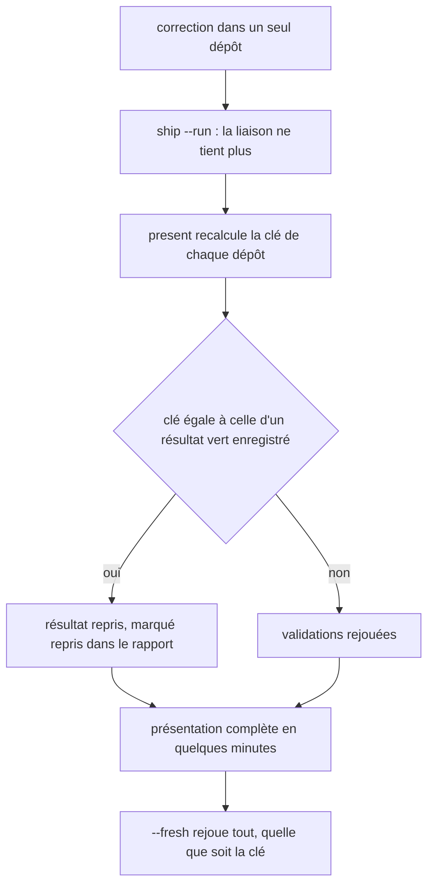
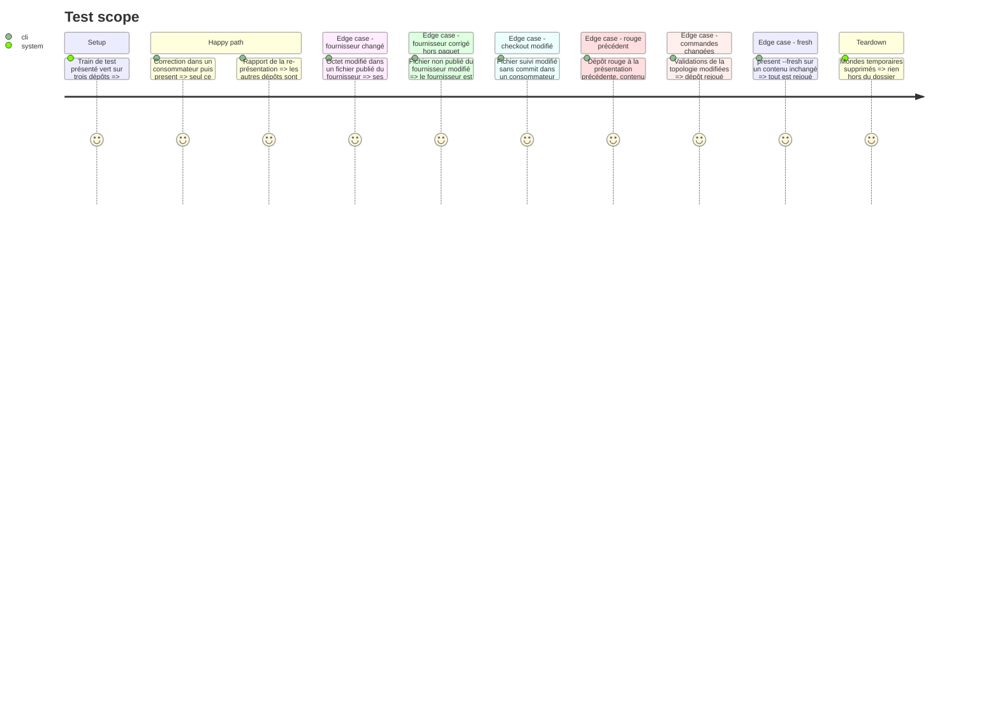

# Instruction: Re-présentation par contenu

## Architecture projection

```txt
obsidian-handbook/
├── supervisor/
│   └── train.schema.json              ✏️ champ evidence facultatif par dépôt présenté
├── tools/
│   ├── supervise.mjs                  ✏️ option --fresh de present et de ship
│   ├── supervisor.harness.mts         ✏️ scénarios : réutilisation, invalidation, --fresh
│   └── supervisor/
│       ├── evidence.mjs               ✅ clé de preuve d'un dépôt et décision de réutilisation
│       ├── present.mjs                ✏️ réutilise un vert dont la clé n'a pas changé, le dit dans le rapport
│       ├── presentCommands.mjs        ✏️ transmet --fresh
│       └── ship.mjs                   ✏️ transmet --fresh
├── doc/supervisor.fr.md               ✏️ ce qui est rejoué, ce qui est repris
└── CLAUDE.md                          ✏️ --fresh rejoue tout, en une ligne

~/.claude/skills/ship-train/references/supervisor.md   ✏️ --fresh
```

## User Journey



## Test Scope



## Tasks to do

### `1)` Mesurer puis définir la clé de preuve

> Dire précisément sur quoi un résultat a été prouvé, après avoir vu ce qui est réellement rejoué.

1. Attendre un train réel livré après les phases 1 et 2. Dans son résumé des durées, relever pour chaque re-présentation ce que chaque dépôt inchangé a rejoué et pour quelle durée. Si ce train n'a connu aucune re-présentation, attendre le suivant. Le tampon `full` de `check.mjs` reprend déjà un `pnpm check` de Handbook sur contenu identique ; la clé de preuve vise ce que ce tampon ne couvre pas : les autres dépôts, les builds, et un fournisseur lié changé. Écrire le relevé dans le tableau Decisions du plan.
2. Si le relevé montre que moins d'un dixième de la durée d'une re-présentation serait repris, arrêter la phase ici et la marquer sans objet. La phase 7 ne dépend pas de celle-ci et se fait sans l'attendre.
3. Créer `tools/supervisor/evidence.mjs` : la clé d'un dépôt est le `sha256` d'une forme canonique de son arbre git au commit présenté, de l'empreinte empaquetée de chaque fournisseur lié (phase 2), de ses commandes de validation et de la version de Node. Un dépôt lié à un fournisseur dont la phase 2 a exclu un fichier de l'empreinte n'a pas de clé : il est toujours rejoué.
4. Réutiliser la forme canonique de `digest.mjs` plutôt que d'en écrire une seconde.
5. Ne pas faire entrer l'heure, le SHA du commit ni l'identifiant du train dans la clé.
6. Laisser le tampon `full` de `check.mjs` en place : il sert les passages à la main, la clé de preuve sert la présentation.

### `2)` Enregistrer et reprendre

> Ne rejouer que ce qui a changé.

1. Enregistrer la clé et la date de preuve dans l'entrée de chaque dépôt de la présentation, quand toutes ses validations sont vertes.
2. Dans `presentTrain`, avant de lancer les validations d'un dépôt, comparer sa clé à celle de la présentation précédente ; si elles sont égales et que le résultat était vert, reprendre ce résultat en le marquant repris.
3. Ne jamais reprendre un résultat rouge, ni un résultat dont une validation est « non lancée ».
4. Ne reprendre que sur un checkout propre : un fichier suivi modifié ou un fichier non suivi et non ignoré fait rejouer le dépôt.
5. Laisser `computeDigest` et `bindingProblems` inchangés : la liaison reste par commit, seule la durée de `present` change.
6. Ne pas étendre la reprise à l'adoption validée ni à la convergence : la première est commitée dès qu'elle est verte, la seconde relève des invariants de publication.

### `3)` Rendre la reprise visible et annulable

> Qu'une reprise ne passe jamais pour une exécution.

1. Dans le rapport, afficher pour chaque validation reprise « repris » avec la date de la preuve d'origine, à la place de « passed ».
2. Ajouter `--fresh` à `present` et à `ship` : toute clé est ignorée.
3. Déclarer le champ, facultatif, dans `supervisor/train.schema.json`, et vérifier qu'un enregistrement sans clé se lit toujours et rejoue tout.

### `4)` Preuves et documentation

> Tenir par scénarios ce qui invalide une preuve.

1. Ajouter les scénarios du Test Scope au harnais du superviseur.
2. Documenter dans `doc/supervisor.fr.md` la composition de la clé, ce qui invalide une preuve, et `--fresh` ; ajouter `--fresh` à `references/supervisor.md` de la skill `ship-train` et, en une ligne, à `CLAUDE.md`.
3. Passer `rtk proxy pnpm build`, les deux portées de lint et `pnpm check`.

## Relevé de la tâche 1 (2026-10-08) : phase en attente

Source : `urban-shadows-2e-contract.durations.jsonl`, train Urban Shadows 2E livré le 2026-10-08. **Ce train a tourné avec le superviseur de la phase 1 seule** (worktree arrêté avant la phase 2) : son enregistrement ne porte ni `packed` ni `linkedProviders`, et aucune étape de build ou d'empaquetage du fournisseur n'y est mesurée. La condition « un train réel livré après les phases 1 et 2 » n'est donc pas remplie ; les tâches 3 et suivantes ne sont pas commencées.

| Présentation (UTC) | Ce qui avait changé | schema-pbta | lantern | Handbook | Étape | Aurait été repris |
| --- | --- | --- | --- | --- | --- | --- |
| 06:18, rouge | train commité dans Handbook | `npm run check` 82,7 s | 7 validations, 35,6 s | `pnpm check` rouge en 40,0 s | 176,9 s | rien : la présentation d'avant, interrompue, n'a rien enregistré |
| 06:22, verte | aucun commit, dans aucun dépôt | 63,8 s | 28,1 s | 828,2 s, rejoué de droit (rouge juste avant) | 936,8 s | 91,9 s, soit 9,8 % |
| 06:46, verte | un commit de `schema-pbta`, deux workflows hors paquet | 61,5 s, rejoué de droit (arbre changé) | 24,7 s | 0,7 s (tampon `full`) | 102,9 s | 24,7 s, soit 24 %, si l'empreinte empaquetée n'a pas bougé (non mesurée par ce train) |

Lecture : sur ce train, la reprise aurait épargné environ deux minutes sur un cycle de trente-cinq. Le poste lourd, `pnpm check` de Handbook, est soit rejoué de droit, soit déjà repris par le tampon `full`. Une des deux re-présentations passe le seuil du dixième, l'autre le manque de peu : le relevé ne tranche pas, et il lui manque ce que la phase 2 a ajouté (build et empaquetage du fournisseur, validations contre l'archive liée). À refaire sur le premier train mené par le superviseur d'après la phase 2.

## Test acceptance criteria

| Task | Acceptance criteria |
| ---- | ------------------- |
| 1 | Le plan porte le relevé : par dépôt, ce qu'une re-présentation rejoue aujourd'hui et sa durée. |
| 1 | Deux calculs de la clé sur le même contenu donnent la même valeur, sur deux commits différents portant le même arbre comme sur deux trains différents. |
| 2 | Après une correction dans un seul consommateur, la re-présentation ne lance que les validations de ce consommateur ; le faux lanceur le compte. |
| 2 | Un dépôt rouge à la présentation précédente est rejoué même si son contenu n'a pas changé. |
| 2 | Un octet modifié dans un fichier publié d'un fournisseur fait rejouer chacun de ses consommateurs. |
| 2 | Un fichier non publié d'un fournisseur modifié rejoue ce fournisseur et reprend ses consommateurs : c'est le cas qui a coûté trois présentations entières au dernier train. |
| 2 | Un fichier suivi modifié sans commit fait rejouer son dépôt. |
| 3 | Le rapport distingue « repris » de « passed » et donne la date de la preuve d'origine. |
| 3 | `present --fresh` rejoue chaque validation de chaque dépôt. |
| 3 | Un enregistrement de train écrit avant cette phase se lit et se présente sans erreur. |
| 4 | `pnpm assert:supervisor` et `pnpm check` passent. |
