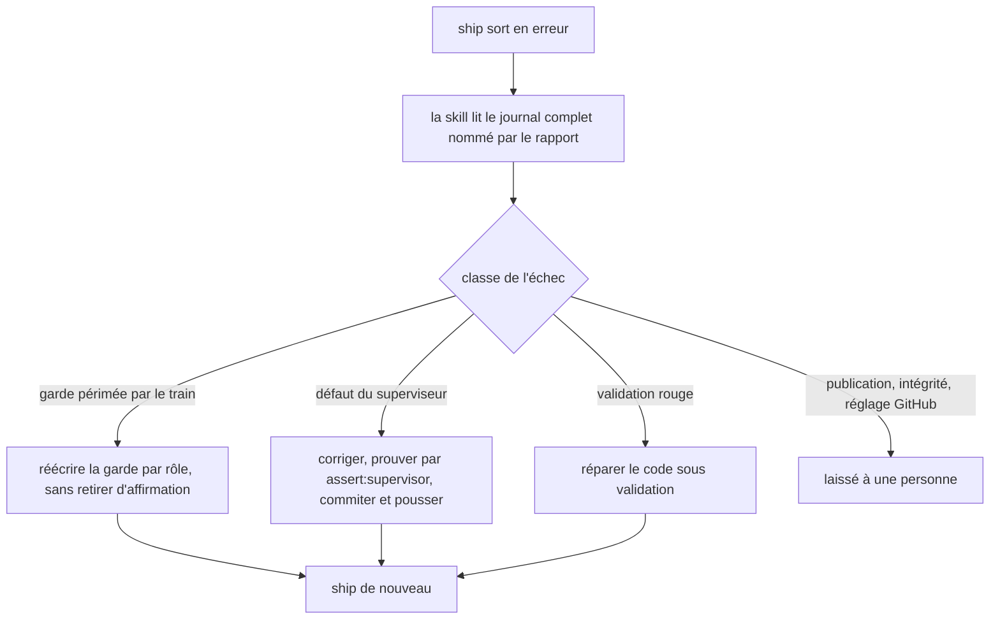
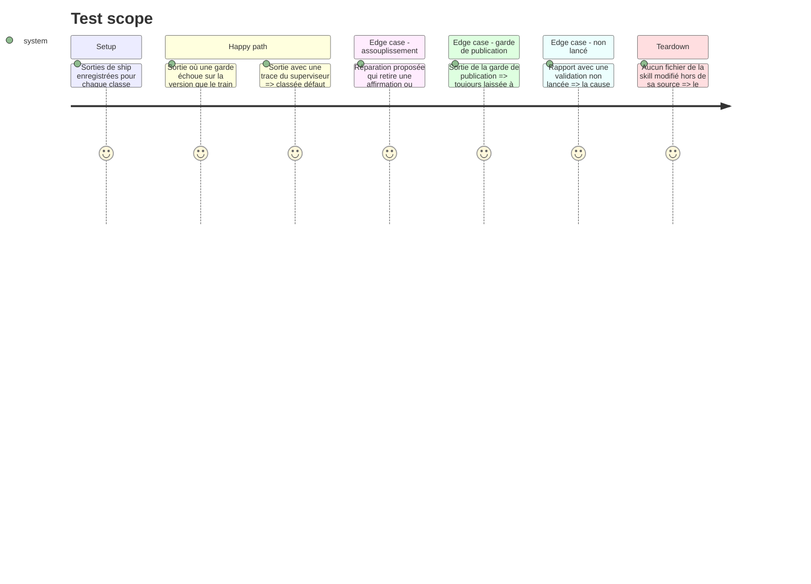

# Instruction: Skill ship-train, documentation et mémoire alignées

## Architecture projection

```txt
~/.claude/skills/ship-train/
├── SKILL.md                           ✏️ règle transversale sur la lecture du journal complet
├── actions/
│   ├── 05-ship.md                     ✏️ lit les durées et le chemin du journal
│   └── 06-repair.md                   ✏️ réparation d'une garde périmée, réparation du superviseur
├── references/
│   ├── failures.md                    ✏️ classes « garde périmée par le train », « non lancé », défaut du superviseur réparable
│   ├── bounds.md                      ✏️ chemins hors de portée réduits à ce qui l'est vraiment
│   └── supervisor.md                  ✏️ journaux, résumé des durées
└── evals/                             ✏️ cas pour chaque nouvelle classe

obsidian-handbook/
├── tools/supervisor/self.mjs          ✏️ message du refus : ne nomme plus « une personne »
├── tools/supervisor.harness.mts       ✏️ scénario du refus aligné sur le message
├── CLAUDE.md                          ✏️ règles d'action nouvelles, en une ligne chacune
├── doc/supervisor.fr.md               ✏️ relecture d'ensemble après les phases 1 à 5
└── aidd_docs/memory/internal/
    ├── ci-and-release.md              ✏️ ce qui est répété en local, ce qui reste en CI
    └── supervisor-windows.md          ✏️ emplacement des journaux
```

## User Journey



## Test Scope



## Tasks to do

### `1)` Classer les nouveaux signaux

> Que la skill sache nommer ce que le superviseur dit désormais.

1. Ajouter à `references/failures.md` la classe « garde périmée par le train » : une validation qui échoue sur une valeur que le train lui-même déplace (version, épingle, tag, URL d'archive). Suite : technique.
2. Ajouter la ligne « validation non lancée » : traiter d'abord l'échec en amont qu'elle nomme.
3. Remplacer les lignes « défaut du superviseur → personne » et « changement du superviseur → personne » par une suite technique : corriger, prouver par `pnpm assert:supervisor`, commiter et pousser sur `origin/main`, puis relancer. Le refus de `self.mjs` reste le signal que ce push manque.
4. Reformuler le message de `self.mjs` : le code du superviseur doit être commité et poussé avant de tourner, sans dire par qui ; le refus lui-même et son scénario de harnais sont conservés.
5. Mettre à jour la ligne « épingle dépassée » : `present` mesure désormais contre le paquet empaqueté.
6. Garder l'ordre « la première ligne qui correspond l'emporte », les lignes de publication et d'intégrité en tête.

### `2)` Resserrer les bornes sur ce qui compte

> Autoriser la réparation utile sans ouvrir la triche.

1. Dans `references/bounds.md`, retirer de « hors de portée » le code du superviseur, ses harnais et ses fixtures.
2. Remplacer « une commande de validation et le script derrière elle » par une borne sur le geste : dans un tel script, seul le remplacement d'un littéral par la lecture de la source qui le déclare est permis.
3. Écrire ce qui reste interdit dans ces scripts : retirer une affirmation, changer un comparateur, changer un seuil ou un compteur, élargir un motif d'acceptation.
4. Garder hors de portée : `.github/workflows/`, la garde de publication, les tags et releases publiés, les réglages GitHub, le `data.json` d'un coffre, les enregistrements de train.
5. Laisser les limites de boucle inchangées.

### `3)` Adapter les actions

> Que la réparation suive les nouvelles classes.

1. Dans `actions/05-ship.md`, lire le chemin du journal complet et les durées dans la sortie plutôt que la fin de sortie.
2. Dans `actions/06-repair.md`, décrire la réparation d'une garde périmée et celle du superviseur, avec la preuve exigée pour chacune, et imposer que le diff d'une garde figure dans le rapport final.
3. Dans `references/supervisor.md`, ajouter l'emplacement des journaux et du résumé des durées.
4. Ajouter un cas d'évaluation par nouvelle classe, dont un cas de refus d'assouplissement.

### `4)` Documentation et mémoire du dépôt

> Laisser les règles d'action là où la prochaine session les lit.

1. Relire `doc/supervisor.fr.md` d'un bout à l'autre et supprimer ce que les phases livrées ont rendu faux. Cette phase se fait après les phases 1 à 5 ; elle n'attend pas la phase 6, qui met à jour elle-même la documentation et la skill si elle livre.
2. Ajouter à `CLAUDE.md` les règles d'action nouvelles, une ligne chacune : une garde affirme un rôle ; un échec se lit dans le journal complet.
3. Mettre à jour `ci-and-release.md` et `supervisor-windows.md`.
4. Passer `rtk proxy pnpm build`, les deux portées de lint et `pnpm check`.

### `5)` Mesurer sur un vrai train

> Vérifier que l'objectif du plan est tenu. Cette tâche attend un train réel : les tâches 1 à 4 se terminent sans elle, et le plan ne passe à terminé qu'après elle.

1. Au premier train livré après ces phases, relever le nombre de cycles `ship` et la durée de chacun dans le résumé des durées du train (phase 1).
2. Comparer au dernier train PbtA et écrire le résultat dans le tableau Decisions du plan.
3. Si un cycle a encore été perdu, nommer sa cause et l'ouvrir comme constat, sans rouvrir ce plan.

## Test acceptance criteria

| Task | Acceptance criteria |
| ---- | ------------------- |
| 1 | Une sortie où une garde échoue sur la version déplacée par le train est classée « garde périmée » et non « validation rouge ». |
| 1 | Une sortie de la garde de publication reste classée « laissé à une personne ». |
| 1 | Le message du refus de `self.mjs` ne nomme plus de personne ; le scénario « code du superviseur non publié » échoue toujours `ship`. |
| 2 | Une réparation qui retire une affirmation, change un comparateur ou un seuil est refusée par la skill sur le cas d'évaluation correspondant. |
| 2 | `bounds.md` ne nomme plus le code du superviseur parmi les chemins hors de portée, et nomme toujours les workflows et la garde de publication. |
| 3 | Chaque nouvelle classe a un cas d'évaluation, et tous les cas passent. |
| 4 | `doc/supervisor.fr.md` ne décrit aucun comportement que le code n'a plus ; `pnpm check` passe. |
| 5 | Le plan porte le nombre de cycles et leurs durées pour le train de mesure, face à ceux du dernier train PbtA. |
