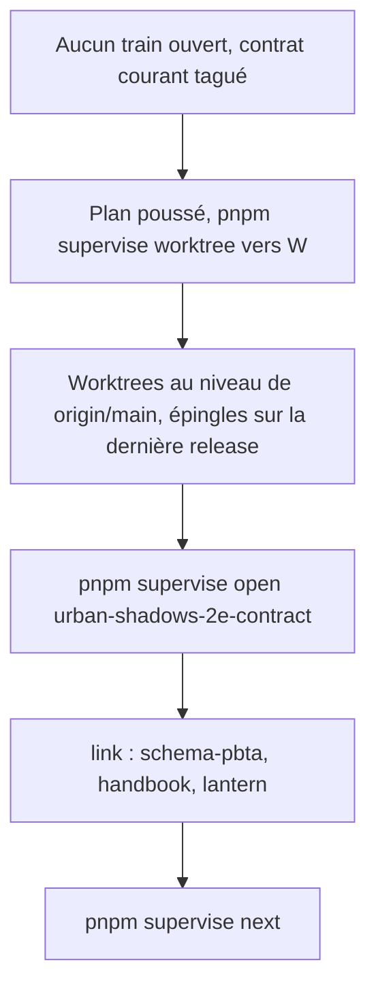
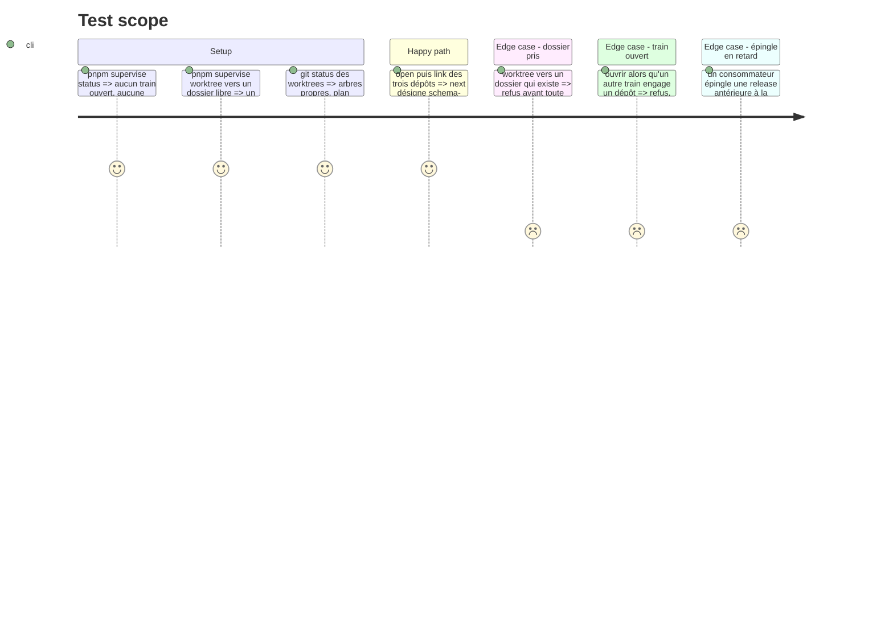

# Instruction: Ouvrir le train du contrat

> Exécution dans les worktrees du superviseur (`plan.md`, ligne Exécution) : chemins sous `<W>/<dépôt>`, commandes `pnpm supervise` lancées depuis `<W>/obsidian-handbook` avec `--root <W>`.

Premier des deux trains : `urban-shadows-2e-contract` publie la majeure suivante de `schema-pbta`, l'apparence du pack, et livre dans Handbook les sections et les callouts de pack. Le second (`urban-shadows-2e`, Handbook seul, #89) s'ouvre en fin de phase 6. Rien ne démarre tant qu'un autre train engage ces dépôts. Les versions se lisent au moment d'exécuter.

## Architecture projection

> Tree of the final files. ✅ create · ✏️ modify · ❌ delete

```txt
obsidian-handbook/
└── supervisor/trains/urban-shadows-2e-contract.json   ✅ écrit par `open` puis `link`, jamais à la main
```

## User Journey



## Test Scope



## Tasks to do

### `1)` Vérifier les préalables

> Photo du 2026-10-07, à remesurer : le train `pbta-light-only-monsterhearts` est `open` et engage les trois dépôts ; `main` de `schema-pbta` porte un contrat non tagué ; Handbook et Lantern épinglent la release précédente ; le checkout habituel de Handbook est en retard sur `origin/main` et porte des changements non commités ; `../train` existe déjà.

1. Tout train ouvert qui engage `schema-pbta`, `obsidian-handbook` ou `lantern` est clos par son propre `ship` : geste de ce train-là, hors de ce plan ; ne pas le forcer d'ici. Si c'est le train de #87 qui est ouvert, attendre sa clôture
2. Les fichiers de ce plan (`aidd_docs/tasks/2026_10/2026_10_07_urban-shadows-2e-integration/`) sont commités **et poussés** sur `origin/main` à la demande de l'utilisateur, avant la création des worktrees : un worktree part de `origin/main`
3. Choisir `<W>` : un dossier qui n'existe pas, à côté des dépôts
4. Depuis le checkout habituel de Handbook : `pnpm supervise worktree <W>`. Si la commande refuse parce que le code du superviseur de ce checkout diffère de `origin/main`, le mettre à jour est un geste de l'utilisateur
5. `<W>/schema-pbta` : le tag `v<version de package.json>` existe (`git tag --list`) : le contrat courant, noté v\<N>, est publié
6. `pnpm supervise status --strict --root <W>` ne signale aucun train ouvert, aucune épingle divergente ni sur une candidate ; l'épingle de `schema-pbta` vise l'archive de sa dernière release
7. Relever trois faits qui conditionnent la suite, dans `<W>` :
   - `schema-pbta` v\<N> exporte-t-il `PBTA_PACK_CALLOUTS` ? Si non, la phase 5 passe dans le second train
   - `nativeCallouts.ts` lit-il déjà `PBTA_PACK_CALLOUTS` ? Si oui, la phase 5 se réduit à sa vérification
   - `presentation` de `src/pack-manifest.ts` est-il déjà une liste ? Si oui, la tâche correspondante de la phase 4 se réduit à y ajouter une entrée

### `2)` Ouvrir et lier

> Action `board` du skill `ship-train`, dont ce plan est le routage ; les commandes ci-dessous en sont la forme pour ce train, `--root <W>` en plus. Une issue par dépôt, la coordination vit dans Handbook. #89 reste pour le second train : une issue ne sert qu'un train.

1. `pnpm supervise open urban-shadows-2e-contract --title "Urban Shadows 2E : contrat, apparence, sections et callouts" --root <W>`
2. `pnpm supervise link schema-pbta --create --title "Urban Shadows 2E : livret aligné sur les feuilles, présentation, callouts et apparence du pack" --yes --root <W>` (`--create` n'accepte pas `--depends-on`)
3. `pnpm supervise link obsidian-handbook --create --title "Section d'un pack à une seule polarité et callouts publiés par les packs" --yes --root <W>`, puis `pnpm supervise link obsidian-handbook#<n> --depends-on schema-pbta --root <W>`
4. `pnpm supervise link lantern --create --title "Adopter le contrat Urban Shadows 2E de schema-pbta" --yes --root <W>`, puis `pnpm supervise link lantern#<n> --depends-on schema-pbta --root <W>`
5. `pnpm supervise sync --root <W>`, puis `pnpm supervise next --root <W>`

## Test acceptance criteria

| Task | Acceptance criteria |
| ---- | ------------------- |
| 1 | Les worktrees existent sous `<W>`, détachés sur `origin/main`, propres, et contiennent ce plan ; `git worktree list` ne montre aucune branche neuve ; `status --strict` sort sans écart et ne liste aucun train ouvert ; Handbook et Lantern épinglent la dernière release de `schema-pbta` ; les trois faits de l'étape 7 sont relevés et notés dans le tableau Decisions de `plan.md` s'ils changent le découpage |
| 2 | Le fichier de train existe ; `next` désigne l'élément `schema-pbta` ; Handbook et Lantern en dépendent ; #89 n'est liée à aucun train |
