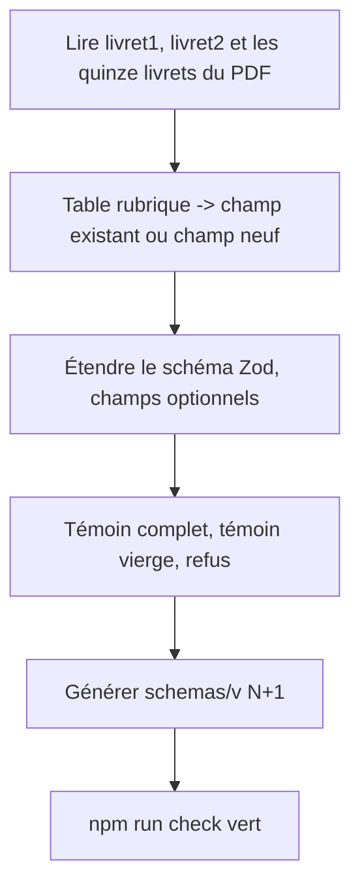
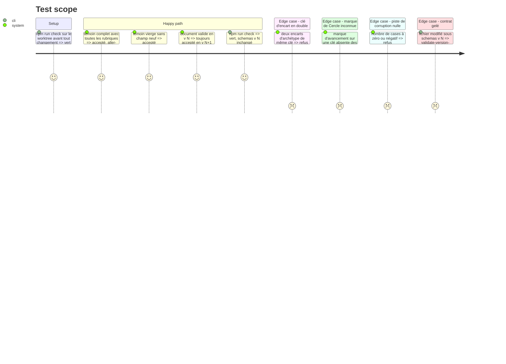

# Instruction: schema-pbta — majeure suivante du contrat, livret `urban-shadows-playbook`

> Exécution dans les worktrees du superviseur (`plan.md`, ligne Exécution) : chemins sous `<W>/<dépôt>`. `schema-pbta` utilise **npm** (`npm.cmd run check`).

Aligner `urban-shadows-playbook` sur les deux faces du livret imprimé. Le livret est vierge : le schéma porte le gabarit et les options, aucun état. Tout champ neuf est optionnel. Rien n'est commité ici : le commit part avec le `ship` de la phase 6.

## Architecture projection

> Tree of the final files. ✅ create · ✏️ modify · ❌ delete

```txt
schema-pbta/
├── src/contract-version.ts                                    ✏️ majeure suivante, tag de schéma assorti
├── src/zod/<fichier de urban-shadows-playbook>                ✏️ champs du livret
├── tools/validate-references.ts                               ✏️ règles inter-champs (clés uniques, clés de Cercle connues)
├── schemas/v<N+1>/                                            ✅ généré puis commité ; schemas/v<N> intact
├── corpus/contract/valid/urban-shadows-playbook-complete.toml ✏️ toutes les rubriques des deux faces
├── corpus/contract/valid/urban-shadows-playbook-blank.toml    ✅ document minimal, sans aucun champ neuf
├── corpus/contract/invalid/urban-shadows-playbook-*.toml      ✅ un refus par règle neuve
├── package.json                                               ✏️ `files` et `exports` gagnent `schemas/v<N+1>` (chaque dossier y est listé un à un)
├── package.json, package-lock.json                            ✏️ version du contrat, par `npm version` (un fournisseur est hors de `prepare`)
└── CHANGELOG.md                                               ✏️ section de la majeure
```

## User Journey



## Test Scope



## Tasks to do

### `1)` Table des rubriques

> Les captures font foi pour The Aware ; le PDF pour les quatorze autres. Une rubrique déjà portée par `moves`, `creation` ou `editorial` n'est pas dupliquée.

1. Ouvrir `Perso/RPG/urban-shadows/_sources/Design/livret1.png` et `livret2.png`, puis feuilleter `_sources/US-Playbooks-web20241126.pdf` : relever chaque rubrique, sa face, et ce qui varie d'un archétype à l'autre
2. Pour chaque rubrique, chercher le champ dans `src/zod/` et dans `corpus/contract/valid/urban-shadows-playbook-complete.toml`. Lu le 2026-10-07 : `statuses`, `mortalRelationships`, `harm`, `scars`, `corruption` (`trigger`, `advances`, `moves`), `endMove`, `editorial`, `creation` existent
3. Rubriques sans champ au 2026-10-07, à confirmer par l'étape 2 : marques de Cercle de l'avancement, seconde liste d'avancées, capacités « Let it out », intimité, dettes de départ, cadre propre à l'archétype, nombre de cases de la piste de corruption, listes de noms / d'attitudes / d'apparences si `creation` ne les porte pas
4. Consigner la table « rubrique → face → champ » dans la description de l'issue `schema-pbta` du train

### `2)` Étendre le schéma

> Règles du dépôt : `z.strictObject`, `.optional()`, pas de `.refine()` dans `src/zod`, une `description` par propriété, règles inter-champs dans `tools/validate-references.ts`.

1. `src/contract-version.ts` : majeure suivante et tag de schéma assorti
2. Champs neufs, tous optionnels ; les noms suivent les conventions voisines de `src/zod` (un champ de même rôle existant dans un autre playbook spécialisé se réutilise tel quel) :
   - avancement : marques de Cercle (liste de clés de `stats`), seconde liste d'avancées distincte de la première
   - `letItOut` : liste de capacités (texte)
   - `intimacy` : texte du mouvement d'intimité
   - `debts` : dettes de départ (lignes de texte)
   - `extras` : encarts titrés propres à l'archétype (`key`, `label`, `text` optionnel, `items` optionnel) ; un encart qui s'avère un mouvement à l'étape 1 va dans `moves`, pas ici
   - `corruption.track` : nombre de cases, entier strictement positif
3. Aucun champ d'état (case cochée, valeur choisie) : le livret est vierge
4. `PBTA_COLLECTION_ITEM_EDITORS` ne gagne aucune valeur ; une collection neuve prend un éditeur existant (`pbta-text`, `pbta-advancement`), sinon Lantern ne compile plus
5. `tools/validate-references.ts` : clés d'`extras` uniques ; chaque marque de Cercle est une clé de `stats`

### `3)` Témoins et refus

> Les deux moitiés sont nécessaires. Aucun texte du livre : libellés et phrases inventés.

1. `urban-shadows-playbook-complete.toml` : chaque rubrique de la table a une valeur
2. `urban-shadows-playbook-blank.toml` : le document minimal accepté en v\<N>, inchangé, pour prouver que rien de neuf n'est requis
3. Un refus par règle neuve (`corruption.track` nul, clé d'encart en double, marque de Cercle inconnue, champ inconnu sous `extras`)
4. Générer `schemas/v<N+1>/` et le commiter avec le reste ; `schemas/v<N>/` ne bouge pas. Lu le 2026-10-07 : `package.json` liste chaque dossier `schemas/v*` dans `files` et dans `exports` ; y ajouter le neuf, sinon le tarball part sans lui
5. `npm.cmd run check` vert
6. Mesure anticipée, pour ne pas découvrir en phase 6 un type qui casse un consommateur : `npm.cmd pack --pack-destination <dossier temporaire hors dépôt>`, épingle locale dans `<W>/lantern` et `<W>/obsidian-handbook`, compilation seule (`npm run build` ; `rtk proxy pnpm build`), puis restauration de `package.json` et des lockfiles à leur état commité et installation gelée. L'épingle locale ne se commite jamais ; un échec de compilation se corrige ici, dans le schéma

## Test acceptance criteria

| Task | Acceptance criteria |
| ---- | ------------------- |
| 1 | La table couvre toutes les rubriques des deux captures ; chaque ligne nomme un champ existant ou un champ neuf ; aucune rubrique n'est portée deux fois ; la forme d'`extras` a été confrontée aux quinze livrets du PDF |
| 2 | `PBTA_CONTRACT_VERSION` vaut v\<N+1> ; tout champ neuf est optionnel et décrit ; aucun `.refine()` ajouté dans `src/zod` ; `PBTA_COLLECTION_ITEM_EDITORS` est inchangé ; aucun champ d'état |
| 3 | Le témoin complet et le témoin vierge passent, chaque refus échoue pour sa raison nommée ; `git diff --stat` ne touche pas `schemas/v<N>/` ; `npm.cmd pack --dry-run` liste `schemas/v<N+1>/` ; `npm.cmd run check` vert ; Lantern et Handbook compilent contre le tarball local, puis leur `git status` ne montre ni `package.json` ni lockfile modifié ; l'arbre de `schema-pbta` porte les changements, non commités |
