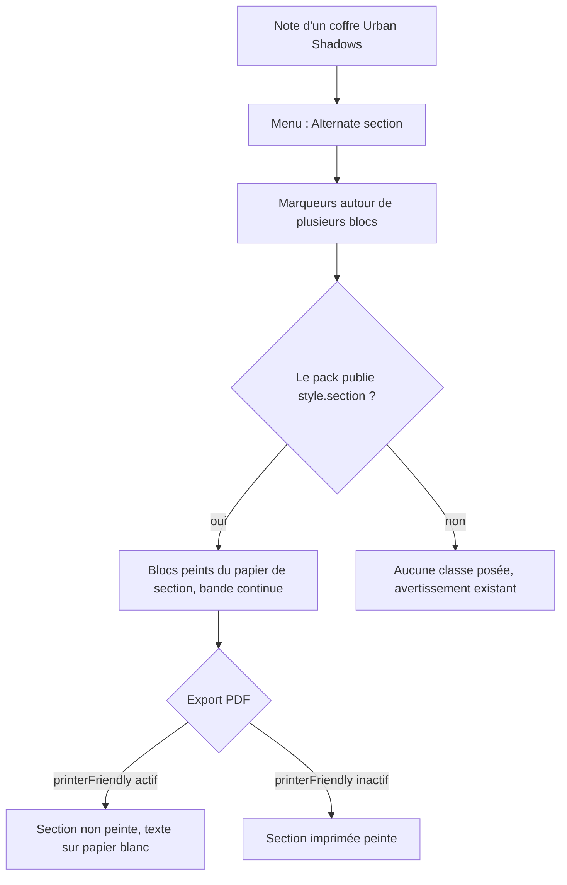

# Instruction: Handbook — section d'un pack à une seule polarité

> Exécution dans les worktrees du superviseur (`plan.md`, ligne Exécution) : chemins sous `<W>/obsidian-handbook`.

Un pack qui ne déclare que `light` peut publier l'apparence d'une section dans ce thème unique. Le marqueur est celui qui existe : `<!-- handbook-mode: alternate -->` … `<!-- /handbook-mode -->`. Cette phase n'importe rien de `schema-pbta` : elle est verte sur v\<N> comme sur v\<N+1> et part avec le premier train. Aucun identifiant de pack n'est écrit dans Handbook. Rien n'est commité ici.

## Architecture projection

> Tree of the final files. ✅ create · ✏️ modify · ❌ delete

```txt
obsidian-handbook/
├── schemas/appearance/game-pack.schema.json          ✏️ `style.section` (jetons `note`)
├── src/games/types.ts                                ✏️ couche `section` de `GameStyleValues`
├── src/games/fromSchema.ts                           ✏️ `STYLE_FIELDS` et lecture de la couche
├── src/games/overrides.ts                            ✏️ la couche se surcharge comme les autres
├── src/features/modes/styleElement.ts                ✏️ bloc de section pour un pack à une polarité
├── src/features/modeSections/postProcessor.ts        ✏️ `alternate` offert si le jeu publie une section
├── src/features/modeSections/insertion.ts            ✏️ menu proposé dans le même cas
├── src/BrumesPlugin.ts                               ✏️ expose « le jeu actif publie une section »
├── src/styles/_mode-sections.scss                    ✏️ seulement si la bande ne tient pas telle quelle
├── tools/modeSections.harness.mts                    ✏️ cas du pack à une polarité (`assert:mode-sections`)
├── tools/assertStyleScope.harness.mts                ✏️ section hors papier à l'impression (`assert:style-scope`)
├── tools/customPacks.harness.mts                     ✏️ tolérance d'un lecteur ancien, puis lecture de la couche (`assert:custom-packs`)
├── tools/gamePackContract.harness.mts                ✏️ schéma étendu (`assert:game-pack-contract`)
├── corpus/temoins/, corpus/refus/                    ✏️ un pack témoin avec section, un refus pour le jeton mal nommé
├── doc/ (page des sections de mode)                  ✏️ une section sans seconde polarité
└── aidd_docs/memory/internal/decisions/single-polarity-pack-publishes-a-section.md  ✅ ADR
```

## User Journey



## Test Scope

```mermaid
---
title: Test scope
---
journey
  section Setup
    pack témoin à une polarité déclarant style.section => chargé sans avertissement: 5: system
  section Happy path
    section alternate dans une note de ce pack => classe handbook-mode-alternate sur chaque bloc: 5: system
    style généré => un bloc de section sous le sélecteur du jeu, jetons de la couche: 5: system
    section dans une note en trois colonnes => bande continue d'une colonne à l'autre: 5: browser
    callout posé dans la section => garde son propre fond, la bande continue autour: 5: browser
  section Edge case - pack sans section
    section alternate, pack à une polarité sans couche => aucune classe, avertissement inchangé: 1: system
  section Edge case - mode forcé
    section dark dans un pack à une polarité avec couche => refusée comme aujourd'hui: 1: system
  section Edge case - polarité ajoutée par surcharge
    pack à une polarité avec couche, seconde polarité dans overrides.json => alternate vaut l'autre polarité, couche ignorée avec avertissement: 1: system
  section Edge case - jeton invalide
    nom de jeton hors du motif dans style.section => jeton refusé à la lecture: 1: system
  section Edge case - lecteur ancien
    pack avec style.section lu par le lecteur d'avant ce changement => couche ignorée, pack accepté: 1: system
  section Edge case - impression
    export avec printerFriendly actif => aucune classe de section, aucun fond sombre hors de media screen: 1: system
    export avec printerFriendly inactif => section conservée: 1: system
  section Teardown
    pnpm check => vert, dump dom des corpus canoniques inchangé: 5: cli
```

## Wireframe

```txt
Note en trois colonnes, section ouverte au milieu de la deuxième

+----------------------+----------------------+----------------------+
| texte clair          | texte clair          |######################|
| texte clair          | texte clair          |## texte encre ######|
| texte clair          |<!-- alternate -->    |## blanche ##########|
| texte clair          |######################|## [ callout : son ]#|
| texte clair          |## SOUS-TITRE #######|## [ propre fond   ]#|
| texte clair          |## texte encre ######|## texte ###########|
| texte clair          |## blanche ##########|~~~ bord du pack ~~~~|
| texte clair          |######################|<!-- /alternate -->   |
| texte clair          |######################| texte clair          |
+----------------------+----------------------+----------------------+
  #  papier de section (couche style.section du pack), sans trou entre blocs
  ~  bord inférieur : feuille du pack, pas Handbook
  Export PDF, printerFriendly actif : aucune zone #, tout le texte en encre du thème
```

## Tasks to do

### `1)` Prouver la tolérance avant de changer le lecteur

> Le pack sera servi aux coffres avant la release de Handbook qui sait le lire : ce que fait le lecteur **actuel** d'un champ inconnu décide de l'ordre de livraison.

1. Dans `tools/customPacks.harness.mts`, avant toute modification de `fromSchema.ts` : un pack dont `style` porte une couche inconnue est accepté, la couche est ignorée, un avertissement est émis (`log.setLevel("warn")`)
2. Si le pack est refusé : arrêter, le noter dans le tableau Decisions de `plan.md` ; la couche de section n'entrera alors dans `handbook/urban-shadows/pack.json` qu'après la release de Handbook (phase 8), et la tâche 3.2 de la phase 4 est reportée d'autant
3. Garder ce cas dans le harnais sous une couche au nom volontairement inconnu : il protège la prochaine extension

### `2)` Contrat d'apparence et lecture

> `schemas/appearance/` appartient à Handbook. Format gelé : on ajoute, on ne renomme rien.

1. `game-pack.schema.json` : `style.section` optionnel, un seul emplacement `note` (une section vit dans la note, pas dans l'espace de travail), mêmes règles de jetons que les autres couches
2. `types.ts`, `fromSchema.ts` (`STYLE_FIELDS`, lecture par `readPackTokens`, donc motif `/^--[a-zA-Z0-9-]+$/` inchangé), `overrides.ts` (la couche se surcharge depuis `overrides.json`)
3. La règle se lit sur les polarités **effectives** (`plugin.effectivePolarities()`, surcharges de `overrides.json` comprises), pas sur le pack : dès qu'il y en a plus d'une, `alternate` reste l'autre polarité comme aujourd'hui et la couche de section est ignorée avec un avertissement. Aucun pack n'est refusé pour cela : un coffre qui ajoute une polarité par surcharge ne doit pas perdre son jeu
4. `assert:game-pack-contract` suit le schéma étendu

### `3)` Offrir et peindre la section

> Le mécanisme existant reste la seule voie : mêmes classes, même bande.

1. `isModeOffered` (`src/features/modeSections/parser.ts`) : `alternate` est offert si le jeu a plus d'une polarité effective **ou**, à une seule, publie une couche de section ; `dark` et `light` forcés gardent leur règle. `BrumesPlugin` expose l'information à côté de `effectivePolarities()`, calculée sur la même apparence résolue (variante et surcharges comprises)
2. `insertion.ts` : la commande et le menu « Alternate section » apparaissent dans les mêmes cas
3. `buildGameStyle` : pour un pack à une polarité avec couche, écrire un bloc de section sur `.brumes--<id> .handbook-mode-alternate` avec les jetons de la couche ; `--brumes-section-texture` et `--brumes-section-texture-size` restent les seuls points d'entrée d'une image (ADR existante)
4. Hors papier : le bloc s'écrit sous `@media screen` quand `printerFriendly` est actif, sans condition sinon, par le chemin `offPaper` existant
5. `_mode-sections.scss` : vérifier que `mode-section-band` et la règle des colonnes s'appliquent sans modification ; toute géométrie partagée passe par le `@mixin`, jamais par copie
6. Un callout dans la section : la section ne force ni son fond ni son encre ; c'est la feuille du pack qui l'habille (phase 4)

### `4)` Impression et preuves

> Exigence de l'issue : la section « saute » à l'export, prouvée par un `assert:*`.

1. `printProcessor.ts` : confirmer par lecture que, `printerFriendly` actif, aucune classe `handbook-mode-*` n'est posée à l'export ; sinon corriger
2. `tools/modeSections.harness.mts` : pack à une polarité avec couche (classes posées), sans couche (aucune classe), mode forcé (refusé), export `printerFriendly` actif (aucune classe) et inactif (classes conservées)
3. `tools/assertStyleScope.harness.mts` : dans le style généré pour ce pack, `printerFriendly` actif, aucune déclaration de la couche de section n'existe hors de `@media screen`
4. `pnpm dump:dom` : le DOM des corpus canoniques ne change pas
5. ADR `single-polarity-pack-publishes-a-section.md` ; page de doc des sections ; `game-packs.md` (une ligne sur la couche)
6. `rtk proxy pnpm build`, `./node_modules/.bin/eslint src --ext .ts`, `pnpm lint`, `pnpm check`

## Test acceptance criteria

| Task | Acceptance criteria |
| ---- | ------------------- |
| 1 | Le cas « couche inconnue » passe sur le lecteur d'avant le changement, ou le refus est consigné dans `plan.md` avec le report de livraison |
| 2 | Le pack témoin avec `style.section` est lu sans avertissement ; un jeton mal nommé est refusé ; à deux polarités effectives la couche est ignorée avec un avertissement et le pack reste chargé ; un `overrides.json` écrit avant ce changement est lu à l'identique |
| 3 | Sous le pack témoin, `alternate` pose `handbook-mode-alternate` et le menu le propose ; sans couche, rien ne change par rapport à aujourd'hui ; aucun identifiant de pack dans le diff de `src/` ; en trois colonnes, la bande est continue (constat au coffre, phase 6) |
| 4 | `assert:mode-sections`, `assert:style-scope`, `assert:custom-packs`, `assert:game-pack-contract` et `assert:print-page-breaks` verts ; `dump:dom` sans diff ; build et les deux portées de lint à zéro erreur ; l'arbre porte les changements, non commités |
