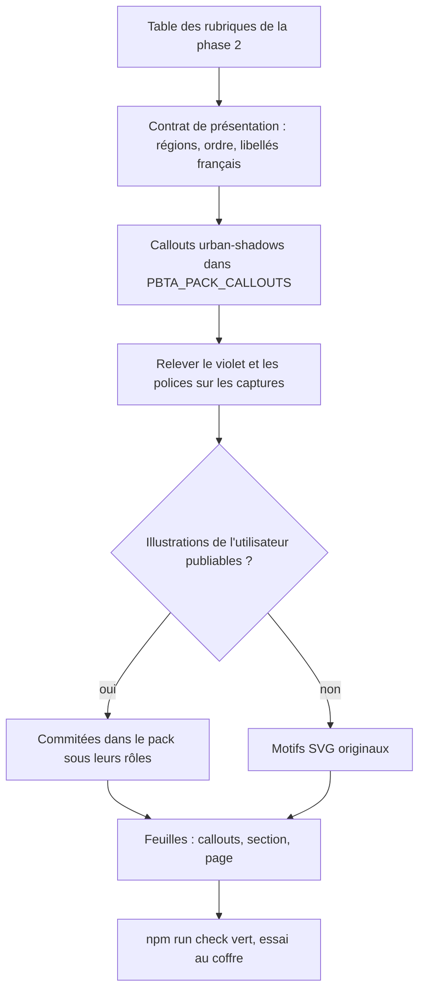
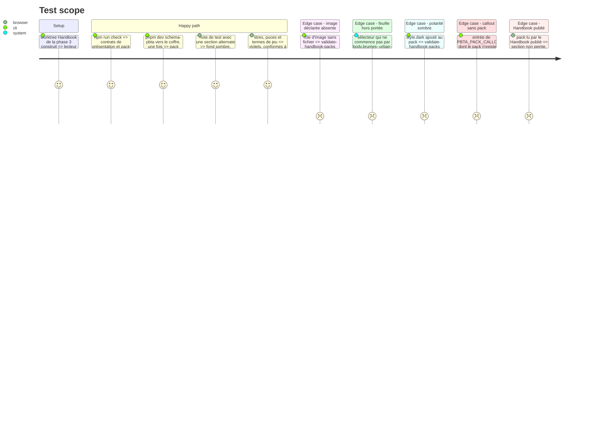

# Instruction: schema-pbta — présentation, callouts et apparence du pack

> Exécution dans les worktrees du superviseur (`plan.md`, ligne Exécution) : chemins sous `<W>/schema-pbta`. `schema-pbta` utilise **npm**.

Publier ce que Handbook rendra : le contrat de présentation du livret, les callouts `urban-shadows-*`, et l'apparence du pack (violet, polices, section sombre, style de page). `handbook/urban-shadows/` est hors tarball et servi aux coffres à la référence que suit leur source (par défaut la dernière release du schéma) : ne rien y exiger que le Handbook déjà publié ne sache faire. Rien n'est commité ici.

## Architecture projection

> Tree of the final files. ✅ create · ✏️ modify · ❌ delete

```txt
schema-pbta/
├── src/pack-manifest.ts                                  ✏️ `presentation` : une liste, une entrée par cible
├── src/presentation/callouts.ts                          ✏️ entrées `urban-shadows-*` de `PBTA_PACK_CALLOUTS`
├── src/presentation/urban-shadows-playbook.ts            ✅ source de la présentation + son schéma Zod, propre au pack
├── src/presentation/urban-shadows-appearance.ts          ✅ source de l'apparence, sur le modèle monsterhearts
├── src/presentation/index.ts                             ✏️ exports
├── tools/gen-presentation-contracts.ts                   ✏️ génère aussi les deux contrats Urban Shadows
├── packs/urban-shadows/presentation-contract.json        ✅ **généré**, jamais écrit à la main
├── packs/urban-shadows/appearance-contract.json          ✅ **généré**
├── packs/urban-shadows/pack-contract.json                ✏️ déclare présentation et apparence
├── tools/validate-presentation-contract.ts               ✏️ second pack
├── tools/validate-presentation-appearance.ts             ✏️ second pack
├── tools/validate-pack-manifest.ts, validate-package.ts  ✏️ `presentation` en liste ; fichiers neufs présents dans le tarball
├── tools/render-handbook-preview.ts                      ✏️ seulement s'il lit `presentation` du manifeste
├── tools/validate-handbook-packs.ts                      ✏️ admet `style.section` ; callouts requis par pack ; accroches et règles d'impression de `layout.css`
├── handbook/urban-shadows/pack.json                      ✏️ palette violette, police pinceau, couche de section, rôles d'image, feuilles
├── handbook/urban-shadows/assets/fonts/                  ✏️ WOFF2 de la police pinceau + son `OFL.txt`
├── handbook/urban-shadows/assets/images/                 ✅ motifs SVG originaux (fond et bord de section, coulures)
├── handbook/urban-shadows/assets/styles/callouts.css     ✏️ callouts `urban-shadows-*`
├── handbook/urban-shadows/assets/styles/section.css      ✅ habillage de la section sombre
├── handbook/urban-shadows/assets/styles/page.css         ✅ titres, filigrane, puces, termes de jeu
├── handbook/urban-shadows/assets/styles/layout.css       ✅ géométrie du livret (`plan.md`, Decisions)
├── handbook/urban-shadows/preview/, README.md            ✏️ aperçu et notice à jour
└── LICENSES/HANDBOOK-ASSETS.md                           ✏️ police et motifs ajoutés
```

## User Journey



## Test Scope



## Tasks to do

### `1)` Contrat de présentation du livret

> Chaque pack déclare son propre schéma Zod de présentation. Libellés français par défaut. Aucun texte du livre.

1. `src/pack-manifest.ts` : `presentation` devient une liste d'entrées `{ target, artifact, appearanceArtifact }` ; l'entrée monsterhearts est migrée ; si la phase 1 a constaté la liste déjà en place, n'ajouter que l'entrée Urban Shadows. Les outils qui lisent ce champ suivent (`validate-pack-manifest.ts`, `validate-package.ts`, `validate-handbook-packs.ts`, `render-handbook-preview.ts`). Constaté le 2026-10-07 : ni Handbook ni Lantern ne lisent ce champ, ils importent le JSON du contrat ; le changement de forme ne les touche donc pas
2. La source est du TypeScript, le JSON en sort : `src/presentation/urban-shadows-playbook.ts` reprend la forme de `monsterhearts-playbook.ts` (`regions` avec `id`, `label`, `group`, `primitive`, `fields` ; `rows` ; `canonicalOrder` ; `fallbacks` ; `pack`), une région par rubrique de la table de la phase 2, libellés français. Chaque pack déclare son propre schéma : `group` y est une énumération libre, celle d'Urban Shadows vaut la face (`recto`, `verso`) ; `rows` reprend la forme à trois colonnes. Aucune structure neuve tant que cela suffit. La région des caractéristiques et celle des Cercles nomment leurs clés de `stats`
3. Primitives : réutiliser celles de monsterhearts quand la forme est la même ; n'en déclarer une neuve (losange de caractéristique, rond de Cercle à trois pastilles, piste à cases) que si aucune ne convient
4. `src/presentation/urban-shadows-appearance.ts` ; `tools/gen-presentation-contracts.ts` génère les deux JSON sous `packs/urban-shadows/` ; `pack-contract.json` les déclare. Lu le 2026-10-07 : `package.json` publie déjà tout `packs/` (`files`) et l'exporte (`./packs/*`), rien à y ajouter ; `validate-package.ts` prouve que les deux fichiers sont dans le tarball
5. `tools/validate-presentation-contract.ts` et `validate-presentation-appearance.ts` couvrent le second pack ; les assertions propres à monsterhearts restent telles quelles, celles d'Urban Shadows comparent `canonicalOrder` aux régions et chaque `fields` au schéma, sans compte de régions recopié d'ailleurs que de la table de la phase 2

### `2)` Callouts du pack

> Une entrée = `{ pack, id, label, template, capability: "style:pbta" }`. Aucune capacité neuve.

1. `PBTA_PACK_CALLOUTS` gagne, pour `urban-shadows` : mouvement (`move`, `darksection`), choix à cases (`powerchoice`), aparté (`callout1`), encadré plein (`callout32`), panneau d'archétype (`dark-callout`), exemple de jeu (`exampleofplay`) ; ids préfixés `urban-shadows-`, libellés français
2. `tools/validate-handbook-packs.ts` : les callouts requis d'un pack sont les communs plus ceux que `PBTA_PACK_CALLOUTS` lui attribue
3. `assets/styles/callouts.css` : une règle par callout, d'après sa capture ; cases à cocher du choix à cases dessinées en CSS ; l'encadré plein lit le rôle d'image des coulures et garde un fond uni si la variable manque

### `3)` Apparence : palette, polices, section, page

> Les valeurs se relèvent sur les captures, elles ne s'inventent pas. Un thème de jeu fixe `--code-normal` et `--code-background`.

1. Relever le violet sur `titles.png`, `subtitles.png` et `callout32.png` ; remplacer `#591133` et `#7b244d` partout dans `pack.json` et les feuilles ; fixer `--code-normal` et `--code-background`
2. `pack.json` : couche `style.section.note` (`--background-primary` sombre, `--text-normal` clair, accents, liens, `--brumes-section-texture` si un motif de fond est publié) ; `polarities` reste `["light"]`, aucun `style.dark` ; `minimumHandbookVersion` inchangé ; `tools/validate-handbook-packs.ts` admet `section` dans `styleFields` et lui applique les règles de jetons
3. Police pinceau : Caveat Brush par défaut, WOFF2 sans sous-ensemblage, déclarée dans `assets.fonts`, `OFL.txt` à côté, ligne dans `LICENSES/HANDBOOK-ASSETS.md`
4. Illustrations : demander à l'utilisateur ses fichiers de fond et de coulures et s'ils sont publiables dans un dépôt public. Sinon dessiner des motifs SVG originaux (éclaboussures du bord, coulures). Chaque rôle déclaré dans `assets.images` a son fichier
5. `assets/styles/section.css`, sélecteurs sous `body.brumes--urban-shadows .handbook-mode-alternate` : sous-titres violets, liens et termes de jeu lisibles, bord inférieur en éclaboussures sur le dernier bloc de la section, tenue autour d'un callout ; rien sous `@media print`
6. `assets/styles/page.css` : titre de chapitre violet condensé, titres de section noirs, sous-titres violets, puces en losange, termes de mouvement en gras italique violet, nom du jeu en petites capitales
7. Filigrane du titre de chapitre : mesurer dans le coffre que le titre rendu porte son texte dans un attribut ; si oui, pseudo-élément géant incliné lisant cet attribut ; sinon abandonner le filigrane et le signaler à l'utilisateur
8. `assets/styles/layout.css`, quatrième entrée de `assets.stylesheets` : géométrie du livret (faces, rangées, colonnes, régions, marques, pastilles, cases, lignes à remplir), en CSS brut sous `body.brumes--urban-shadows`. `container-type: inline-size` sur la portée du bloc ; trois colonnes en `@container` large ; en `@container` étroit et sous `@media print`, rangées et colonnes en `display: contents` et `order: var(--pbta-region-order)` ; saut de page entre deux faces, aucune région coupée. Couleurs et polices par les jetons du pack, aucune couleur en dur. La feuille peut partir dans le premier train : tant que Handbook n'émet pas le livret (phase 7), ses sélecteurs ne touchent rien
9. `tools/validate-handbook-packs.ts` : `layout.css` est déclarée et présente ; chaque `[data-region]` et chaque `[data-primitive]` qu'elle cible existe dans `PBTA_URBAN_SHADOWS_PLAYBOOK_PRESENTATION` ; elle porte le saut de page entre faces, `break-inside: avoid` sur la région et l'ordre canonique à l'impression
10. Version du pack relevée, identique dans les fichiers qui la portent ; `preview/` et `README.md` à jour

### `4)` Vérifier

1. `npm.cmd run check` vert, sans diff généré
2. Essai au coffre : `pnpm dev:schema-pbta --vault C:/Users/fxgui/Documents/Perso/RPG/urban-shadows --once` depuis `<W>/obsidian-handbook` (exige la source déjà installée dans le coffre), avec le `dist/` de la phase 3 déployé depuis le worktree, sans écraser `data.json`
3. Lecture par le Handbook **publié** : le pack s'installe, la section n'est pas peinte, rien n'est refusé

## Test acceptance criteria

| Task | Acceptance criteria |
| ---- | ------------------- |
| 1 | Chaque rubrique de la table de la phase 2 a une région, chaque région un libellé français et une face ; les deux JSON de `packs/urban-shadows/` sortent du générateur sans diff à la seconde passe ; le contrat monsterhearts généré est identique à l'octet ; `npm.cmd pack --dry-run` liste les deux contrats Urban Shadows ; `package.json` n'a pas changé pour eux |
| 2 | Les six callouts sont publiés sous le pack `urban-shadows` ; un pack qui n'habille pas un de ses callouts échoue à la validation ; aucune capacité neuve |
| 3 | Plus aucune occurrence de `#591133` ni de `#7b244d` dans `handbook/urban-shadows/` ; `polarities` vaut `["light"]` ; chaque police a sa licence, chaque rôle d'image son fichier ; chaque sélecteur des quatre feuilles commence par `body.brumes--urban-shadows` ; `npm.cmd run handbook:validate` rougit si `layout.css` cible une région ou une primitive absente du contrat, ou perd son saut de page ; le sort du filigrane est consigné |
| 4 | `npm.cmd run check` vert ; au coffre, section, titres et callouts s'affichent ; le Handbook publié installe le pack sans refus ; l'arbre de `schema-pbta` porte les changements des phases 2 et 4, non commités |
