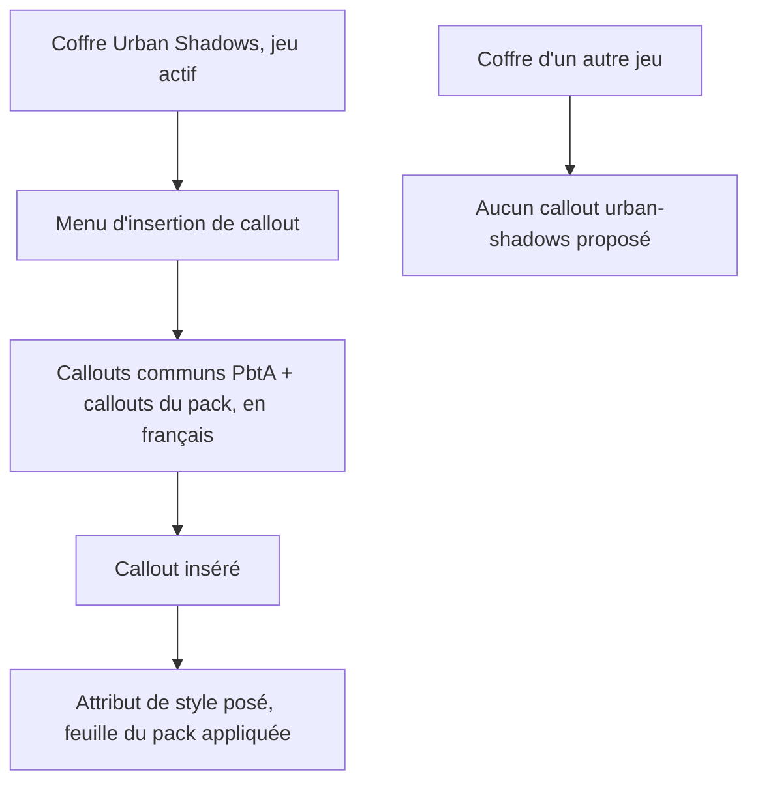
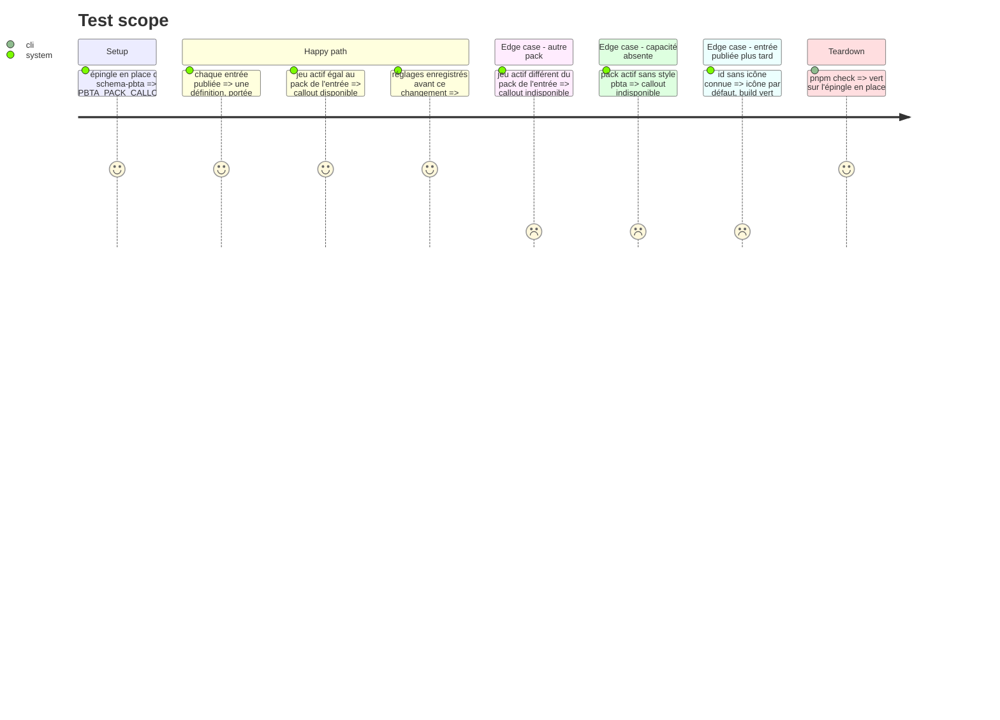

# Instruction: Handbook — callouts publiés par les packs

> Exécution dans les worktrees du superviseur (`plan.md`, ligne Exécution) : chemins sous `<W>/obsidian-handbook`.

Le schéma publie les callouts propres à un pack dans `PBTA_PACK_CALLOUTS` ; au 2026-10-07 Handbook ne lit que `PBTA_VISUAL_CALLOUTS`, et les feuilles de pack ciblent un attribut que Handbook ne pose que sur un callout qu'il connaît. Cette phase branche la liste pour tous les packs à la fois. Elle part avec le premier train si v\<N> exporte la liste (relevé en phase 1), sinon avec le second. Constaté le 2026-10-07 : `main` de `schema-pbta` l'exporte, la release que Handbook épingle ce jour-là non ; v\<N> l'aura donc dès que le train alors ouvert sera livré, ce que la phase 1 exige. Si malgré tout elle glisse au second train, le verdict sur les six callouts glisse avec elle de la phase 6 à la phase 8, et la phase 6 le dit à l'utilisateur. Si le branchement existe déjà, la tâche 1 se réduit à sa vérification. Rien n'est commité ici.

## Architecture projection

> Tree of the final files. ✅ create · ✏️ modify · ❌ delete

```txt
obsidian-handbook/
├── src/features/callouts/nativeCallouts.ts   ✏️ définitions tirées de `PBTA_PACK_CALLOUTS`, portée = pack
├── tools/assertCallouts.harness.mts          ✏️ callouts de pack : visibles sous leur pack seul (`assert:callouts`, lancé par `tools/assert-callouts.mjs`)
└── doc/ (page des callouts)                  ✏️ callouts fournis par un pack
```

## User Journey



## Test Scope



## Tasks to do

### `1)` Brancher la liste par pack

> Aucun identifiant de pack écrit dans Handbook : la portée vient de `entry.pack`.

1. `nativeCallouts.ts` : une `CalloutDefinition` par entrée de `PBTA_PACK_CALLOUTS`, sur le modèle des `PBTA_VISUAL_CALLOUTS` (`id`, `name` = `label`, `styleKey` = `id`, `capability`), avec `scope` = `entry.pack` au lieu de `"all"`
2. Table d'icônes indexée par id **en texte**, avec une icône par défaut : une entrée publiée plus tard ne casse pas le build
3. `SCHEMA_CALLOUT_IDS` gagne les ids de `PBTA_PACK_CALLOUTS` : c'est la liste que `migrateAliases.ts` parcourt pour compléter des réglages enregistrés avant l'ajout

### `2)` Preuves

> Les assertions parcourent la liste publiée : elles sont vertes sur v\<N> (entrées monsterhearts) comme sur v\<N+1> (entrées Urban Shadows en plus).

1. `assertCallouts.harness.mts` : pour **chaque** entrée publiée, disponible sous son pack avec `style:pbta`, indisponible sous un autre pack ou sans la capacité ; aucun id ni compte écrit en dur
2. Réglages anciens : reçoivent les définitions neuves sans perdre leurs alias
3. `rtk proxy pnpm build`, `./node_modules/.bin/eslint src --ext .ts`, `pnpm lint`, `pnpm check`

## Test acceptance criteria

| Task | Acceptance criteria |
| ---- | ------------------- |
| 1 | Le menu d'un coffre propose les callouts de son pack et aucun d'un autre ; `nativeCallouts.ts` ne contient aucun identifiant de pack PbtA en littéral ; un id sans icône reçoit l'icône par défaut |
| 2 | `assert:callouts` vert sur l'épingle en place ; aucun compte d'entrées en dur ; build et les deux portées de lint à zéro erreur ; l'arbre porte les changements, non commités |
