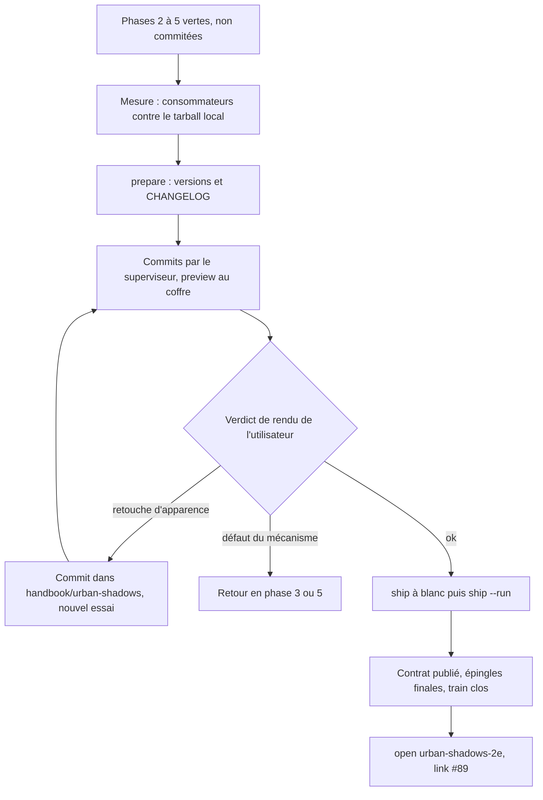
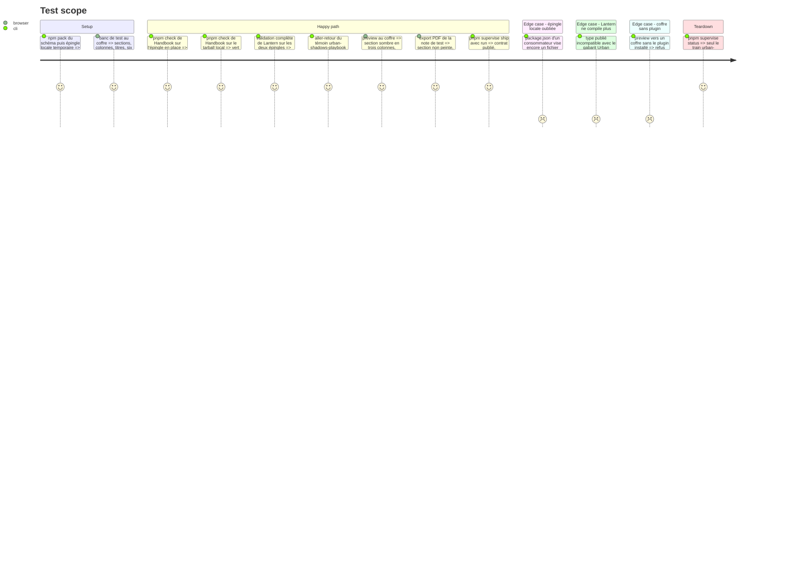

# Instruction: Valider le rendu des pages et livrer le premier train

> Exécution dans les worktrees du superviseur (`plan.md`, ligne Exécution) : chemins sous `<W>/<dépôt>`, commandes `pnpm supervise` lancées depuis `<W>/obsidian-handbook` avec `--root <W>`.

Fin du train `urban-shadows-2e-contract`. `present` valide chaque consommateur contre l'épingle en place (v\<N>), puis le superviseur publie la candidate v\<N+1> et relance les mêmes validations dessus : tout ce que Handbook et Lantern commitent ici est **vert sur les deux contrats**. Épingle, lockfiles et `release-train.matrix.json` sont écrits par l'outil ; version et `CHANGELOG` des consommateurs par l'action `prepare` du skill `ship-train`. Les tâches 2 à 4 sont les actions `prepare`, `preview`, `ship` et `repair` de ce skill, avec `--root <W>` sur chaque commande : ce qui suit n'en fixe que les particularités de ce train. L'utilisateur ne donne qu'un verdict : le rendu après preview.

## Architecture projection

> Tree of the final files. ✅ create · ✏️ modify · ❌ delete

```txt
obsidian-handbook/
├── package.json, manifest.json, versions.json         ✏️ version, par `prepare` de `ship-train` (`pnpm version`)
├── CHANGELOG.md                                       ✏️ section de la version
├── package.json, pnpm-lock.yaml                       ✏️ épingle, écrits par le superviseur
├── supervisor/trains/urban-shadows-2e-contract.json   ✏️ clos par `ship`
└── supervisor/trains/urban-shadows-2e.json            ✅ second train, écrit par `open` puis `link`
lantern/
├── package.json, package-lock.json                    ✏️ version, par `prepare` de `ship-train` (`npm version`)
├── CHANGELOG.md                                       ✏️ section de la version, limite comprise
└── release-train.matrix.json                          ✏️ écrit par le superviseur
Perso/RPG/urban-shadows/
└── Handbook - Test pages urban-shadows.md             ✅ banc de test du coffre (hors dépôt)
```

## User Journey



## Test Scope



## Tasks to do

### `1)` Mesurer sur le tarball local

> Seule façon de voir la candidate avant qu'elle existe ; l'épingle locale ne se commite jamais. La phase 2 a déjà compilé les consommateurs contre le schéma seul ; ici le tarball porte aussi la phase 4 et c'est la validation complète qui tourne.

1. Dans `<W>/schema-pbta` : `npm.cmd run check` vert, puis `npm.cmd pack --pack-destination <dossier temporaire hors dépôt>`
2. Dans `<W>/obsidian-handbook` puis `<W>/lantern`, jamais dans les checkouts habituels : épingler ce fichier, installer, lancer la validation complète (`pnpm check` ; `npm run check`, `npm run assert:contracts`, `npm run build`, `npm run assert:template-chunks`)
3. Échecs attendus et sans suite : les harnais qui refusent une épingle hors release (`assert:pbta-contract`, `assert:consumer-schema-pins` côté Handbook ; `assert:consumer-schema-pins`, `assert:candidate-pins`, `assert:release-inputs` côté Lantern). Tout autre échec se corrige dans le consommateur par un changement vert sur l'épingle en place ; s'il n'en existe pas, retour en phase 2
4. Constats attendus, non des échecs : `assert:pbta-pack-coverage` et `assert:pbta-specialized-projection` tolèrent les champs neufs non rendus ; s'ils comptent en dur une déclaration de Handbook, l'égalité se met à jour ici
5. Restaurer `package.json` et lockfiles de chaque consommateur à leur état commité, réinstaller en mode gelé, relancer la validation complète sur l'épingle en place : verte

### `2)` Lantern : version et limite

> Aucun changement de `src/` ni de `tools/` n'est attendu.

1. `ship-train` / `prepare` : version de Lantern comparée à sa dernière release ; déjà en avance, elle reste, sinon mineure par `npm version minor --no-git-tag-version`. Section du `CHANGELOG.md`, en anglais
2. Limite à y consigner : les champs neufs de `urban-shadows-playbook` ne sont ni affichés ni édités (liste fixe de sections du gabarit `src/templates/urban-shadows/playbook/`) ; ils survivent à l'aller-retour. Les rendre éditables demande une issue Lantern distincte

### `3)` Banc de test, preview et verdict

> Seul point où l'utilisateur intervient. Coffre : `C:/Users/fxgui/Documents/Perso/RPG/urban-shadows`. Ne jamais écraser `data.json`.

1. Écrire `Handbook - Test pages urban-shadows.md` à la racine du coffre : une section `alternate` en pleine largeur, la même dans une note en trois colonnes, un callout dans la section, les six callouts hors section, titres des trois niveaux, liste à puces, termes de jeu. Texte inventé, aucun extrait du livre
2. Handbook, par la même action `prepare` : si sa version n'est pas en avance sur sa dernière release, `pnpm version <x.y.z>` avec la mineure suivante, lue et non recopiée ; section du `CHANGELOG.md` ; `pnpm assert:release-version` ; build, les deux portées de lint, `pnpm check`
3. Message de commit en anglais pour chacun des trois worktrees, dans le fichier que donne `git rev-parse --git-path SUPERVISOR_COMMIT_MSG` ; `pnpm supervise commit <dépôt> --only --root <W>` pour chacun, `schema-pbta` d'abord
4. `pnpm supervise preview --vault C:/Users/fxgui/Documents/Perso/RPG/urban-shadows --root <W>` : exige les trois dépôts propres et au niveau de `origin/main`, d'où les commits de l'étape 3 ; Handbook y est construit contre le checkout de `schema-pbta` (les six callouts de la candidate sont donc proposés), le pack est monté dans le coffre, `dist/` déployé sans toucher à `data.json`, et le serveur de Lantern lancé (`--no-serve` s'il n'est pas voulu)
5. Montrer à l'utilisateur le banc de test à côté des captures (`dark`, `darksection`, `dark-callout`, `titles`, `subtitles`, `liste1`, `move`, `powerchoice`, `callout1`, `callout32`, `exampleofplay`), et un export PDF de la note ; attendre son verdict
6. Retouche d'apparence : commit dans `handbook/urban-shadows/`, essayé par `pnpm dev:schema-pbta --vault <coffre> --once`, puis preview rejouée. Défaut du mécanisme : retour en phase 3 ou 5
7. Montrer aussi, tiré du contrat de présentation généré, le tableau « région → libellé français → champs → face » du livret : régions et libellés partent dans le tarball, une erreur vue après coûte une release du schéma

### `4)` Livrer et ouvrir le second train

1. `ship-train` / `ship` : `pnpm supervise ship --root <W>` à blanc avant les commits (action `preview`), puis, **une fois le verdict de rendu donné**, `pnpm supervise ship --run --root <W>` lancé par le skill ; un arrêt passe par son action `repair`, dans ses bornes (jamais le code du superviseur, un workflow, un tag publié)
2. Après la clôture : `pnpm supervise open urban-shadows-2e --title "Urban Shadows 2E : livret de PJ" --root <W>`, `pnpm supervise link obsidian-handbook#89 --root <W>`, `pnpm supervise sync --root <W>`
3. Cocher dans #89 les lignes livrées (sections sombres, style du pack, callouts, contrat)

## Test acceptance criteria

| Task | Acceptance criteria |
| ---- | ------------------- |
| 1 | Sur le tarball local, seuls échouent les harnais qui refusent une épingle hors release ; après restauration, `git status` des consommateurs ne montre ni `package.json` ni lockfile modifié par l'épingle |
| 2 | Aucun fichier de `src/` ni de `tools/` de Lantern n'a changé ; la limite figure dans son `CHANGELOG` |
| 3 | L'utilisateur a rendu son verdict sur le banc de test et sur l'export PDF, et validé le tableau des régions ; `data.json` du coffre est intact |
| 4 | Le tag de la majeure de `schema-pbta` et ceux de Lantern et de Handbook sont publiés ; les deux consommateurs épinglent la finale ; `urban-shadows-2e-contract` est clos et `urban-shadows-2e` ouvert avec #89 pour seul élément |
