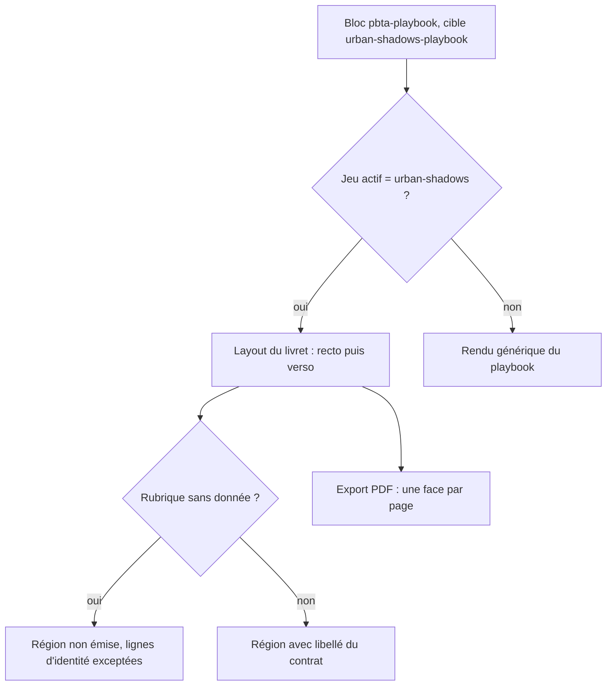
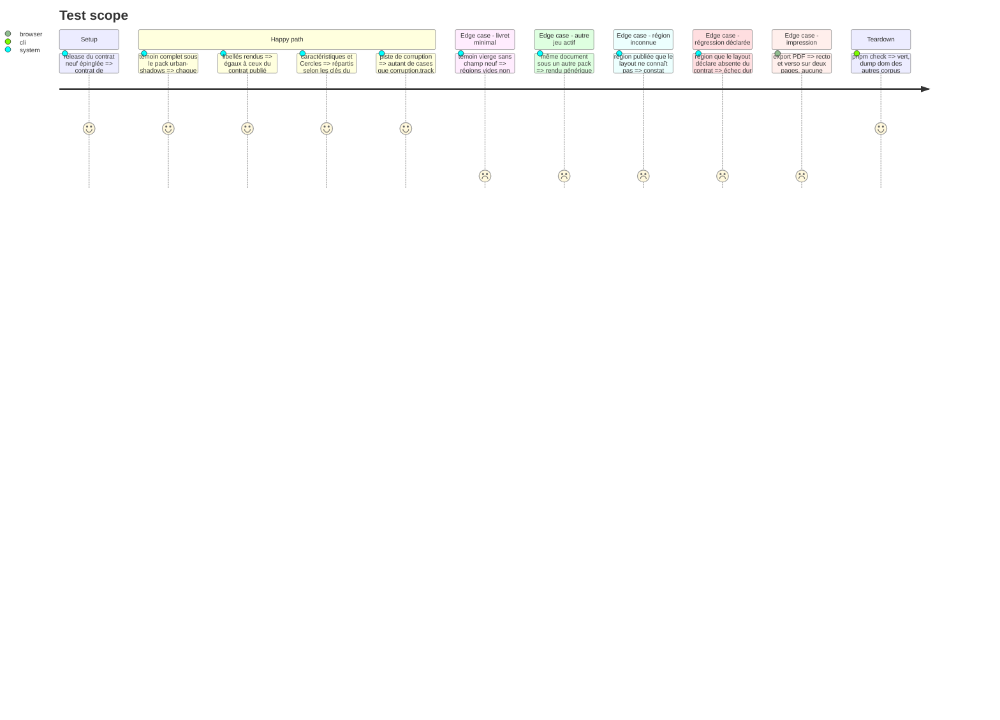

# Instruction: Handbook — layout du livret Urban Shadows

> Exécution dans les worktrees du superviseur (`plan.md`, ligne Exécution) : chemins sous `<W>/obsidian-handbook`.

Second train (`urban-shadows-2e`, #89). Handbook épingle maintenant la v\<N+1> : le layout peut importer `schema-pbta/packs/urban-shadows/presentation-contract.json`. Le livret est vierge et statique : cases vides, aucune écriture dans la note. Régions, ordre et libellés viennent du contrat publié, jamais de littéraux. Rien n'est commité ici.

## Architecture projection

> Tree of the final files. ✅ create · ✏️ modify · ❌ delete

```txt
obsidian-handbook/
├── src/features/pbta/block.ts                    ✏️ table (pack, cible) → layout, à la place du ternaire
├── src/features/pbta/urbanShadowsLayout.ts       ✅ rendu recto / verso d'après le contrat
├── src/features/pbta/monsterheartsLayout.ts      (inchangé)
├── src/features/pbta/shape.ts                    ✏️ zones du livret (surchargeables par `overrides.json`)
├── src/features/pbta/renderer.ts                 ✏️ champs neufs dans le rendu générique de repli
├── src/styles/pbta/_blocks.scss                  (inchangé : la géométrie est dans `<W>/schema-pbta/handbook/urban-shadows/assets/styles/layout.css`, phase 4)
├── tools/assert-urban-shadows-layout.mjs         ✅ `assert:urban-shadows-layout`, sur le modèle de `assert-monsterhearts-layout.mjs`
├── tools/urbanShadowsLayout.harness.mts          ✅ son harnais
├── tools/pbtaSpecializedProjection.harness.mts   ✏️ champs neufs projetés
├── package.json                                  ✏️ script `assert:urban-shadows-layout`, branché dans `check`
└── corpus/temoins/                               ✏️ livret complet et livret minimal
```

## User Journey



## Test Scope



## Wireframe

> Disposition à recaler sur `livret1.png` et `livret2.png` en tâche 1 : seules les rubriques sont certaines.

```txt
RECTO
+------------------------------------------------------------------+
| NOM DE L'ARCHÉTYPE            accroche en italique               |
| Nom / pronoms ________  Attitude ________  Apparence ___________ |
+----------------------+---------------------+---------------------+
| Stats (pinceau)      | MOUVEMENTS          | AVANCEMENT          |
|  <> <> <> <>         | consigne de choix   |  o o o o  Cercles   |
|  Blood Heart ...     | [ ] mouvement       | [ ] avancée         |
|                      |     texte           | [ ] avancée         |
| Circles (pinceau)    | [ ] mouvement       | -- après cinq --    |
|  ( ) ( ) ( ) ( )     |     texte           | [ ] avancée         |
|  ooo ooo ooo ooo     | [ ] mouvement       +---------------------+
|  Statut              |                     | Harm (pinceau)      |
+----------------------+                     | [ ][ ] légère ...   |
| LET IT OUT           |                     | Armure ___          |
|  <> capacité         |                     | CICATRICES          |
|  <> capacité         |                     | [ ] cicatrice  -1   |
+----------------------+---------------------+ MOUVEMENT DE FIN    |
                                             +---------------------+
VERSO
+----------------------+-------------------------------------------+
| CRÉATION             | RELATIONS MORTELLES                       |
|  Nom, apparence,     | [ ] relation : texte                      |
|  attitude            | [ ] relation : texte                      |
|  Caractéristiques    +---------------------+---------------------+
|  Cercles de départ   | INTIMITÉ            | DETTES DE DÉPART    |
|  Questions           | texte               | - ligne             |
|  d'introduction      +---------------------+---------------------+
|  Équipement          | ENCART D'ARCHÉTYPE (titre du document)    |
|  de départ           +-------------------------------------------+
+----------------------+ Corruption (pinceau)  [ ][ ][ ][ ][ ]     |
| ÉQUIPEMENT ET NOTES  | déclencheur                               |
| ____________________ | [ ] avancée   [ ] mouvement de corruption |
+----------------------+-------------------------------------------+
  <>  losange    ( )  rond    o  pastille    [ ]  case vide
```

## Tasks to do

### `1)` Aiguillage et structure

> Aucun identifiant de pack dans un `if` : une table.

1. Recaler le wireframe sur les deux captures : colonnes, ordre des régions, région par région
2. `block.ts` (l.25, `context?.packId === "monsterhearts" && data.target === "monsterhearts-playbook"`) : remplacer ce ternaire par une table `(packId, target) → layout` ; l'entrée monsterhearts garde son comportement, l'entrée Urban Shadows s'ajoute ; hors table, `renderPbtaPlaybook`
3. `urbanShadowsLayout.ts` : parcourir les régions du contrat importé, par face ; un rendu par primitive ; une région sans donnée n'est pas émise, sauf les lignes d'identité, qui restent des lignes à remplir
4. Tolérance asymétrique : région publiée inconnue du layout = constat (`log.warn`), région déclarée par le layout et absente du contrat = erreur
5. Cible ES basse : ni `Object.values` ni `Array.prototype.flat`

### `2)` Primitives et style

> Handbook fournit le DOM et ses accroches ; la géométrie est dans `layout.css` du pack (`plan.md`, Decisions). Couleurs et polices par les jetons du pack.

1. Losanges de caractéristique, ronds de Cercle avec trois pastilles de Statut, cases de blessure, piste de corruption à `corruption.track` cases, listes à case vide (mouvements, avancées, cicatrices, relations)
2. Titres au pinceau (Stats, Circles, Harm, Corruption) : la région porte une classe, la police vient d'un jeton que le pack fixe ; sans le jeton, la police de titre du thème
3. Aucun SCSS neuf : `urbanShadowsLayout.ts` pose sur chaque région `data-region`, `data-primitive` et `--pbta-region-order`, sur chaque face `data-face`, sur chaque rangée `data-row`, sur chaque colonne `data-column`, et garde ses classes `handbook-urban-shadows-*` ; ce sont les accroches de `layout.css`. Sans cette feuille les régions s'empilent dans le flux et restent lisibles. Mesurer `dist/styles.css` après build : sa taille ne doit pas avoir bougé du fait de cette phase
4. `shape.ts` : zones du livret déclarées, surchargeables depuis `overrides.json` comme celles des autres blocs
5. `renderer.ts` : les champs neufs apparaissent aussi dans le rendu générique, pour un coffre dont le jeu actif n'est pas Urban Shadows

### `3)` Preuves

1. `assert:urban-shadows-layout` (`tools/assert-urban-shadows-layout.mjs` + `tools/urbanShadowsLayout.harness.mts`, bundlé par esbuild) : régions émises comparées au **contrat publié**, libellés compris ; témoin complet, témoin vierge, autre jeu actif, région inconnue, région déclarée absente
2. `assert:pbta-specialized-projection` : les champs neufs sont projetés ; `assert:monsterhearts-layout` reste vert sans modification de ses attentes
3. `assert:urban-shadows-layout` vérifie aussi les accroches (attributs et classes) et `--pbta-region-order` ; `assert:print-page-breaks` reste tel quel : le saut de page du livret est dans la feuille du pack, contrôlé côté schéma (phase 4) et vu à l'export PDF (phase 8) ; `pnpm dump:dom` : seul le DOM du témoin Urban Shadows change
4. `rtk proxy pnpm build`, `./node_modules/.bin/eslint src --ext .ts`, `pnpm lint`, `pnpm check`

## Test acceptance criteria

| Task | Acceptance criteria |
| ---- | ------------------- |
| 1 | Sous le pack `urban-shadows`, le témoin complet rend toutes les régions du contrat, dans son ordre, avec ses libellés ; sous un autre pack, le rendu générique ; `block.ts` ne contient plus de comparaison à un identifiant de pack hors de la table |
| 2 | Aucun fichier de `src/styles/` n'a changé et `dist/styles.css` a la taille mesurée avant la phase ; chaque région émise porte `data-region` et `data-primitive` aux valeurs du contrat ; la piste de corruption suit `corruption.track` ; le rendu générique montre les champs neufs |
| 3 | `assert:urban-shadows-layout` vert et branché dans `pnpm check` ; `assert:monsterhearts-layout` inchangé et vert ; `dump:dom` ne diffère que sur le témoin Urban Shadows ; build et les deux portées de lint à zéro erreur ; l'arbre porte les changements, non commités |
