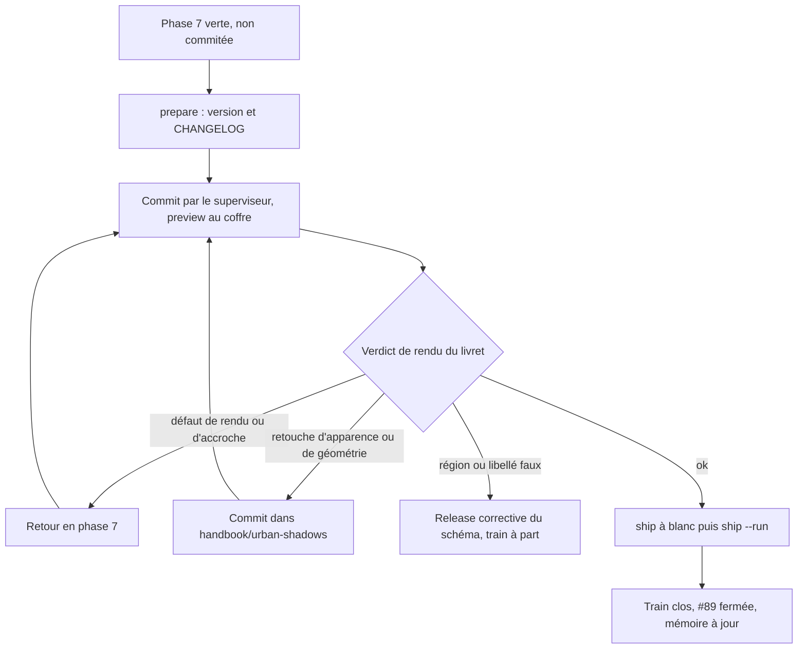
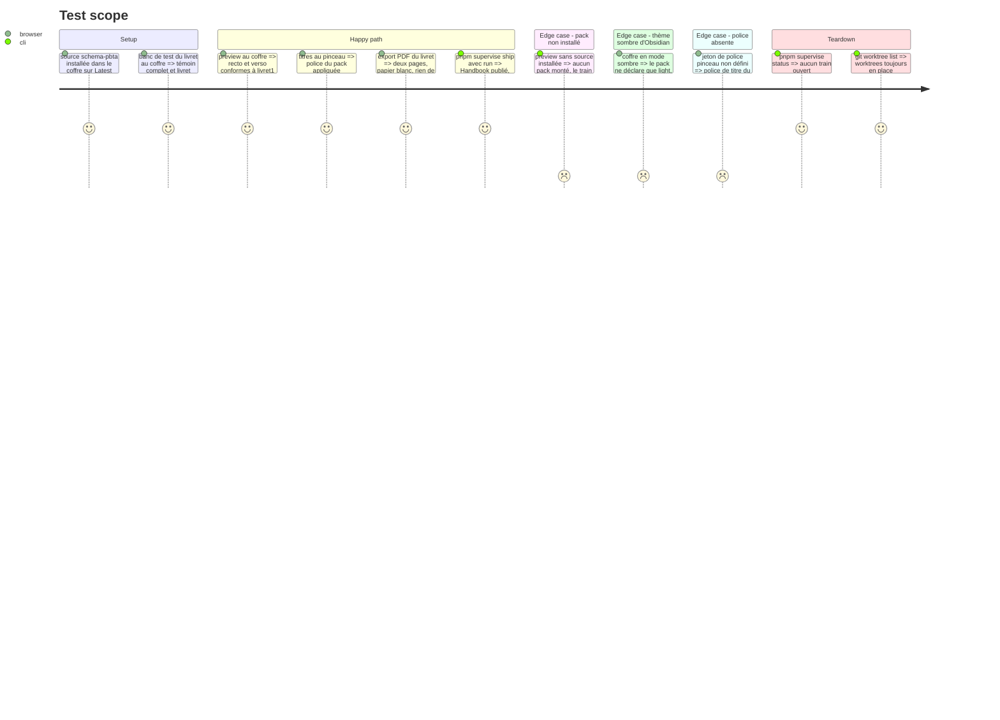

# Instruction: Valider le livret et livrer

> Exécution dans les worktrees du superviseur (`plan.md`, ligne Exécution) : chemins sous `<W>/<dépôt>`, commandes `pnpm supervise` lancées depuis `<W>/obsidian-handbook` avec `--root <W>`.

Fin du train `urban-shadows-2e`. Les tâches sont les actions `prepare`, `preview`, `ship` et `repair` du skill `ship-train`, avec `--root <W>` sur chaque commande. L'utilisateur ne donne qu'un verdict : le rendu du livret après preview. Le reste s'enchaîne.

## Architecture projection

> Tree of the final files. ✅ create · ✏️ modify · ❌ delete

```txt
obsidian-handbook/
├── package.json, manifest.json, versions.json        ✏️ version, par `prepare` de `ship-train` (`pnpm version`)
├── CHANGELOG.md                                      ✏️ section de la version
├── README, doc/                                      ✏️ livret Urban Shadows, section d'un pack à une polarité
├── aidd_docs/memory/internal/game-packs.md           ✏️ couche `style.section`
├── aidd_docs/memory/internal/pbta-coverage.md        ✏️ layout Urban Shadows
├── aidd_docs/memory/internal/ci-and-release.md       ✏️ les deux trains
└── supervisor/trains/urban-shadows-2e.json           ✏️ clos par `ship`
Perso/RPG/urban-shadows/
└── Handbook - Test blocs urban-shadows.md            ✅ banc de test du livret (hors dépôt)
```

## User Journey



## Test Scope



## Tasks to do

### `1)` Préparer la preview

> Dans un train sans fournisseur, `preview` ne monte aucun pack : il vient de la source installée dans le coffre.

1. Geste de l'utilisateur : dans les réglages de Handbook du coffre `C:/Users/fxgui/Documents/Perso/RPG/urban-shadows`, la source `schema-pbta` suit `Latest release` (la release publiée en phase 6 contient `handbook/urban-shadows/`) et le jeu Urban Shadows est choisi
2. Écrire `Handbook - Test blocs urban-shadows.md` à la racine du coffre : un bloc `pbta-playbook` reprenant le témoin complet, un second reprenant le témoin vierge. Texte inventé
3. `ship-train` / `prepare` : si la version de Handbook n'est pas en avance sur sa dernière release, `pnpm version <x.y.z>` avec la mineure suivante, lue et non recopiée ; section du `CHANGELOG.md` ; `pnpm assert:release-version`
4. README et `doc/` : le livret Urban Shadows et la section d'un pack à une seule polarité
5. Build, les deux portées de lint, `pnpm check` ; message de commit en anglais dans le fichier que donne `git rev-parse --git-path SUPERVISOR_COMMIT_MSG` ; `pnpm supervise commit obsidian-handbook --only --root <W>`

### `2)` Preview et verdict

> Seul point où l'utilisateur intervient. Ne jamais écraser `data.json`.

1. `pnpm supervise preview --vault C:/Users/fxgui/Documents/Perso/RPG/urban-shadows --root <W>`
2. Montrer à l'utilisateur le livret à côté de `livret1.png` et `livret2.png`, et son export PDF ; attendre son verdict
3. Défaut de rendu (donnée, région, accroche manquante) : retour en phase 7, nouveau commit, preview rejouée
4. Retouche d'apparence ou de géométrie (police pinceau, couleurs, espacements, colonnes, marques, saut de page : `layout.css` et les autres feuilles du pack) : commit dans `handbook/urban-shadows/`, `npm.cmd run check` vert, essayé par `pnpm dev:schema-pbta --vault <coffre> --once`, poussé à la demande de l'utilisateur ; un coffre en `Latest release` ne la reçoit qu'à la release suivante de `schema-pbta` : le signaler
5. Région ou libellé faux : ils sont dans le tarball ; l'utilisateur décide d'une release corrective du schéma (train à part) ou d'attendre

### `3)` Livrer et clore

1. `ship-train` / `ship` : `pnpm supervise ship --root <W>` à blanc lu avant le commit, puis, **une fois le verdict de rendu donné**, `pnpm supervise ship --run --root <W>` lancé par le skill ; un arrêt passe par son action `repair`
2. Si la phase 3 a dû reporter la couche de section (lecteur ancien intolérant) : l'ajouter maintenant à `handbook/urban-shadows/pack.json`, avec `minimumHandbookVersion` relevé à la version qui vient d'être publiée, par un commit `schema-pbta` distinct, à la demande de l'utilisateur
3. #89 : cocher les lignes du livret, consigner les écarts acceptés (filigrane, illustrations, cadre d'archétype), fermer si tout est livré
4. Mémoire : `game-packs.md` (couche `style.section`, pack à une polarité), `pbta-coverage.md` (layout Urban Shadows, table des layouts), `ci-and-release.md` (les deux trains, sans numéro de version recopié)
5. Rappeler à l'utilisateur que les worktrees de `<W>` restent en place : `git worktree remove` est son geste

## Test acceptance criteria

| Task | Acceptance criteria |
| ---- | ------------------- |
| 1 | Le banc de test existe dans le coffre ; `data.json` est intact ; build, lint et `pnpm check` verts ; le commit est fait par le superviseur |
| 2 | L'utilisateur a rendu son verdict sur le livret et sur son export PDF ; toute retouche d'apparence ou de géométrie non encore diffusée lui a été signalée |
| 3 | Le tag de Handbook est publié ; `pnpm supervise status --root <W>` ne liste aucun train ouvert ; #89 est à jour ; les trois fichiers de mémoire sont à jour ; aucun worktree n'a été supprimé |
