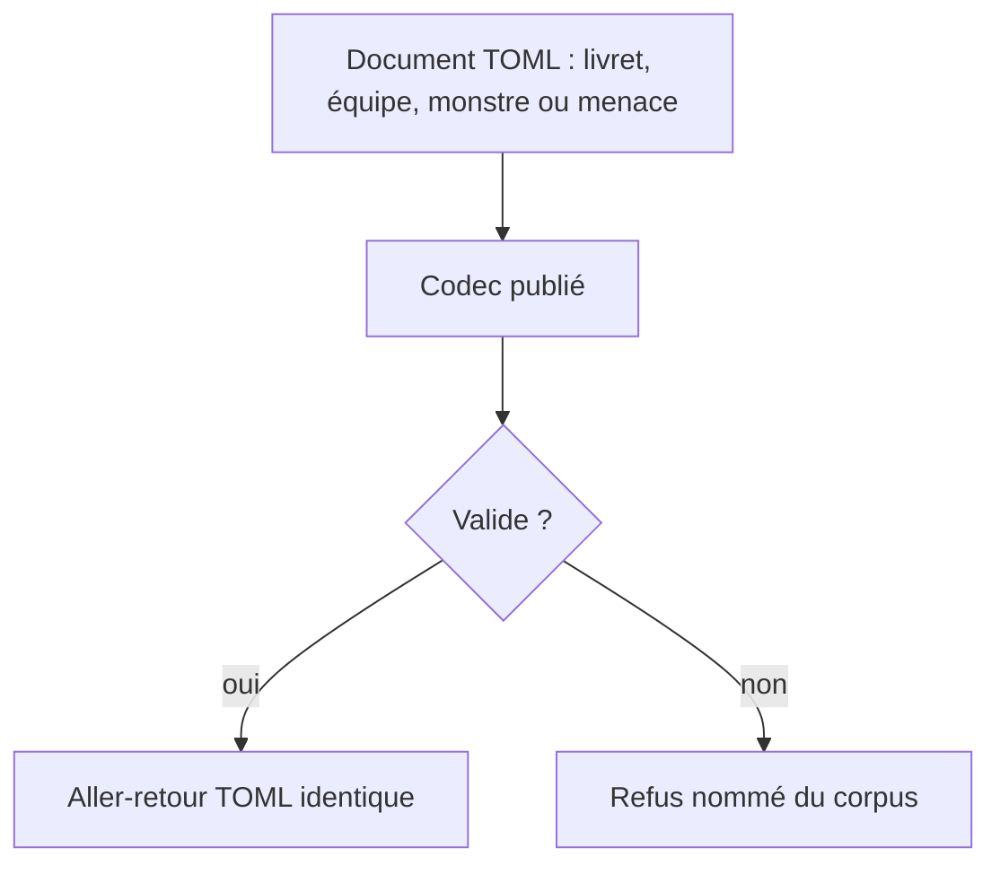
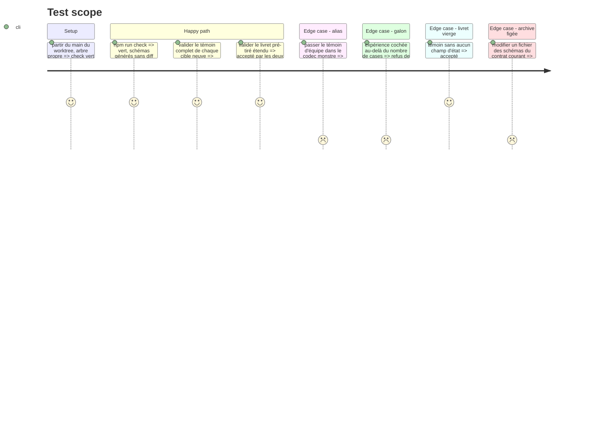

# Instruction: schema-pbta — contrat du livret, de l'équipe, du monstre et de la menace

> Exécution dans les worktrees du superviseur (`plan.md`, ligne Exécution) : chemins sous `<W>/<dépôt>`.

Phase d'écriture, **sans train ni commit**. Elle suppose les phases 2 à 4 du plan Masks : majeure suivante ouverte (ou à ouvrir ici si Masks n'est pas passé : voir `plan.md`, ligne Versions), règle `<pack.id>-<type>`, mesure d'alias de `validate-pack-coverage.ts`. **v\<N>** est le contrat que porte `main` au départ, **v\<N+1>** (ou la suivante) celui que le train publie : lire, ne recopier aucun numéro. Dépôt en **npm** (`npm.cmd run check` sous Bash). Règles locales : `z.strictObject`, `.optional()` jamais `.default()`, aucun `.refine()` dans `src/zod`, une `description` par propriété, règles inter-champs dans `tools/validate-references.ts`. Textes de témoins originaux : aucun texte du livre.

## Architecture projection

> Tree of the final files. ✅ create · ✏️ modify · ❌ delete

```txt
schema-pbta/
├── src/zod/monster-of-the-week-playbook.ts        ✏️ champs du livret
├── src/zod/monster-of-the-week-team.ts            ✅
├── src/zod/monster-of-the-week-monster.ts         ✅
├── src/zod/monster-of-the-week-threat.ts          ✅
├── src/zod/motw-shared.ts                         ✅ sous-structure partagée monstre et menace, non exportée du paquet
├── src/zod/constants.ts                           ✏️ trois entrées dans TARGETS
├── src/codecs/toml.ts                             ✏️ schémas, types, codecs
├── src/index.ts                                   ✏️ exports publics
├── src/presentation/collections.ts                ✏️ collections neuves du livret
├── schemas/v<N+1>/                                ✅ généré par `gen`
├── corpus/contract/valid et invalid/              ✅ un témoin et un refus par contrainte, par cible
├── corpus/temoins et refus/monster-of-the-week/   ✅ une famille par cible
├── examples/monster-of-the-week/                  ✏️ livret ; ✅ équipe, monstre, menace
├── packs/monster-of-the-week/pack-contract.json   ✏️ quatre documents, capacités `block:pbta-team`, `block:pbta-monster`, `block:pbta-threat`
├── cross-tool-provider.json                       ✏️ capacités handbook
├── tools/validate-references.ts                   ✏️ règles de bornes et de noms
├── tools/validate-package.ts                      ✏️ listes en dur de cibles et de parseurs
└── docs/compatibility.md, README.md, CHANGELOG.md ✏️
```

## User Journey



## Test Scope



## Tasks to do

### `1)` Ouvrir la majeure (si Masks ne l'a pas fait)

1. Si le plan Masks a ouvert la majeure et que ce plan la partage : rien à ouvrir, rebaser sur son travail. Sinon : `contract-version.ts`, `package.json` (version, `exports`, `files`), `archivedVersions`, assertions de `validate-package.ts`, `contractVersion` des six `pack-contract.json` et de `cross-tool-provider.json`, matrice de `docs/compatibility.md`, `CHANGELOG.md` ; `npm.cmd run validate:version` et `validate:package` le prouvent

### `2)` Étendre `monster-of-the-week-playbook`

> Liste arrêtée sur `playbook1` et `playbook2`. Tous les champs neufs sont optionnels : un livret vierge reste valide. Relire l'état courant du schéma et ne déclarer que ce qui manque.

| Champ | Forme | Région |
| ----- | ----- | ------ |
| `heroName` (ou nom du chasseur) | texte | en-tête |
| `luck` | objet à `max` et `marked` optionnels (nombres) | Chance |
| `harm`, `unstable` | `harm` : objet à `marked` optionnel (nombre) ; `unstable` : booléen | Dégâts et instable |
| `experience` | objet à `max` et `marked` optionnels (nombres) | galon de cinq cases |
| `specialWeapon` | texte | arme spéciale |
| `statChoices` | `string[]` | stats à choisir |
| `look`, `introductions`, `history` | `string[]` | apparence, présentations, histoire |
| `improvements`, `advancements` | liste d'objets à `label` et `checked` optionnel | améliorations et avancées |
| `notes` | `string[]` | notes |

1. Écrire ces champs ; `improvements` et `advancements` réutilisent `advancementEntrySchema`
2. `validate-references.ts` : `luck.marked` ≤ `luck.max`, `experience.marked` ≤ `experience.max`, `harm.marked` ≤ son maximum
3. `collections.ts` : collections du tableau, éditeurs existants seulement (`PBTA_COLLECTION_ITEM_EDITORS` ne gagne aucune valeur)
4. Deux témoins (pré-tiré, livret vierge), un refus par contrainte, exemple à jour

### `3)` Créer les trois cibles

1. `monster-of-the-week-team` (`team`, `team2`) : `slug`, `name`, `game`, trois listes cochables `enemies`, `allies`, `maneuvers`, puis `assets`, `improvement`, `style` en listes d'entrées `label` + `checked?` ; aucun champ d'image
2. `monster-of-the-week-monster` (`creature.jpg`) et `monster-of-the-week-threat` (`menace1`, `menace2`) : deux objets stricts autonomes qui composent un sous-schéma privé de `motw-shared.ts` (nom, type, description, attaques, points faibles, mouvements) ; la menace y ajoute ses champs propres lus sur les captures (motivation, compte à rebours ou étapes). Si la lecture des captures montre que les deux cibles ne diffèrent que d'un champ, **les fusionner** est une décision à porter dans le tableau Decisions de ce plan avant d'écrire
3. `constants.ts`, `toml.ts`, `index.ts`, listes en dur de `validate-package.ts`
4. Corpus contractuel (accepter et refuser, les deux moitiés), corpus d'audit, exemple original par cible
5. La mesure d'alias de `validate-pack-coverage.ts` couvre les quatre cibles

### `4)` Déclarer les cibles et les capacités

1. `pack-contract.json` : quatre documents ; `requirements.handbook` gagne les trois capacités de bloc ; `requirements.lantern` reste `edit:pbta`
2. `cross-tool-provider.json` : capacités ajoutées ; aucune collection publiée pour les cibles neuves

### `5)` Vérifier

1. `npm.cmd run check` vert ; schémas générés dans l'arbre, aucun écart ; rien n'est commité (le message de commit s'écrit en phase 4, tâche 3)

## Test acceptance criteria

| Task | Acceptance criteria |
| ---- | ------------------- |
| 1 | Le paquet s'annonce en majeure suivante, l'archive du contrat courant est identique au tag |
| 2 | Pré-tiré et livret vierge acceptés et stables à l'aller-retour ; chaque contrainte neuve a son refus |
| 3 | Chaque témoin est accepté par sa cible et refusé par les trois autres ; une valeur cochée hors bornes est refusée |
| 4 | Le contrat du pack déclare quatre documents ; chaque exigence est incluse dans les capacités du fournisseur |
| 5 | `check` est vert et ne laisse aucun diff |
