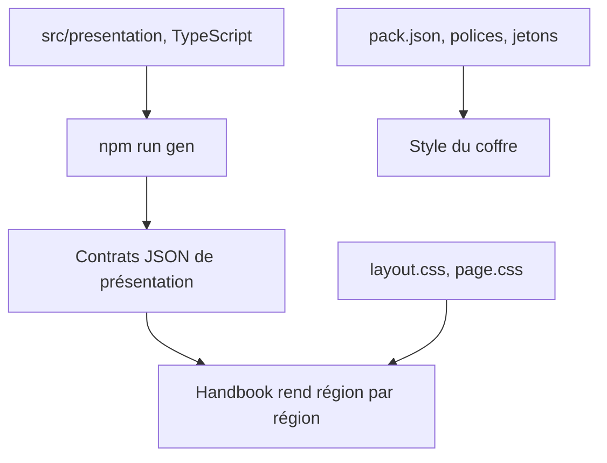
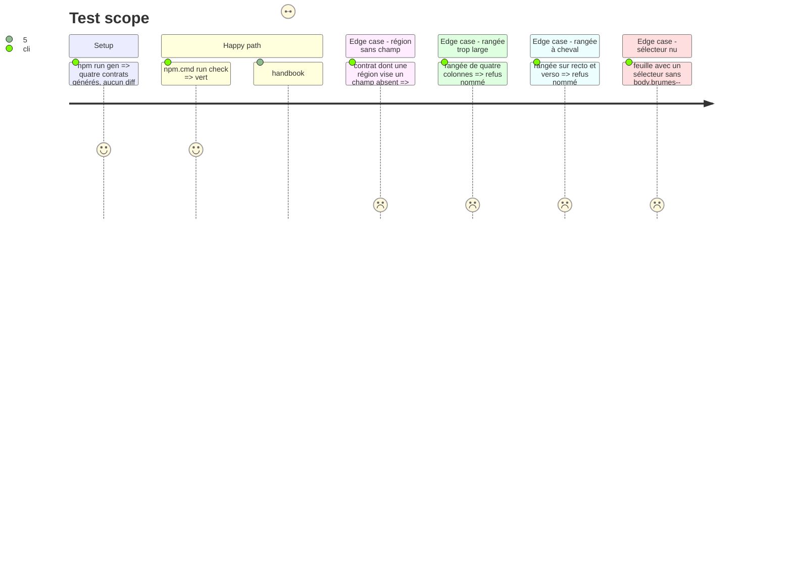

# Instruction: schema-pbta — présentation et apparence du pack Monster of the Week

> Exécution dans les worktrees du superviseur (`plan.md`, ligne Exécution) : chemins sous `<W>/<dépôt>`.

Phase d'écriture, **sans train ni commit**, dans le même élément `schema-pbta` que la phase 2. Les contrats de présentation sont **générés** : on rédige `src/presentation/<cible>.ts`, `npm run gen` écrit `packs/monster-of-the-week/*presentation-contract.json`, le JSON n'est jamais édité. Le modèle est la phase 3 du plan Masks (contrats, polices, jetons, feuilles du pack).

## Architecture projection

> Tree of the final files. ✅ create · ✏️ modify · ❌ delete

```txt
schema-pbta/
├── src/presentation/monster-of-the-week-playbook.ts   ✅ deux faces, rangées de une à trois colonnes
├── src/presentation/monster-of-the-week-team.ts       ✅
├── src/presentation/monster-of-the-week-monster.ts    ✅
├── src/presentation/monster-of-the-week-threat.ts     ✅
├── src/presentation/index.ts                          ✏️
├── src/zod/pack-manifest.ts                           ✏️ vérifier : `presentation` est déjà une liste
├── packs/monster-of-the-week/*presentation-contract.json  ✅ généré
├── packs/monster-of-the-week/pack-contract.json       ✏️ `presentation:pbta-layout` pour handbook
├── corpus/presentation/invalid/                       ✅ un fichier par contrainte
├── src/presentation/monster-of-the-week-appearance.ts  ✅ source de l'apparence : ressources et jetons propres au pack
├── packs/monster-of-the-week/appearance-contract.json ✅ généré, référencé par `appearanceArtifact`
├── handbook/monster-of-the-week/pack.json             ✏️ `pack.assets` (polices, feuilles), thème de la note, version du pack
└── handbook/monster-of-the-week/assets/
    ├── fonts/                                         ✅ WOFF2 de substitution et leurs `OFL.txt`
    └── styles/                                        ✅ `page.css`, `layout.css`
```

## User Journey



## Test Scope



## Wireframe

```txt
LIVRET — recto, trois colonnes
┌───────────────────┬───────────────────┬───────────────────┐
│ (1) NOM · TYPE     │ (5) Stats à        │ (8) Améliorations  │
│ (2) Chance ☐☐☐☐☐☐☐ │     choisir        │     ☐ ...          │
│     Dégâts ☐☐☐☐☐☐☐ │ (6) Arme spéciale  │ (9) Avancées       │
│     Instable ☐     │ (7) Apparence      │     ☐ ...          │
│ (3) Expérience     │     Présentations  │                    │
│     ☐ ☐ ☐ ☐ ☐ ★    │     Histoire       │ (10) Notes         │
└───────────────────┴───────────────────┴───────────────────┘
VERSO : suite des mêmes colonnes selon playbook2

ÉQUIPE — trois colonnes de listes cochables
┌─────────────────┬─────────────────┬─────────────────┐
│ Ennemis ☐ ...    │ Alliés ☐ ...     │ Manœuvres ☐ ...  │
│ Atouts ☐ ...     │ Amélioration ☐   │ Style ☐ ...      │
└─────────────────┴─────────────────┴─────────────────┘

MONSTRE — carte étroite        MENACE — page
┌───────────────────┐          ┌──────────────────────────┐
│ NOM · type         │          │ NOM · type · motivation   │
│ Description        │          │ Description               │
│ Attaques           │          │ Étapes ou compte à rebours│
│ Points faibles     │          │ Mouvements                │
│ Mouvements         │          └──────────────────────────┘
└───────────────────┘
```

Croquis de structure à faire valider ; l'ordre, les libellés français et les positions viennent des contrats et se règlent sur les captures. Les régions du livret sont à numéroter d'après `playbook1` et `playbook2` à l'écriture.

## Tasks to do

### `1)` Contrats de présentation

1. Vérifier `pack-manifest.ts` : `presentation` est une liste, une entrée par cible, `appearanceArtifact` optionnel ; Monster of the Week y déclare quatre entrées
2. Rédiger les quatre sources TypeScript : régions, ordre, libellés français, faces `recto`/`verso` pour le livret seul, rangées de une à trois colonnes ; `npm run gen`
3. Corpus de refus dans `corpus/presentation/invalid/` : région sans champ, rangée de plus de trois colonnes, rangée sur deux faces, région d'en-tête absente, id dupliqué ; `validate-presentation-contract.ts` nomme les régions volontairement non placées
4. `pack-contract.json` : `presentation:pbta-layout` pour handbook, pas pour lantern. L'entrée `presentation` de chaque cible gagne `appearanceArtifact: appearance-contract.json` (le paquet ne publie encore aucun contrat de présentation ni d'apparence pour ce jeu : tout part de `pack-contract.json` seul)

### `2)` Polices, jetons, fond blanc

1. Choisir sur un rendu côte à côte au coffre une famille libre par rôle : titre (3rd Man), corps (Warnock Pro), sous-titre (Myriad Pro Condensed) ; Handbook ne localise pas, le français a droit à la même famille de titre (3rdManAccentuated couvre les accents, le substitut doit les couvrir aussi : vérifier é, è, ê, à, ç, œ)
2. Publier chaque famille en WOFF2 compressé sans sous-ensemblage ni instanciation, avec son `OFL.txt` ; déclarer dans `pack.json` (`pack.assets.fonts`, au format `famille → file, weight, style`) et dans la source d'apparence (`resources.fonts`, `famille → chemin`)
3. Jetons : jetons propres au pack dans la source `src/presentation/monster-of-the-week-appearance.ts` (variante `base`, noms `--monster-of-the-week-*`), contrat généré par `npm run gen` ; variables de thème d'Obsidian dans `pack.style.base.note` de `pack.json` (celles que le paquet porte déjà y sont réécrites, pas dupliquées) ; ensuite : papier `#fff`, texte, accent (la rouge `#a53628` d'origine peut rester accent si le contraste est bon), rien de sombre ; `--code-normal` et `--code-background` fixés
4. Glyphes de Fate Core Glyphs : remplacés par des caractères Unicode ou des formes CSS ; aucun fichier de police d'origine dans le dépôt

### `3)` Feuilles du pack

1. `page.css` : titres, puces, tableaux aux jetons ; `layout.css` : géométrie du livret, de l'équipe, du monstre et de la menace, partagée par propriétés personnalisées (le CSS brut n'a pas de `@mixin`) ; sélecteurs commençant par `body.brumes--monster-of-the-week`, pas d'`@import`, moins de 256 Kio
2. Cases à cocher : `align-items: flex-start`, `margin: calc((1lh - 1.25rem) / 2) 0 0`, `font: inherit` ; saut de page entre faces et papier blanc dans `@media print` ; aucune règle sombre
3. Vérifier que les quatre callouts génériques se rendent correctement sur fond blanc (rien à publier)
4. `handbook:validate` : `layout.css` ne cible que des régions et primitives du contrat

### `4)` Version du pack

1. `handbook/monster-of-the-week/pack.json` : version relevée avec le changement, `minimumHandbookVersion` laissé tel quel (tranché après la release de Handbook, phase 7, tâche 4)

## Test acceptance criteria

| Task | Acceptance criteria |
| ---- | ------------------- |
| 1 | `gen` ne laisse aucun diff, chaque contrainte a son refus, le contrat du pack déclare `presentation:pbta-layout` côté handbook seulement |
| 2 | Chaque police déclarée existe, avec sa licence ; aucune police d'origine ; les accents français s'affichent en police de titre |
| 3 | `handbook:validate` passe ; aucune règle sombre statique ; `check` vert |
| 4 | Le pack annonce une version neuve ; `minimumHandbookVersion` inchangé |
