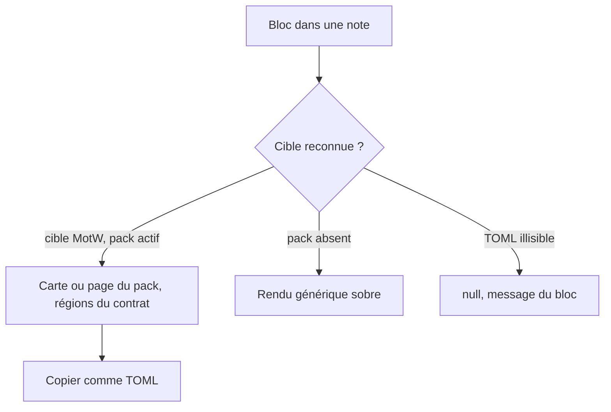
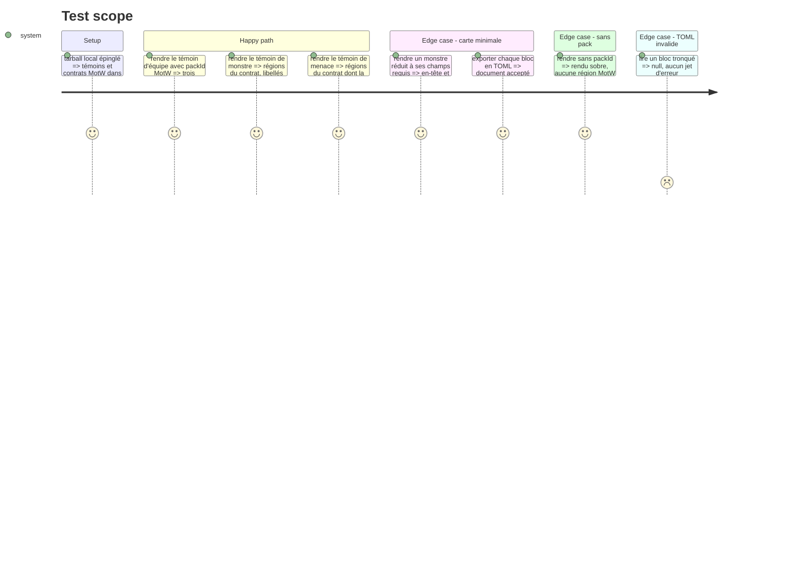

# Instruction: Handbook — blocs équipe, monstre et menace

> Exécution dans les worktrees du superviseur (`plan.md`, ligne Exécution) : chemins sous `<W>/<dépôt>`.

Phase d'écriture, **sans train ni commit**, sur l'épingle locale de la phase 4. Handbook importe les contrats neufs directement. Les gardes lisent un rôle, jamais un chiffre (`pnpm assert:guards-by-role`) ; une donnée fermée porte `guard-fixture: <raison>`. Les quatre obligations d'un format de bloc (`aidd_docs/guidelines/schema-design.md`) s'appliquent. Le modèle est la phase 5 du plan Masks (bloc `pbta-npc`).

## Architecture projection

> Tree of the final files. ✅ create · ✏️ modify · ❌ delete

```txt
.
├── src/features/pbta/motwTeam.ts                   ✅ rendu de la fiche d'équipe
├── src/features/pbta/motwMonster.ts                ✅ rendu de la fiche de monstre
├── src/features/pbta/motwThreat.ts                 ✅ rendu de la page de menace
├── src/features/pbta/motwShared.ts                 ✅ sous-structure commune monstre et menace
├── src/features/pbta/block.ts                      ✏️ blocs `pbta-team`, `pbta-monster`, `pbta-threat`, gabarits
├── src/features/pbta/shape.ts                      ✏️ zones nommées
├── src/features/pbta/coverage.ts                   ✏️ trois cibles projetées
├── src/features/blocks/registry.ts                 ✏️ entrées dans BRUMES_BLOCKS
├── src/features/blocks/tomlExports.ts              ✏️ « copier comme TOML »
├── src/games/capabilities.ts                       ✏️ `block:pbta-team`, `block:pbta-monster`, `block:pbta-threat`
├── tools/assert-motw-layout.mjs                    ✅
├── tools/assertMotwLayout.harness.mts              ✅ faux DOM avec setAttribute et dataset
├── tools/pbtaPackCoverage.harness.mts              ✏️ blocs déclarés, cibles projetées
├── tools/pbtaContractCorpus.mts                    ✏️ trois cibles
├── tools/customPacks.harness.mts                   ✏️
├── tools/contextualPackBlocks.harness.mts          ✏️
├── package.json                                    ✏️ script `assert:motw-layout`
├── aidd_docs/guidelines/schema-design.md           ✏️ trois blocs
└── aidd_docs/memory/internal/pbta-coverage.md      ✏️ trois cibles projetées
```

## User Journey



## Test Scope



## Wireframe

```txt
ÉQUIPE
┌───────────────────────────────────────────────────┐
│ (1) NOM DE L'ÉQUIPE                                │
├───────────────────┬───────────────────┬───────────┤
│ (2) Ennemis        │ (3) Alliés         │ (4) Manœuvres │
│  ☐ ...             │  ☐ ...             │  ☐ ...        │
│ (5) Atouts         │ (6) Amélioration   │ (7) Style     │
│  ☐ ...             │  ☐ ...             │  ☐ ...        │
└───────────────────┴───────────────────┴───────────┘

MONSTRE                         MENACE
┌───────────────────┐           ┌───────────────────────────┐
│ (1) NOM · type     │           │ (1) NOM · type             │
│ (2) Description    │           │ (2) Description            │
│ (3) Attaques       │           │ (3) Attaques, points faibles│
│ (4) Points faibles │           │ (4) Étapes / compte à rebours│
│ (5) Mouvements     │           │ (5) Mouvements             │
└───────────────────┘           └───────────────────────────┘
```

Les régions, leur ordre et leurs libellés viennent des contrats publiés ; ce croquis ne fixe que la structure à faire valider.

## Tasks to do

### `1)` Projeter les trois cibles

1. `coverage.ts`, `specializedPlaybooks.ts`, `pbtaContractCorpus.mts` : les trois cibles rejoignent les cibles projetées, chacune associée à son bloc ; les égalités des harnais sont mises à jour

### `2)` Les trois blocs

1. Lecture tolérante : la cible du pack d'abord, `null` sinon
2. Rendu région par région d'après le contrat, `outsideCard` éventuel hors cadre ; une région sans donnée n'est pas émise ; rendu sobre quand le pack n'est pas actif
3. `motwShared.ts` rend la sous-structure commune une fois pour le monstre et la menace
4. Zones nommées dans `shape.ts`, commande « copier comme TOML », gabarit d'insertion par bloc, capacités `block:*`, drapeau `pbtaParser` réutilisé
5. Aucun SCSS dans Handbook : accroches `data-region`, `data-primitive`, `data-row`, `data-column` aux valeurs du contrat ; sans la feuille du pack les régions s'empilent, lisibles

### `3)` Harnais

1. `assert:motw-layout`, volet blocs : régions, ordre, libellés, accroches ; ordre et libellés attendus lus dans le contrat publié
2. Les trois cibles ajoutées aux corpus des harnais de contrat, de packs contextuels et personnalisés
3. Mémoire et guide à jour

## Test acceptance criteria

| Task | Acceptance criteria |
| ---- | ------------------- |
| 1 | `assert:pbta-pack-coverage` ne liste plus les trois cibles comme non résolues |
| 2 | Chaque bloc rend sa fiche, un TOML tronqué ne rend rien et ne lève pas, l'export TOML repasse le codec |
| 3 | Le harnais échoue si une région, un libellé ou une accroche est retiré ; aucun fichier de `src/styles/` n'a changé ; build, lints et `assert:*` touchés verts un par un ; rien n'est commité |
