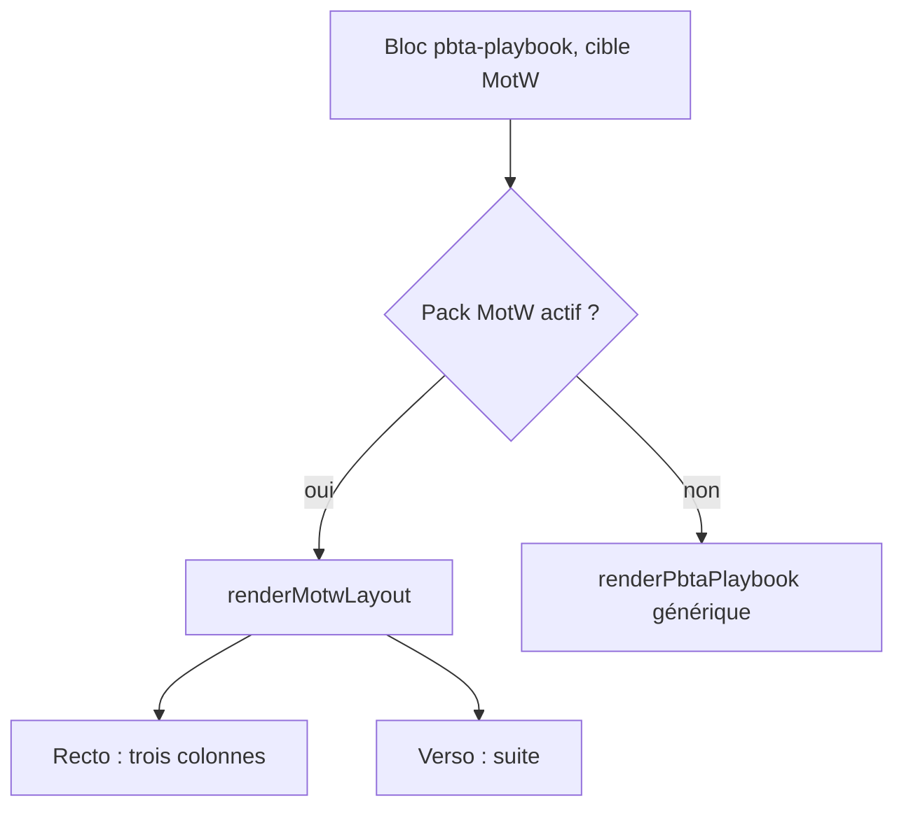
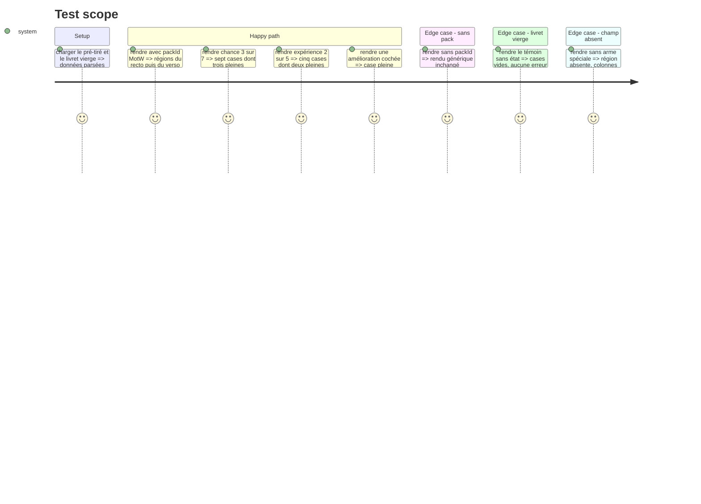

# Instruction: Handbook — layout du livret de PJ

> Exécution dans les worktrees du superviseur (`plan.md`, ligne Exécution) : chemins sous `<W>/<dépôt>`.

Suite de la phase 5 : même worktree, même tarball local, toujours sans train ni commit. Le modèle est `masksLayout.ts` (plan Masks, phase 6), lui-même fondé sur `monsterheartsLayout.ts` : rendu par région d'après les faces et l'ordre du contrat publié. Le rendu générique du playbook reste valide sans `packId`. La table `PLAYBOOK_LAYOUTS` existe : s'y brancher.

## Architecture projection

> Tree of the final files. ✅ create · ✏️ modify · ❌ delete

```txt
.
├── src/features/pbta/motwLayout.ts                 ✅ recto et verso, régions du contrat
├── src/features/pbta/block.ts                      ✏️ ligne `monster-of-the-week` + `monster-of-the-week-playbook`
├── src/features/pbta/renderer.ts                   ✏️ PBTA_SPECIALIZED_FIELDS pour les champs neufs
├── src/features/pbta/shape.ts                      ✏️ zones du livret
├── tools/assertMotwLayout.harness.mts              ✏️ volet livret
├── tools/pbtaSpecializedProjection.harness.mts     ✏️ champs mécaniques neufs
└── <W>/schema-pbta/handbook/monster-of-the-week/assets/styles/layout.css  ✏️ géométrie réglée au coffre
```

## User Journey



## Test Scope



## Wireframe

Le croquis de structure est celui du livret de la phase 3 ; les positions exactes suivent `playbook1` et `playbook2` par le contrat. Ce qui est à faire valider ici : trois colonnes, le galon d'expérience de cinq cases, les rangées de cases de Chance et de Dégâts, et la mise en page identique sur les deux faces.

## Tasks to do

### `1)` Brancher le layout

1. `PLAYBOOK_LAYOUTS` : ajouter la ligne `monster-of-the-week` + `monster-of-the-week-playbook`, aucun ternaire par jeu
2. `motwLayout.ts` importe le contrat de présentation et rend région par région ; une région sans donnée n'est pas émise

### `2)` Régions mécaniques

1. Chance, dégâts, instable, galon d'expérience : cases lues dans `marked` et `max` du document
2. Stats à choisir, arme spéciale, apparence, présentations, histoire, améliorations, avancées, notes
3. `PBTA_SPECIALIZED_FIELDS` étendu : le rendu générique imprime aussi les champs neufs

### `3)` Faces, accroches, harnais

1. `data-face`, `data-region`, `data-primitive`, `data-row`, `data-column` aux valeurs du contrat ; aucun SCSS neuf ; `dist/styles.css` ne bouge pas
2. `assert:motw-layout`, volet livret ; `assert:pbta-specialized-projection` : un témoin par cible affiche chaque champ neuf

## Test acceptance criteria

| Task | Acceptance criteria |
| ---- | ------------------- |
| 1 | Un livret MotW rend le layout quand le pack est actif, le rendu générique sinon ; les autres livrets PbtA sont inchangés (`pnpm dump:dom` sans diff hors MotW) |
| 2 | Chance 3 sur 7 rend sept cases dont trois pleines ; aucun libellé n'est une chaîne du layout |
| 3 | Le harnais échoue si une région ou une accroche est retirée ; `dist/styles.css` garde la taille mesurée avant la phase 5 |
