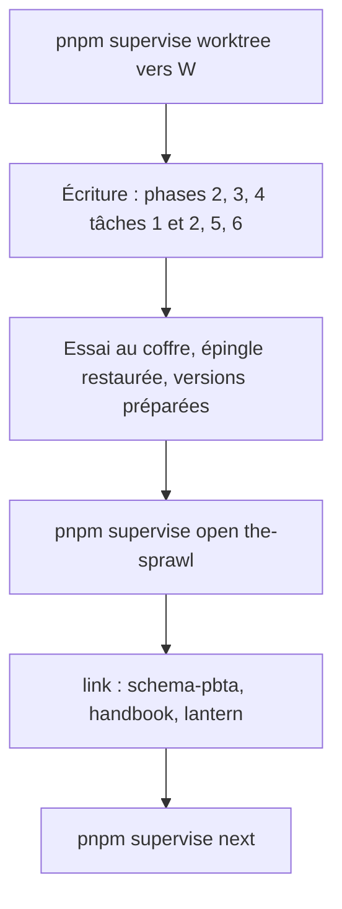
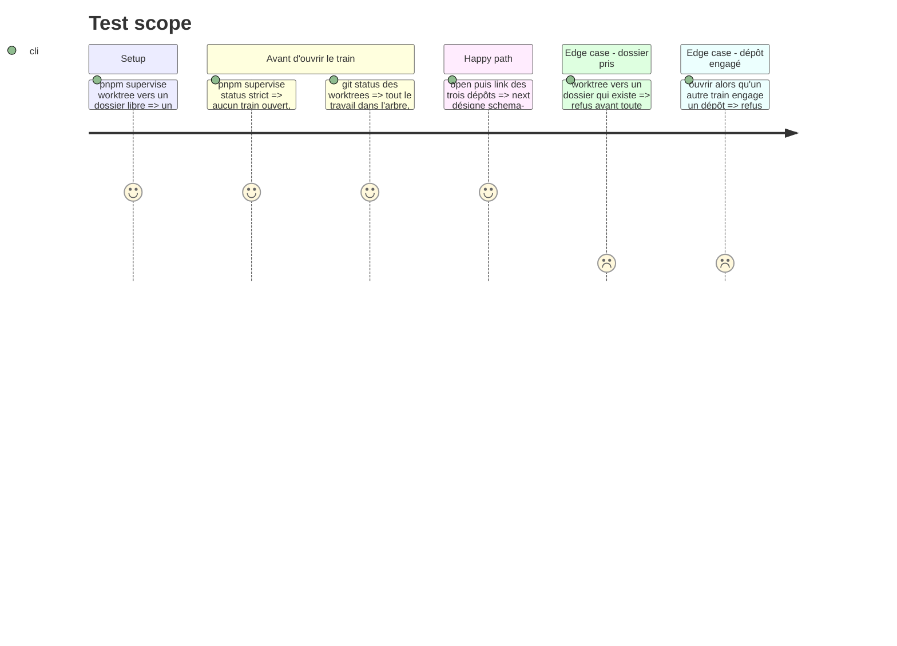

# Instruction: Créer les worktrees, puis ouvrir le train unique

> Exécution dans les worktrees du superviseur (`plan.md`, ligne Exécution) : chemins sous `<W>/<dépôt>`, commandes `pnpm supervise` lancées depuis `<W>/obsidian-handbook` avec `--root <W>`.

Deux temps, comme la phase 1 du plan Masks. La tâche 1 crée les worktrees et se fait tout de suite. La tâche 2 ouvre le train `the-sprawl` et ne vient qu'**une fois les phases 2, 3, 5, 6, les tâches 1 et 2 de la phase 4 écrites, l'essai au coffre fait (phase 7, tâche 1) et l'épingle restaurée (phase 4, tâche 3)**.

## Architecture projection

> Tree of the final files. ✅ create · ✏️ modify · ❌ delete

```txt
obsidian-handbook/
└── supervisor/trains/the-sprawl.json   ✅ écrit par `open` puis `link`, jamais à la main
```

## User Journey



## Test Scope



## Tasks to do

### `1)` Créer les worktrees (tout de suite)

1. Choisir `<W>` : un dossier qui n'existe pas, à côté des dépôts ; relire `git worktree list`. Un `<W>` des plans Masks ou Monster of the Week peut servir s'il est propre et que son train est livré
2. Depuis le checkout habituel de Handbook : `pnpm supervise worktree <W>`
3. Lire dans `<W>/schema-pbta` le contrat de `main` (`PBTA_CONTRACT_VERSION`), vérifier qu'il est tagué, noter l'avancement de Masks et de Monster of the Week : cela fixe la ligne **Versions** du plan
4. Vérifier que les briques du plan Masks sont sur `origin/main` ; sinon les reprendre
5. Enchaîner sur la phase 2

### `2)` Ouvrir et lier (code écrit) : action `board` de `ship-train`

1. Préalables : tout train qui engagerait ces dépôts est clos (ceux des autres plans compris) ; le plan est poussé ; l'essai au coffre et la restauration de l'épingle sont faits
2. Mettre chaque worktree au niveau de `origin/main` ; si `main` de `schema-pbta` a pris une majeure, renuméroter (`gen`, contrats de pack, témoins)
3. Invoquer `ship-train` avec ce plan comme routage (une ligne par dépôt, fournisseur d'abord). Le `board` lit `doc/supervisor.fr.md`, lance `pnpm supervise status --strict --root <W>` puis `next`, et décide :
   - un train ouvert qui porte déjà ce routage : il est repris, aucun `open` ;
   - aucun train ouvert : `open the-sprawl` avec le titre « The Sprawl : livret, matrice, mission et cartes de MC » ;
   - un train ouvert sur un autre sujet : arrêt, il est nommé
4. Une ligne par dépôt routé : issue nommée par l'utilisateur → `link <dépôt>#<n>` ; sinon `link <dépôt> --create --title "<titre du routage>" --yes`. Titres : « The Sprawl : contrat étendu, cibles matrice, mission et cartes, apparence du pack » pour `schema-pbta`, un titre en anglais pour Handbook, « Adopter le contrat The Sprawl de schema-pbta » pour Lantern. Un train sans ligne ne commite et ne publie rien mais se clôt en code 0 : `next` doit en lister au moins une
5. Lantern : la règle du `board` dispense d'une ligne propre un dépôt déjà routé par un fournisseur. Les trains Urban Shadows (Lantern #55) et Monsterhearts (Lantern #53) lui en ont pourtant donné une. Suivre ce que `next` affiche, et le signaler à l'utilisateur plutôt que de trancher seul
6. `pnpm supervise sync --root <W>`, puis `next`. Le fichier de train est écrit par le superviseur, jamais à la main

## Test acceptance criteria

| Task | Acceptance criteria |
| ---- | ------------------- |
| 1 | Les worktrees existent sous `<W>`, détachés sur `origin/main` ; aucun train ouvert ; la ligne Versions du plan est tranchée par écrit |
| 2 | `status --strict` sort sans écart ; `next` liste au moins une ligne et désigne `schema-pbta` d'abord ; Handbook (et Lantern si le `board` lui en donne une) en dépendent ; aucun fichier de train n'a été édité à la main |
