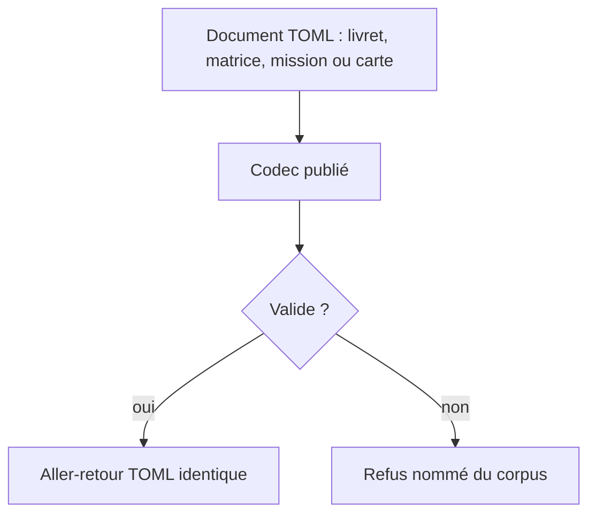
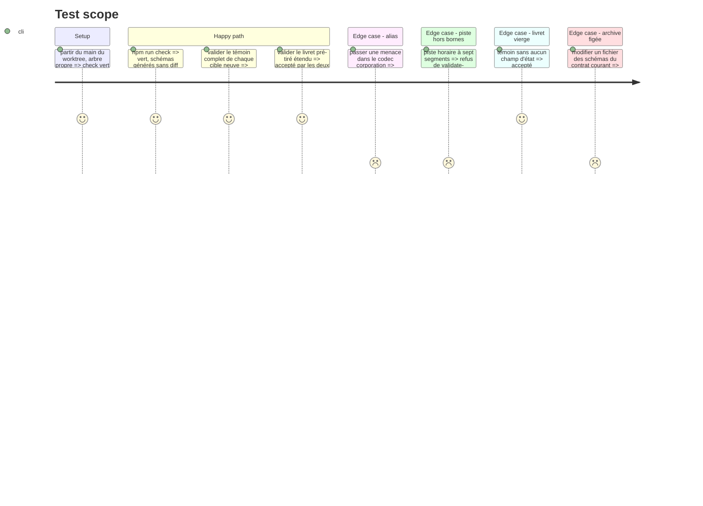

# Instruction: schema-pbta — contrat du livret et des cinq cibles neuves

> Exécution dans les worktrees du superviseur (`plan.md`, ligne Exécution) : chemins sous `<W>/<dépôt>`.

Phase d'écriture, **sans train ni commit**. Elle suppose les phases 2 à 4 du plan Masks (règle `<pack.id>-<type>`, mesure d'alias, majeure suivante). **v\<N>** est le contrat que porte `main` au départ : lire, ne recopier aucun numéro. Dépôt en **npm** (`npm.cmd run check` sous Bash). Règles : `z.strictObject`, `.optional()` jamais `.default()`, aucun `.refine()` dans `src/zod`, une `description` par propriété, règles inter-champs dans `tools/validate-references.ts`. Témoins originaux : aucun texte du livre ; le livret « Le Limier » des captures se réécrit en texte original.

## Architecture projection

> Tree of the final files. ✅ create · ✏️ modify · ❌ delete

```txt
schema-pbta/
├── src/zod/the-sprawl-playbook.ts                 ✏️ champs du livret
├── src/zod/the-sprawl-matrix.ts                   ✅
├── src/zod/the-sprawl-mission.ts                  ✅
├── src/zod/the-sprawl-threat.ts                   ✅
├── src/zod/the-sprawl-corporation.ts              ✅
├── src/zod/the-sprawl-resource.ts                 ✅
├── src/zod/sprawl-shared.ts                       ✅ sous-schémas privés : piste horaire, carte de MC
├── src/zod/constants.ts                           ✏️ cinq entrées dans TARGETS
├── src/codecs/toml.ts, src/index.ts               ✏️
├── src/presentation/collections.ts                ✏️ collections neuves du livret
├── schemas/v<N+1>/                                ✅ généré par `gen`
├── corpus/contract, temoins, refus/               ✅ une famille par cible
├── examples/the-sprawl/                           ✏️ livret ; ✅ cinq cibles
├── packs/the-sprawl/pack-contract.json            ✏️ six documents, capacités `block:*`
├── cross-tool-provider.json                       ✏️
├── tools/validate-references.ts, validate-package.ts, validate-pack-coverage.ts  ✏️
└── docs/compatibility.md, README.md, CHANGELOG.md ✏️
```

## User Journey



## Test Scope



## Tasks to do

### `1)` Ouvrir la majeure (si personne ne l'a fait)

1. Si Masks ou Monster of the Week a ouvert la majeure que ce plan partage : rebaser sur leur travail. Sinon : `contract-version.ts`, `package.json`, `archivedVersions`, assertions de `validate-package.ts`, `contractVersion` des `pack-contract.json` et de `cross-tool-provider.json`, `docs/compatibility.md`, `CHANGELOG.md` ; `validate:version` et `validate:package` le prouvent

### `2)` Étendre `the-sprawl-playbook`

> Liste arrêtée sur `livret1` et `livret2`. Champs neufs optionnels : un livret vierge reste valide. Relire le schéma courant et ne déclarer que ce qui manque.

| Champ | Forme | Région |
| ----- | ----- | ------ |
| `playbookTitle`, `characterName`, `look` | texte | titre vertical, Nom, Apparence |
| `gear`, `cyberware` | listes de choix, chacune entrée avec `label` et `checked?` | Équipement, Cybernétique |
| `stats` | six stats (Cran, Chair, Style, Pro, Esprit, Synth) | hexagones |
| `cred`, `xp` | comptes | hexagones Cred et XP |
| `directives`, `advancement` | listes cochables | Directives, Avancement |
| `links` | six entrées de lien | hexagones de liens |
| `contacts` | `string[]` | Contacts |
| `harm` | piste horaire à six segments, `marked?` | Blessure |

1. Écrire ces champs ; la piste horaire est le sous-schéma privé de `sprawl-shared.ts`
2. `validate-references.ts` : `harm.marked` ≤ six, chaque stat du livret figure dans la définition de jeu
3. `collections.ts` : collections du tableau, éditeurs existants seulement
4. Deux témoins (pré-tiré, livret vierge), un refus par contrainte, exemple à jour

### `3)` Créer les cinq cibles

1. `the-sprawl-matrix` (`matrice-pj`) : avatar, console cybernétique (quatre hexagones Résistance, Pare-feu, Furtivité, Processeur), retenues, programmes
2. `the-sprawl-mission` (`mission`) : deux volets Investigation et Action, chacun avec son compte à rebours (12h00 à 24h00), parties impliquées, « Qu'est-ce qui se passe ? », « Retournement de situation ? », Sécurité ; cadre « Mission » et « Directives de Mission »
3. `the-sprawl-threat` (`menaces`) : nom, type parmi Groupe, Solitaire, Lieu, Actualité, piste horaire, description, objectif
4. `the-sprawl-corporation` (`corpos`) : nom, piste horaire, domaines d'expertise, manœuvres personnalisées
5. `the-sprawl-resource` (`mc`) : nom, étiquettes, compétences, historique
6. `constants.ts`, `toml.ts`, `index.ts`, listes en dur de `validate-package.ts` ; corpus contractuel (accepter et refuser), corpus d'audit, exemple original par cible ; mesure d'alias élargie aux six cibles

### `4)` Déclarer les cibles et les capacités

1. `pack-contract.json` : six documents ; `requirements.handbook` gagne `block:sprawl-matrix`, `block:sprawl-mission`, `block:sprawl-card` ; `requirements.lantern` reste `edit:pbta`
2. `cross-tool-provider.json` : capacités ajoutées, aucune collection publiée pour les cibles neuves

### `5)` Vérifier

1. `npm.cmd run check` vert, schémas générés sans écart, rien de commité

## Test acceptance criteria

| Task | Acceptance criteria |
| ---- | ------------------- |
| 1 | Le paquet s'annonce en majeure suivante, l'archive du contrat courant est identique au tag |
| 2 | Pré-tiré et livret vierge acceptés et stables ; chaque contrainte neuve a son refus |
| 3 | Chaque témoin est accepté par sa cible et refusé par les cinq autres ; une piste horaire hors bornes est refusée |
| 4 | Le contrat du pack déclare six documents ; chaque exigence est incluse dans les capacités du fournisseur |
| 5 | `check` est vert et ne laisse aucun diff |
