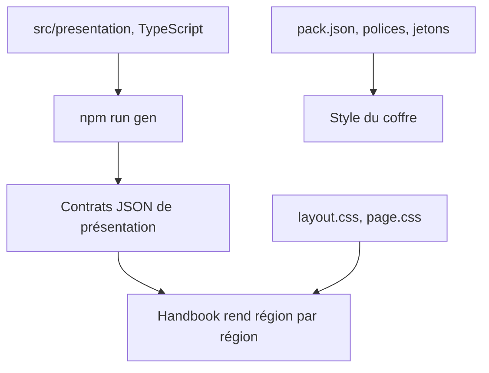
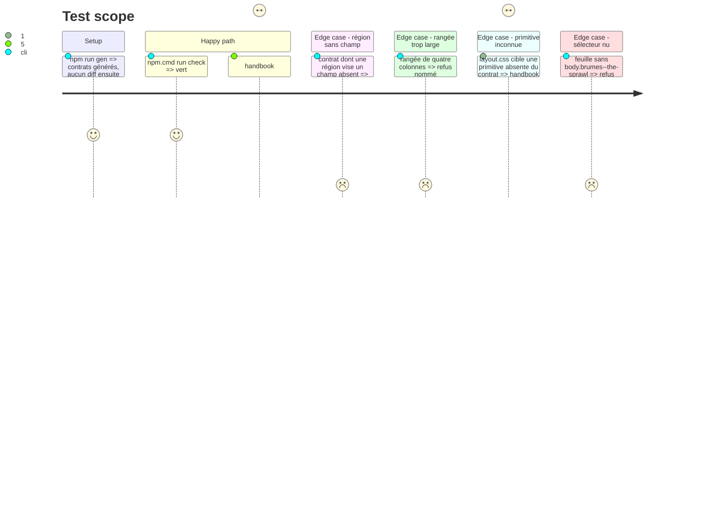

# Instruction: schema-pbta — présentation et apparence du pack The Sprawl

> Exécution dans les worktrees du superviseur (`plan.md`, ligne Exécution) : chemins sous `<W>/<dépôt>`.

Phase d'écriture, **sans train ni commit**, dans le même élément `schema-pbta` que la phase 2. Les contrats de présentation sont **générés** : on rédige `src/presentation/<cible>.ts`, `npm run gen` écrit les JSON, jamais édités. Le modèle est la phase 3 du plan Masks.

## Architecture projection

> Tree of the final files. ✅ create · ✏️ modify · ❌ delete

```txt
schema-pbta/
├── src/presentation/the-sprawl-playbook.ts        ✅ deux faces
├── src/presentation/the-sprawl-matrix.ts          ✅
├── src/presentation/the-sprawl-mission.ts         ✅
├── src/presentation/the-sprawl-card.ts            ✅ squelette commun, rangées des trois cartes (voir tâche 1)
├── src/presentation/index.ts                      ✏️
├── packs/the-sprawl/*presentation-contract.json   ✅ généré
├── packs/the-sprawl/pack-contract.json            ✏️ `presentation:pbta-layout` pour handbook
├── corpus/presentation/invalid/                   ✅ un fichier par contrainte
├── src/presentation/the-sprawl-appearance.ts           ✅ source de l'apparence : ressources et jetons propres au pack
├── packs/the-sprawl/appearance-contract.json ✅ généré, référencé par `appearanceArtifact`
├── handbook/the-sprawl/pack.json                  ✏️ `pack.assets` (polices, feuilles), thème de la note, version du pack
└── handbook/the-sprawl/assets/
    ├── fonts/                                     ✅ WOFF2 de substitution et `OFL.txt`
    └── styles/                                    ✅ `page.css`, `layout.css`
```

## User Journey



## Test Scope



## Wireframe

```txt
LIVRET — recto
┌──┬──────────────────┬──────────────────┬───────────────────┐
│L │ (2) Nom           │ (4) Équipement    │ (6) Cybernétique   │
│E │ (3) Apparence     │     choix d'armes │     implants       │
│  │                   │     options       │     raison, moyen  │
│L │  illustration     │                   │                    │
│I │  (image de la     │                   │                    │
│M │   note, hors bloc)│                   │                    │
└──┴──────────────────┴──────────────────┴───────────────────┘
(1) titre vertical « LE LIMIER »

LIVRET — verso
┌───────────────────┬───────────────────┬───────────────────┐
│ (7) Manœuvres      │ (8) Stats ⬡⬡⬡⬡⬡⬡  │ (11) Liens ⬡×6     │
│     2 colonnes     │     Cran Chair ...│ (12) Contacts      │
│                    │ (9) Cred ⬡ XP ⬡   │ (13) Blessure      │
│                    │ (10) Directives   │     15h 18h 21h    │
│                    │     Avancement    │     22h 23h 24h    │
└───────────────────┴───────────────────┴───────────────────┘

MATRICE                    MISSION
┌─────────────────────┐   ┌────────────────────────────────┐
│ Avatar               │   │ Investigation   Action          │
│ Console ⬡⬡⬡⬡         │   │ 12h ... 24h     12h ... 24h     │
│ Retenues             │   │ Parties, « Qu'est-ce qui se     │
│ Programmes           │   │ passe ? », Retournement, Sécurité│
└─────────────────────┘   │ Cadre « Mission » · Directives  │
                          └────────────────────────────────┘

CARTES DE MC (coins coupés)
┌─────────────────────┐
│ NOM · type          │   menace : type Groupe/Solitaire/Lieu/Actualité,
│ piste 15h … 24h     │   piste, description, objectif
│ corps de la carte   │   corpo : piste, domaines, manœuvres
└─────────────────────┘   ressource : étiquettes, compétences, historique
```

Croquis de structure à faire valider ; les positions et libellés viennent des contrats et se règlent sur les captures. Les régions sont à numéroter d'après `livret1` et `livret2`.

## Tasks to do

### `1)` Contrats de présentation

1. Vérifier que `presentation` du manifeste est une liste ; The Sprawl y déclare six entrées. Les trois cartes de MC partagent un squelette de rangées dans `the-sprawl-card.ts`, chacune gardant sa source et son contrat généré (ou, si la génération l'impose, trois fichiers qui importent le squelette) : à trancher à l'écriture et porter dans le tableau Decisions
2. Rédiger les sources TypeScript : régions, ordre, libellés français, primitives nommées (`hexagon`, `hour-track`, `cut-corner-card`), faces `recto`/`verso` pour le livret seul, rangées de une à trois colonnes ; `npm run gen`
3. Corpus de refus dans `corpus/presentation/invalid/` : région sans champ, rangée de plus de trois colonnes, rangée sur deux faces, primitive inconnue, id dupliqué ; `validate-presentation-contract.ts` nomme les régions volontairement non placées
4. `pack-contract.json` : `presentation:pbta-layout` pour handbook, pas pour lantern. L'entrée `presentation` de chaque cible gagne `appearanceArtifact: appearance-contract.json` (le paquet ne publie encore aucun contrat de présentation ni d'apparence pour ce jeu : tout part de `pack-contract.json` seul)

### `2)` Polices, jetons, fond blanc

1. Choisir sur un rendu côte à côte au coffre une famille libre par rôle (titre, corps, chiffres des hexagones) parmi Michroma, Jura, Exo 2 ; vérifier que les accents français sont couverts
2. Publier chaque famille en WOFF2 compressé sans sous-ensemblage ni instanciation, avec son `OFL.txt` ; déclarer dans `pack.json` (`pack.assets.fonts`, au format `famille → file, weight, style`) et dans la source d'apparence (`resources.fonts`, `famille → chemin`)
3. Jetons : jetons propres au pack dans la source `src/presentation/the-sprawl-appearance.ts` (variante `base`, noms `--the-sprawl-*`), contrat généré par `npm run gen` ; variables de thème d'Obsidian dans `pack.style.base.note` de `pack.json` (celles que le paquet porte déjà y sont réécrites, pas dupliquées) ; ensuite : papier `#fff`, accent bleu glace, accent orange, texte ; remplacent le magenta et le sarcelle actuels ; rien de sombre ; `--code-normal` et `--code-background` fixés
4. Aucun fichier de police d'origine dans le dépôt

### `3)` Feuilles du pack

1. `page.css` : titres, puces, tableaux ; `layout.css` : géométrie du livret, de la matrice, de la mission et des cartes. Les primitives (hexagone, piste horaire, carte à coins coupés) sont définies **une fois** par `clip-path` et propriétés personnalisées, réutilisées par toutes les régions ; sélecteurs commençant par `body.brumes--the-sprawl`, pas d'`@import`, moins de 256 Kio
2. Cases à cocher : `align-items: flex-start`, `margin: calc((1lh - 1.25rem) / 2) 0 0`, `font: inherit` ; saut de page entre faces et papier blanc dans `@media print` ; aucune règle sombre
3. Vérifier les callouts génériques sur fond blanc
4. `handbook:validate` : `layout.css` ne cible que des régions et primitives du contrat

### `4)` Version du pack

1. `handbook/the-sprawl/pack.json` : version relevée ; `minimumHandbookVersion` inchangé (tranché après la release de Handbook, phase 7, tâche 4)

## Test acceptance criteria

| Task | Acceptance criteria |
| ---- | ------------------- |
| 1 | `gen` ne laisse aucun diff, chaque contrainte a son refus, `presentation:pbta-layout` côté handbook seulement |
| 2 | Chaque police déclarée existe avec sa licence ; aucune police d'origine ; accents français rendus |
| 3 | `handbook:validate` passe ; chaque primitive est définie une seule fois ; aucune règle sombre statique ; `check` vert |
| 4 | Le pack annonce une version neuve ; `minimumHandbookVersion` inchangé |
