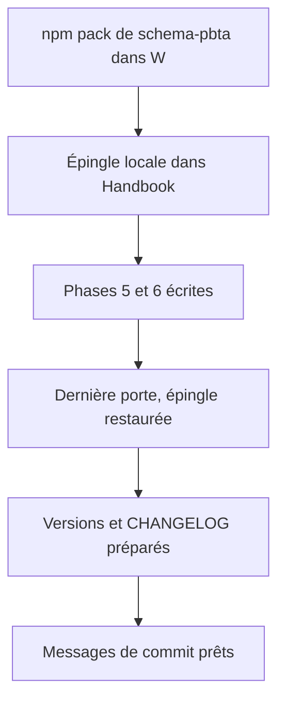
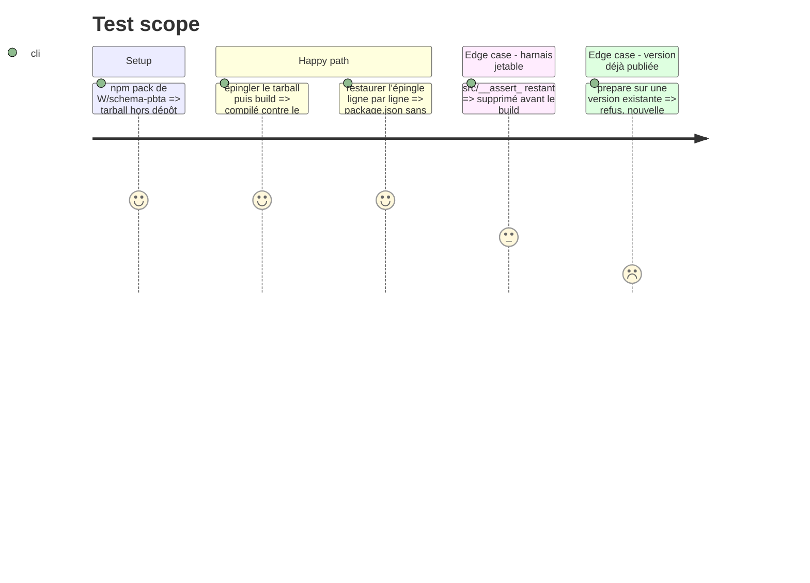

# Instruction: Adoption par Handbook et Lantern, puis versions et pose du travail

> Exécution dans les worktrees du superviseur (`plan.md`, ligne Exécution) : chemins sous `<W>/<dépôt>`, commandes `pnpm supervise` lancées depuis `<W>/obsidian-handbook` avec `--root <W>`.

Les tâches 1 et 2 sont de l'écriture, sans train ni commit. La tâche 3 vient après l'essai au coffre (phase 7, tâche 1) et avant l'ouverture du train. Modèle : la phase 4 du plan Masks.

## Architecture projection

> Tree of the final files. ✅ create · ✏️ modify · ❌ delete

```txt
obsidian-handbook/
├── src/features/pbta/specializedPlaybooks.ts   ✏️ règle d'appartenance lue dans le contrat du pack (vérifier)
├── package.json, pnpm-lock.yaml                ✏️ épingle tarball locale, jamais commitée ; puis release publiée
├── CHANGELOG.md                                ✏️ section de la version du train
├── manifest.json, versions.json                ✏️ tenus par `pnpm version`
└── tools/                                      ✏️ listes de cibles des harnais de contrat
lantern/
├── package.json, package-lock.json             ✏️ épingle
└── CHANGELOG.md                                ✏️
```

## User Journey



## Test Scope



## Tasks to do

### `1)` Règle d'appartenance

1. Vérifier que Handbook déduit le pack d'une cible par `documents[].target` de `pack-contract.json`, pas en retirant un suffixe ; reprendre la tâche du plan Masks si elle n'est pas livrée. Six cibles dont cinq sans suffixe `-playbook` en font l'épreuve

### `2)` Épingle locale

1. `npm pack` de `<W>/schema-pbta` hors dépôt ; épingler ce tarball dans Handbook (`package.json`, `pnpm-lock.yaml`) et dans Lantern
2. Tant qu'elle est là, `pnpm check` s'arrête sur les harnais d'épingle (rouges par construction) : build, lints et `assert:*` un par un

### `3)` Versions, restauration, pose

1. Dernière porte avant de quitter l'épingle : build, `pnpm lint`, `eslint src --ext .ts`, `assert:guards-by-role`, `assert:pbta-pack-coverage`, `assert:style-scope`, `assert:mist-font-packs`, harnais de blocs et de layout de ce plan
2. Restaurer l'épingle, ligne par ligne si un script neuf figure dans `package.json`
3. Supprimer tout harnais jetable `src/__assert_*.ts`
4. Consommateurs changés seulement (Lantern n'en fait partie que si du code y a changé ; sa version déjà en avance sur sa release est laissée) : version et `CHANGELOG` par l'action `prepare` de `ship-train` (`npm version`, `pnpm version`, jamais à la main)
5. Montrer les diffs de version à l'utilisateur, écrire les trois messages de commit en anglais dans le fichier que donne `git rev-parse --git-path SUPERVISOR_COMMIT_MSG` de chaque worktree modifié (en worktree lié, `.git` est un fichier), chacun fermant l\'issue liée

## Test acceptance criteria

| Task | Acceptance criteria |
| ---- | ------------------- |
| 1 | Aucune cible spécialisée n'est rattachée à son pack par retrait de suffixe |
| 2 | Handbook et Lantern compilent contre le tarball local ; aucun fichier d'épingle dans un commit |
| 3 | Aucune épingle locale, aucun harnais jetable ; versions et `CHANGELOG` prêts ; messages de commit écrits |
