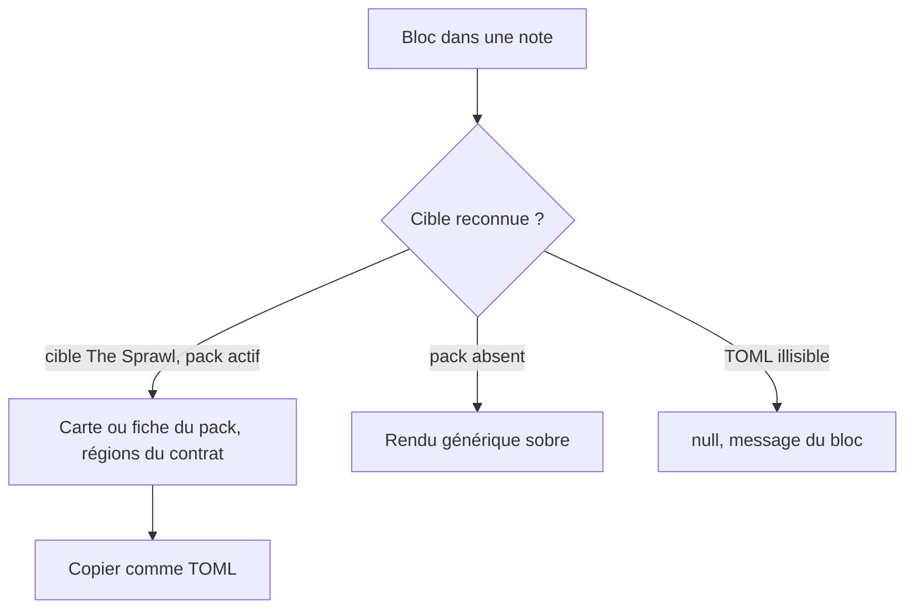
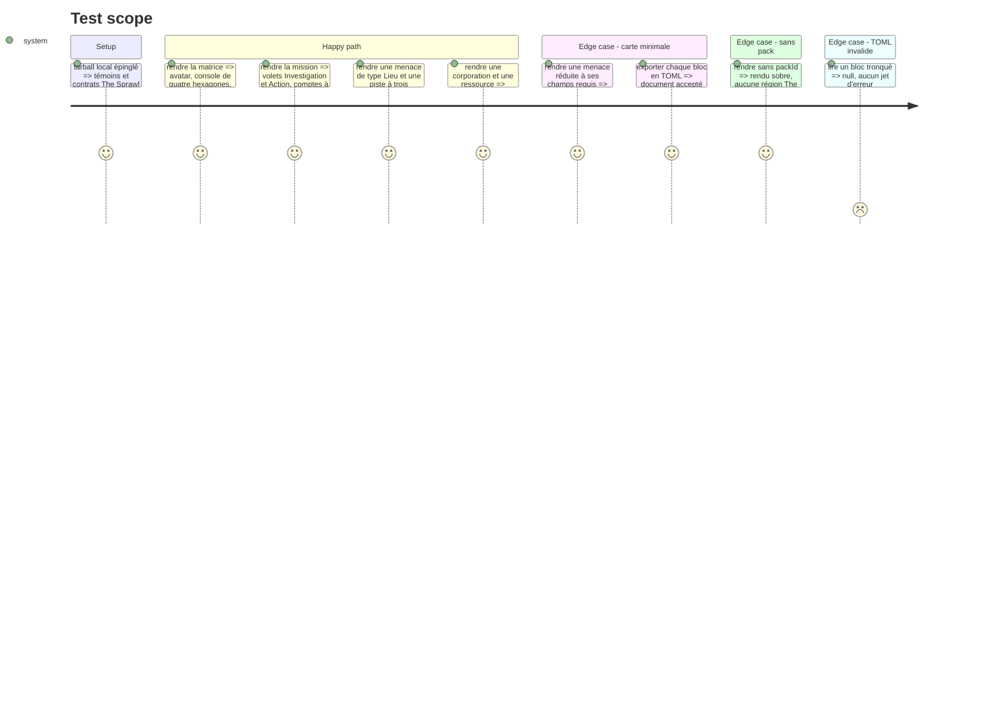

# Instruction: Handbook — blocs matrice, mission et cartes de MC

> Exécution dans les worktrees du superviseur (`plan.md`, ligne Exécution) : chemins sous `<W>/<dépôt>`.

Phase d'écriture, **sans train ni commit**, sur l'épingle locale de la phase 4. Gardes : un rôle, jamais un chiffre (`pnpm assert:guards-by-role`), donnée fermée marquée `guard-fixture: <raison>`. Les quatre obligations d'un format de bloc (`aidd_docs/guidelines/schema-design.md`) s'appliquent. Modèle : la phase 5 du plan Masks, et la phase 5 du plan Monster of the Week pour la sous-structure partagée.

## Architecture projection

> Tree of the final files. ✅ create · ✏️ modify · ❌ delete

```txt
.
├── src/features/pbta/sprawlMatrix.ts               ✅ matrice du PJ
├── src/features/pbta/sprawlMission.ts              ✅ fiche de mission
├── src/features/pbta/sprawlCard.ts                 ✅ menace, corporation, ressource
├── src/features/pbta/sprawlPrimitives.ts           ✅ hexagone et piste horaire, rendus une fois
├── src/features/pbta/block.ts                      ✏️ blocs `sprawl-matrix`, `sprawl-mission`, `sprawl-card`, gabarits
├── src/features/pbta/shape.ts                      ✏️ zones nommées
├── src/features/pbta/coverage.ts                   ✏️ cinq cibles projetées
├── src/features/blocks/registry.ts, tomlExports.ts ✏️
├── src/games/capabilities.ts                       ✏️ trois capacités `block:*`
├── tools/assert-sprawl-layout.mjs                  ✅
├── tools/assertSprawlLayout.harness.mts            ✅ faux DOM avec setAttribute et dataset
├── tools/pbtaPackCoverage.harness.mts, pbtaContractCorpus.mts, customPacks.harness.mts, contextualPackBlocks.harness.mts  ✏️
├── package.json                                    ✏️ script `assert:sprawl-layout`
├── aidd_docs/guidelines/schema-design.md           ✏️ trois blocs
└── aidd_docs/memory/internal/pbta-coverage.md      ✏️ cinq cibles projetées
```

## User Journey



## Test Scope



## Wireframe

Les croquis de la matrice, de la mission et des cartes sont ceux de la phase 3. Ce qui est à faire valider ici : l'ordre des régions de la carte de MC (nom et type, piste, corps), la place du cadre « Directives de Mission », et le rendu sobre sans pack (liste de définitions, sans hexagone ni coin coupé).

## Tasks to do

### `1)` Projeter les cinq cibles

1. `coverage.ts`, `specializedPlaybooks.ts`, `pbtaContractCorpus.mts` : les cinq cibles rejoignent les cibles projetées, associées à leur bloc ; égalités des harnais mises à jour

### `2)` Les blocs

1. Lecture tolérante : la cible du pack d'abord, `null` sinon ; `sprawl-card` lit les trois cibles de carte et choisit son rendu par la cible
2. Rendu région par région d'après le contrat, une région sans donnée n'est pas émise ; rendu sobre sans pack
3. `sprawlPrimitives.ts` rend l'hexagone (valeur, libellé) et la piste horaire (segments cochés) une seule fois ; les cartes, la matrice, le livret et la mission l'appellent
4. Zones dans `shape.ts`, « copier comme TOML », gabarits d'insertion, capacités `block:*`, drapeau `pbtaParser` réutilisé
5. Aucun SCSS dans Handbook : accroches `data-region`, `data-primitive`, `data-row`, `data-column` aux valeurs du contrat

### `3)` Harnais

1. `assert:sprawl-layout`, volet blocs : régions, ordre, libellés, segments de piste, accroches, lus dans le contrat publié
2. Les cinq cibles ajoutées aux corpus de contrat, de packs contextuels et personnalisés
3. Mémoire et guide à jour

## Test acceptance criteria

| Task | Acceptance criteria |
| ---- | ------------------- |
| 1 | `assert:pbta-pack-coverage` ne liste plus les cinq cibles comme non résolues |
| 2 | Chaque bloc rend sa fiche, un TOML tronqué ne rend rien et ne lève pas, l'export TOML repasse le codec, les primitives n'ont qu'une implémentation |
| 3 | Le harnais échoue si une région, un segment ou une accroche est retiré ; aucun fichier de `src/styles/` n'a changé ; build, lints et `assert:*` touchés verts un par un ; rien n'est commité |
