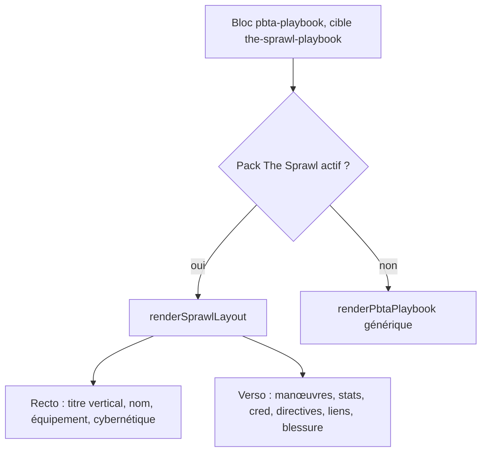
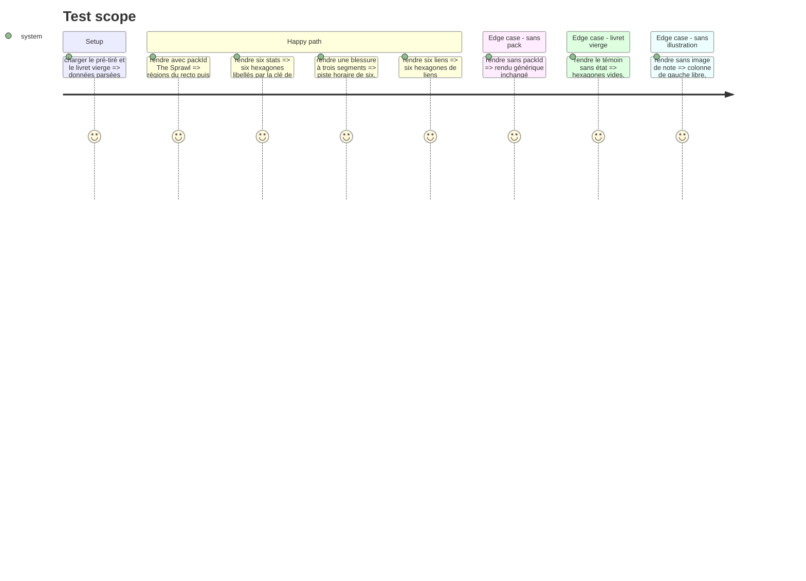

# Instruction: Handbook — layout du livret de PJ

> Exécution dans les worktrees du superviseur (`plan.md`, ligne Exécution) : chemins sous `<W>/<dépôt>`.

Suite de la phase 5 : même worktree, même tarball local, toujours sans train ni commit. Modèle : `masksLayout.ts` (plan Masks, phase 6). Le rendu générique du playbook reste valide sans `packId`. Les primitives de `sprawlPrimitives.ts` (phase 5) servent ici aussi.

## Architecture projection

> Tree of the final files. ✅ create · ✏️ modify · ❌ delete

```txt
.
├── src/features/pbta/sprawlLayout.ts               ✅ recto et verso, régions du contrat
├── src/features/pbta/block.ts                      ✏️ ligne `the-sprawl` + `the-sprawl-playbook` dans PLAYBOOK_LAYOUTS
├── src/features/pbta/renderer.ts                   ✏️ PBTA_SPECIALIZED_FIELDS pour les champs neufs
├── src/features/pbta/shape.ts                      ✏️ zones du livret
├── tools/assertSprawlLayout.harness.mts            ✏️ volet livret
├── tools/pbtaSpecializedProjection.harness.mts     ✏️ champs neufs
└── <W>/schema-pbta/handbook/the-sprawl/assets/styles/layout.css  ✏️ géométrie réglée au coffre
```

## User Journey



## Test Scope



## Wireframe

Le croquis du livret est celui de la phase 3 ; les positions exactes suivent `livret1` et `livret2` par le contrat. À faire valider ici : le titre vertical sur toute la hauteur, l'illustration pleine hauteur à gauche du recto (image de la note), les deux colonnes de manœuvres, le groupe Stats/Cred/XP en hexagones.

## Tasks to do

### `1)` Brancher le layout

1. `PLAYBOOK_LAYOUTS` : ajouter la ligne `the-sprawl` + `the-sprawl-playbook`, aucun ternaire par jeu
2. `sprawlLayout.ts` importe le contrat de présentation et rend région par région ; une région sans donnée n'est pas émise

### `2)` Régions mécaniques

1. Stats, Cred, XP, liens : hexagones de `sprawlPrimitives.ts`, libellé de chaque stat = sa clé dans le document, jamais une chaîne du layout
2. Manœuvres, directives, avancement, contacts, équipement, cybernétique, blessure en piste horaire
3. `PBTA_SPECIALIZED_FIELDS` étendu : le rendu générique imprime aussi les champs neufs

### `3)` Faces, accroches, harnais

1. `data-face`, `data-region`, `data-primitive`, `data-row`, `data-column` aux valeurs du contrat ; aucun SCSS neuf ; `dist/styles.css` ne bouge pas
2. `assert:sprawl-layout`, volet livret ; `assert:pbta-specialized-projection` : un témoin par cible affiche chaque champ neuf

## Test acceptance criteria

| Task | Acceptance criteria |
| ---- | ------------------- |
| 1 | Un livret The Sprawl rend le layout quand le pack est actif, le rendu générique sinon ; les autres livrets PbtA sont inchangés (`pnpm dump:dom` sans diff hors The Sprawl) |
| 2 | Six stats rendent six hexagones ; une blessure de trois rend trois segments pleins ; aucun libellé n'est une chaîne du layout |
| 3 | Le harnais échoue si une région ou une accroche est retirée ; `dist/styles.css` garde la taille mesurée avant la phase 5 |
