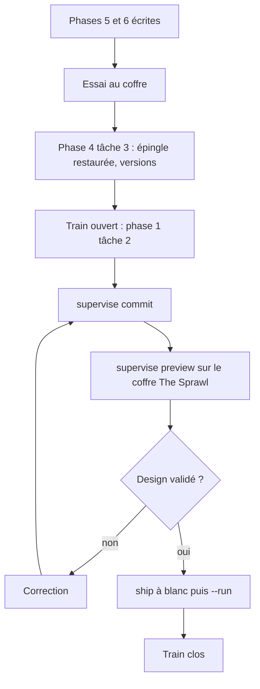
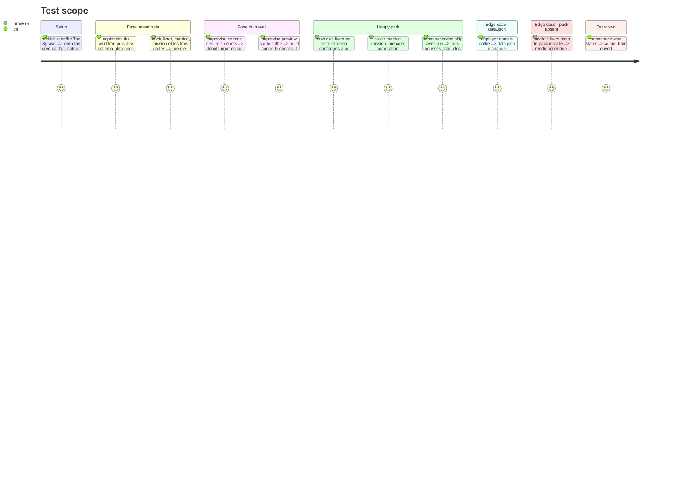

# Instruction: Essayer au coffre, puis valider le rendu et livrer le train

> Exécution dans les worktrees du superviseur (`plan.md`, ligne Exécution) : chemins sous `<W>/<dépôt>`, commandes `pnpm supervise` lancées depuis `<W>/obsidian-handbook` avec `--root <W>`.

Deux temps, comme la phase 8 du plan Masks. La tâche 1 est la fin de l'écriture : essai au coffre sur tarball local, sans train ni commit. Les tâches 2 à 4 livrent le train `the-sprawl`. L'utilisateur ne valide que le design et le fonctionnel.

## Architecture projection

> Tree of the final files. ✅ create · ✏️ modify · ❌ delete

```txt
obsidian-handbook/
└── supervisor/trains/the-sprawl.json              ✏️ clos par `ship`
schema-pbta/
└── handbook/the-sprawl/                           ✏️ seulement si la validation demande une retouche d'apparence
aidd_docs/memory/internal/ci-and-release.md        ✏️ clôture
```

## User Journey



## Test Scope



## Tasks to do

### `1)` Essai au coffre (écriture, avant tout train)

1. Préalable, constaté le 2026-10-08 : le dossier `C:/Users/fxgui/Documents/Perso/RPG/the-sprawl` n'a **pas de `.obsidian`** (seul `_sources` y figure). Ce n'est pas un vrai coffre tant que l'utilisateur ne l'a pas ouvert dans Obsidian et n'y a pas installé Handbook ; c'est son geste, demandé avant la tâche. Ensuite seulement : Handbook activé avec son propre `data.json`, source `schema-pbta` sous `.obsidian/handbook/sources/`. Sans ce coffre, la tâche 1 et la tâche 3 s'arrêtent et le disent
2. Depuis `<W>/obsidian-handbook`, épingle locale en place : `rtk proxy pnpm build`, copie de `dist/main.js`, `dist/styles.css`, `dist/manifest.json` dans `.obsidian/plugins/obsidian-handbook/` ; jamais écraser `data.json` (md5 avant et après)
3. `pnpm dev:schema-pbta --vault <coffre> --once` : le pack non publié du worktree
4. **Choix des polices** : deux ou trois candidats par rôle côte à côte, l'utilisateur tranche ; **réglage des teintes** (bleu glace, orange) sur fond blanc ; vérifier les hexagones et les coins coupés dans le navigateur d'Obsidian
5. Défaut de rendu : Handbook ; d'apparence ou de géométrie : `handbook/the-sprawl/` ; de contrat : `schema-pbta` puis nouveau `npm pack`. **Aucun ne coûte de release à ce stade**
6. Enchaîner sur la phase 4, tâche 3, puis la phase 1, tâche 2

### `2)` Pose du travail (action `preview` de `ship-train`, début)

1. **Nettoyer avant `commit`** : `commit` balaie tous les fichiers non suivis du dépôt, quel qu'en soit l'auteur. Comparer `git status` de chaque dépôt avec ce que le routage a produit ; tout fichier hors routage (les dossiers des autres plans sous `aidd_docs/tasks/`, un dossier temporaire généré) est copié dans le dossier scratchpad, laissé hors du commit, puis remis en place une fois le travail posé
2. Version et `CHANGELOG` de `prepare` sont déjà écrits avant le commit, jamais dans un second
3. Un message de commit en anglais par dépôt modifié dans le fichier que donne `git rev-parse --git-path SUPERVISOR_COMMIT_MSG` (en worktree lié, `.git` est un fichier) ; il ferme l'issue liée (`Closes #<n>`) pour que `next` rapporte la ligne `done`
4. Lire le plan par `pnpm supervise ship --root <W>` sans `--run`, puis `pnpm supervise commit <dépôt> --root <W>` une fois par dépôt (commit et push, aucune release). Un consommateur qui attend une release du fournisseur non encore adoptée ne compile pas sur `main` après la pose : c'est l'ordre attendu, le superviseur adopte l'épingle pendant `ship --run`, ce n'est pas à réparer
5. Un refus se lit dans le journal complet (`Whole output:`), puis action `repair` de `ship-train`
6. Aucune épingle locale ne subsiste, aucun harnais jetable

### `3)` Validation visuelle

1. Le coffre est celui du jeu, fixé par le `CLAUDE.md` du coordinateur ; `pnpm supervise preview --vault <coffre> --root <W>` en tâche de fond : Handbook construit contre le checkout de `schema-pbta`, packs montés ; `data.json` intact
2. Comparer aux captures : livret recto et verso, matrice, mission, menaces, corpos, ressources de MC ; deux témoins du livret (pré-tiré réécrit en texte original, livret vierge)
3. Vérifier l'export PDF du livret et d'une fiche de mission : fond blanc
4. S'arrêter au verdict : aucun `--run` avant la réponse. Une correction renvoie à l'action `implement`, puis nouvelle pose et nouveau `preview`

### `4)` Livraison

1. Action `ship` : sans verdict ni demande de reprise dans la conversation, retour à `preview`. Sinon `pnpm supervise ship --run --root <W>` ; code 0 : `status` puis rapport des tags, adresses de release et durée ; code non nul : lire en entier le fichier nommé après `Whole output:` et passer à `repair` (arrêt à la deuxième occurrence de la même signature, trois tours au plus)
2. Après publication, toute retouche de contrat ou de pack est un correctif du fournisseur (finale immuable) ; une retouche d'apparence est un commit diffusé à la release suivante du schéma
3. Après la release de Handbook : décider si `minimumHandbookVersion` du pack relève, en commit `schema-pbta` distinct

### `5)` Clôture

1. Mettre à jour `aidd_docs/memory/internal/ci-and-release.md` ; fermer l'issue du train
2. Signaler que les worktrees de `<W>` restent en place : `git worktree remove` et `git pull` sont les gestes de l'utilisateur

## Test acceptance criteria

| Task | Acceptance criteria |
| ---- | ------------------- |
| 1 | Le coffre rend les six fiches depuis le build et les packs du worktree ; `data.json` a le même md5 ; polices et teintes arrêtées ; rien n'est commité |
| 2 | Les trois dépôts sont propres et à `origin/main` ; aucune épingle locale ; aucune release publiée |
| 3 | L'utilisateur a validé les rendus face aux captures ; `data.json` intact |
| 4 | Les tags des trois dépôts sont publiés ; le train `the-sprawl` est clos |
| 5 | Mémoire à jour, issue fermée |
