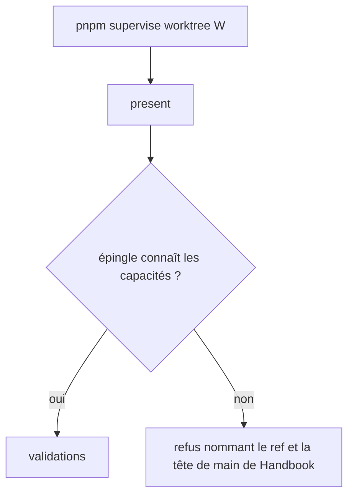
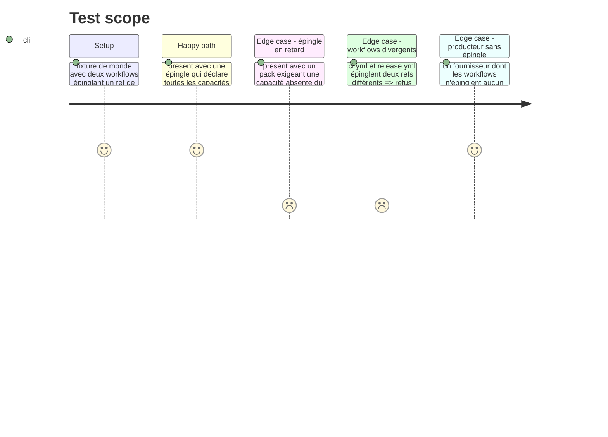

# Instruction: Worktree et garde d'épingle de producteur

## Architecture projection

> Tree of the final files. ✅ create · ✏️ modify · ❌ delete

```txt
obsidian-handbook/
├── tools/supervisor/producerPin.mjs          ✅ lit les `ref:` des workflows et les capacités exigées
├── tools/supervisor/present.mjs              ✏️ appelle la garde dans `checkPreconditions`
├── tools/producerPin.harness.mts             ✅ preuve de la garde
├── tools/assert-producer-pin.mjs             ✅ lanceur du harnais
└── package.json                              ✏️ script `assert:producer-pin`, ajouté à `check`
```

## User Journey



## Test Scope



## Tasks to do

### `1)` Créer le worktree

> Travailler hors du checkout habituel.

1. Attendre la fin du `ship --run` en cours ; relire `git worktree list`
2. `pnpm supervise worktree <W>` depuis le checkout habituel ; toutes les commandes suivantes avec `--root <W>`
3. Obtenir l'accord de l'utilisateur pour éditer `tools/supervisor/**`

### `2)` Lire l'épingle et les capacités exigées

> Un module pur, testable sans réseau.

1. Lire dans `.github/workflows/*.yml` du fournisseur chaque étape qui extrait `RebelliousSmile/obsidian-handbook` et son `ref`
2. Lire l'union des `requires` des `pack.json` du fournisseur
3. Lire par `git show <ref>:src/games/capabilities.ts` les capacités déclarées par ce Handbook : la liste complète n'y est pas exportée (`ALL_CAPABILITIES` est composée à partir de `GAME_PLUGIN_SUPPORT`), donc extraire tous les littéraux de la forme `<famille>:<nom>` du fichier plutôt que d'évaluer le module
4. Faire `fetchOrigin` sur le checkout de Handbook avant la lecture ; un `ref` introuvable est lui-même un refus (la CI échouerait au checkout)
5. Retourner les capacités manquantes par ref, et la tête de `main` de Handbook comme candidat

### `3)` Brancher la garde dans `present`

> Avant la première validation.

1. Appeler la garde dans `checkPreconditions` pour chaque fournisseur du train
2. Écrire le refus : capacités manquantes, `ref` en cause, fichier de workflow à corriger, candidat
3. Couvrir les quatre cas du Test Scope, plus le `ref` introuvable, dans le harnais (monde de fixtures `fixtures/supervisor/world.mts`, comme `tools/supervisor.harness.mts`) et l'ajouter à `pnpm check`

## Test acceptance criteria

| Task | Acceptance criteria                                                                                                      |
| ---- | ------------------------------------------------------------------------------------------------------------------------ |
| 1    | Le worktree existe, détaché, installé ; aucune branche créée                                                              |
| 2    | La liste des capacités manquantes est exacte pour un ref complet, un ref en retard et un ref introuvable                  |
| 3    | `present` refuse avant toute validation quand l'épingle est en retard et passe quand elle suffit ; `pnpm assert:guards-by-role` reste vert (aucun littéral de version ni de SHA) |
