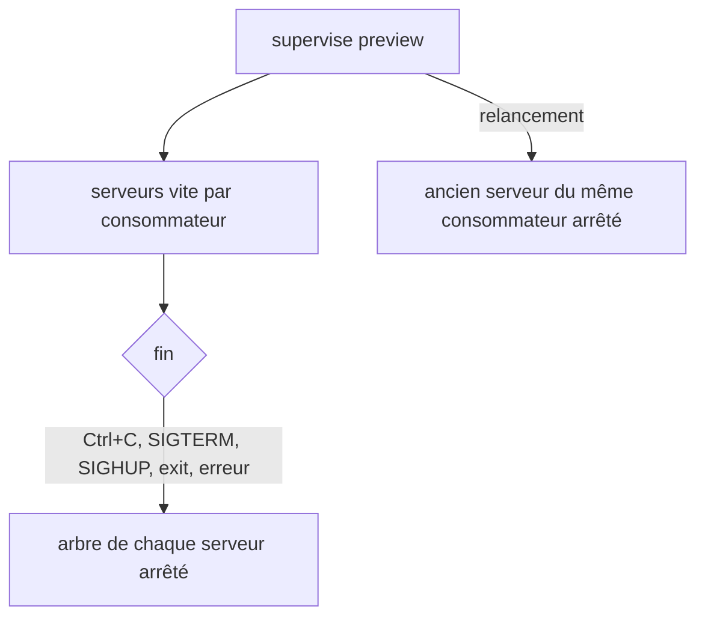
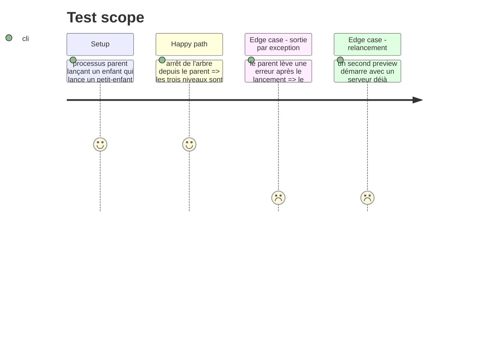

# Instruction: Fermeture des processus de `supervise preview`

## Architecture projection

> Tree of the final files. ✅ create · ✏️ modify · ❌ delete

```txt
obsidian-handbook/
├── tools/supervisor/processTree.mjs          ✅ arrêt d'un arbre de processus, multiplateforme
├── tools/supervisor/preview.mjs              ✏️ nettoyage à toute sortie, arrêt de l'ancien serveur
├── tools/supervisor/previewServer.mjs        ✏️ fermeture propre de vite à la fin du parent
├── tools/processTree.harness.mts             ✅ preuve : aucun descendant ne survit
└── tools/assert-process-tree.mjs             ✅ lanceur du harnais
```

## User Journey



## Test Scope



## Tasks to do

### `1)` Arrêter un arbre de processus

> `child.kill()` ne tue que l'enfant direct sous Windows.

1. Écrire `processTree.mjs` : `taskkill /pid <pid> /T /F` sous Windows, groupe de processus (`detached` + `process.kill(-pid)`) ailleurs ; aucune dépendance neuve
2. Rendre l'arrêt idempotent : un arbre déjà mort n'est pas une erreur

### `2)` Nettoyer à toute sortie

> Ctrl+C n'est pas la seule fin possible.

1. Dans `preview.mjs`, enregistrer le nettoyage sur `SIGINT`, `SIGTERM`, `SIGHUP`, `exit` et sur toute exception de la section de service ; le gestionnaire `exit` est synchrone, donc l'arrêt d'arbre utilise `spawnSync` (`spawn.mjs`)
2. Enregistrer les PID des serveurs dans un fichier **local non suivi** sous le répertoire git (comme les journaux, `<git-dir>/supervisor-logs/`), jamais dans `supervisor/trains/` qui est commité ; au démarrage, arrêter ceux d'un précédent `preview` encore vivants. Un PID n'est tué que si sa ligne de commande (`Get-CimInstance Win32_Process` sous Windows, `ps` ailleurs) est celle du serveur de prévisualisation ; ligne illisible → ne pas tuer
3. Dans `previewServer.mjs`, appeler `server.close()` quand le parent disparaît

## Test acceptance criteria

| Task | Acceptance criteria                                                                                                          |
| ---- | ---------------------------------------------------------------------------------------------------------------------------- |
| 1    | Après l'arrêt, aucun descendant du processus lancé ne reste vivant                                                            |
| 2    | Après chaque type de sortie, aucun `previewServer.mjs` ne reste ; un PID réutilisé par un autre programme n'est jamais tué     |
