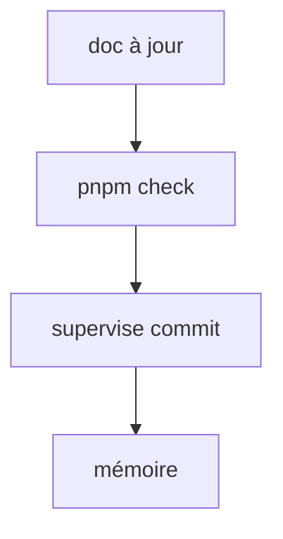
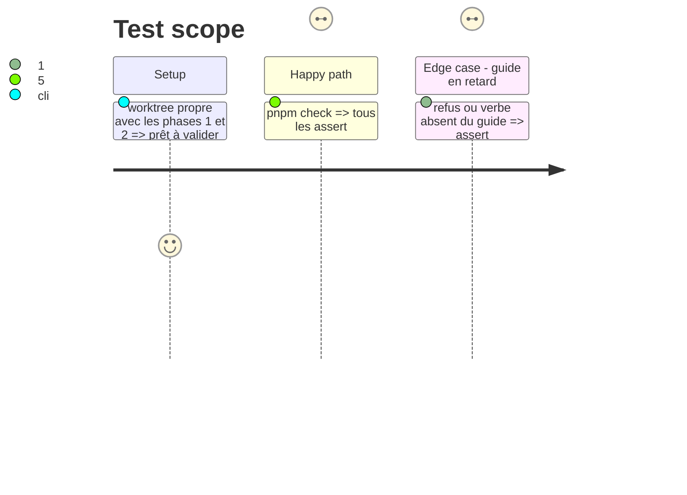

# Instruction: Documentation, porte complète et mémoire

## Architecture projection

> Tree of the final files. ✅ create · ✏️ modify · ❌ delete

```txt
obsidian-handbook/
├── doc/supervisor.fr.md                          ✏️ garde d'épingle (`present`) et nettoyage de `preview`
├── aidd_docs/memory/internal/ci-and-release.md   ✏️ la garde remplace le constat « épingle trop ancienne »
└── tools/assert-supervisor.mjs                   ✏️ si le guide est vérifié contre les verbes
```

## User Journey



## Test Scope



## Tasks to do

### `1)` Documenter

> Le guide dit ce que la garde lit, refuse et corrige.

1. Décrire la garde dans `doc/supervisor.fr.md` : ce qu'elle lit, ce qu'elle refuse, le correctif
2. Décrire l'arrêt des serveurs de `preview` et le fichier de PID
3. Mettre à jour `ci-and-release.md`

### `2)` Valider et livrer

> Les deux portées de lint, puis le commit par le superviseur.

1. Ajouter les deux nouveaux `assert:*` à la liste de `tools/check.mjs` si elle est tenue à la main ; `rtk proxy pnpm build`, `pnpm lint`, `eslint src --ext .ts`, `pnpm check`
2. Livrer par `pnpm supervise commit` (jamais de commit à la main) sur `main`
3. Écrire la note mémoire et retirer des « restes » l'arrêt de l'ancien serveur

## Test acceptance criteria

| Task | Acceptance criteria                                                                     |
| ---- | --------------------------------------------------------------------------------------- |
| 1    | Le guide décrit la garde et le nettoyage ; `assert:supervisor` vert                      |
| 2    | `pnpm check` vert, deux portées de lint à zéro erreur, commit poussé par le superviseur  |
